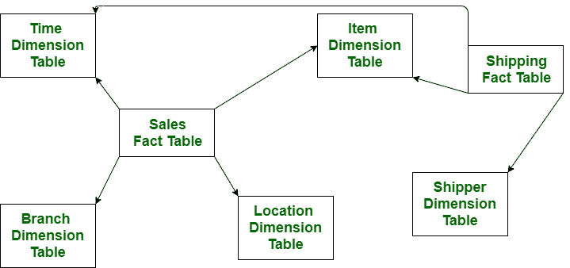

# 雪花图式和事实星座图式的区别

> 原文:[https://www . geesforgeks . org/雪花-模式-事实-星座-模式的区别/](https://www.geeksforgeeks.org/difference-between-snowflake-schema-and-fact-constellation-schema/)

**[雪花模式](https://www.geeksforgeeks.org/snowflake-schema-in-data-warehouse-model/) :**
雪花模式是一种多维模型。它用于数据仓库。在雪花模式中包含事实表、维度表以及每个维度表的一个或多个表。雪花模式是星型模式的规范化形式，减少了冗余，节省了大量存储空间。它易于操作，因为它在表之间具有较少的连接，并且在这种简单且不太复杂的查询中用于访问数据库中的数据。

**[事实星座图式](https://www.geeksforgeeks.org/fact-constellation-in-data-warehouse-modelling/) :**
事实星座图式也是一种多维模型。事实星座模式由多个事实表共享的维度表组成。事实星座模式一次包含多个星形模式。与雪花模式不同，天文馆模式并不容易操作，因为它在表之间有多个数字。与雪花模式不同，星座模式实际上使用非常复杂的查询来访问数据库中的数据。

让我们看看雪花模式和事实星座模式的区别:

| S.NO | 雪花模式 | 事实星座 |
| --- | --- | --- |
| 1. | 雪花模式包含大型中心事实表、维度表和子维度表。 | 而事实上星座模式中，维度表被许多事实表共享。 |
| 2. | 雪花模式节省了大量存储。 | 而事实星座模式不节省存储。 |
| 3. | 雪花模式一次由一个星型模式组成。 | 而事实星座模式一次包含不止一个星形模式。 |
| 4. | 在雪花模式中，表很容易维护。 | 事实上，星座模式的表很难维护。 |
| 5. | 雪花模式是星型模式的规范化形式。 | 而事实星座模式是雪花模式和星形模式的规范化形式。 |
| 6. | 与事实星座模式相比，雪花模式易于操作，因为它在表之间的连接较少。 | 事实星座模式与雪花模式相比不容易操作，因为它在表之间有多个连接。 |
| 7. | 在雪花模式中，使用简单和不太复杂的查询来访问数据库中的数据。 | 而实际上星座模式，从数据库中访问数据使用了更复杂的查询。 |

