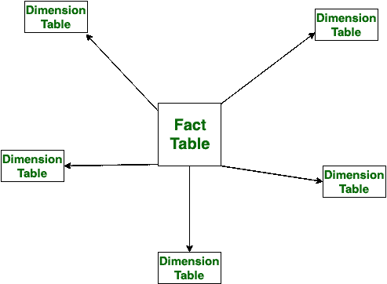

# 恒星图式和事实星座图式的区别

> 原文:[https://www . geesforgeks . org/star-schema-and-fact-constellation-schema/](https://www.geeksforgeeks.org/difference-between-star-schema-and-fact-constellation-schema/)

**[星型模式](https://www.geeksforgeeks.org/star-schema-in-data-warehouse-modeling/) :**
星型模式是一种多维模型类型，它使用简单的查询来访问数据库中的数据。星型模式仅用一维表来描述每个维度。与事实星座模式相比，星型模式易于操作，因为它在表之间的连接较少。与事实星座模式相比，它使用更少的空间。

**[事实星座图式](https://www.geeksforgeeks.org/fact-constellation-in-data-warehouse-modelling/) :**
这个图式是一种多维模型。在这种情况下，维度表由许多事实表共享。事实星座模式一次包含多个星形模式。与星型模式不同，它不容易操作，因为表之间有很多。与星型模式不同，事实星座模式使用非常复杂的查询来访问数据库中的数据。

我们来看看星象图式和事实星座图式的区别:

| S.NO | 星型模式 | 事实星座模式 |
| --- | --- | --- |
| 1. | 星型模式仅用一维表来描述每个维度。 | 在这种情况下，维度表由许多事实表共享。 |
| 2. | 在星型模式中，与事实星座模式相比，表格很容易维护。 | 而实际上星座模式中，表并不容易维护。 |
| 3. | 星型模式不使用规范化。 | 而它是恒星和雪花模式的规范化形式。 |
| 4. | 在星型模式中，简单的查询用于访问数据库中的数据。 | 在这种情况下，使用非常复杂的查询来访问数据库中的数据。 |
| 5. | 与事实星座模式相比，星型模式易于操作，因为它在表之间的连接较少。 | 尽管事实星座模式与星型模式相比不容易操作，因为它在表之间有许多连接。 |
| 6. | 与事实星座模式相比，星形模式使用更少的空间。 | 而事实星座图相对使用更多的空间。 |
| 7. | 由于简单，理解起来非常简单。 | 而由于它的复杂性很难理解。 |

