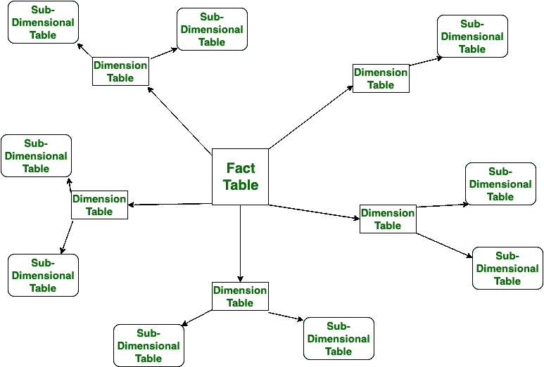

# 星型模式和雪花模式的区别

> 原文:[https://www . geesforgeks . org/star-schema 和雪花-schema 的区别/](https://www.geeksforgeeks.org/difference-between-star-schema-and-snowflake-schema/)

**星型模式:**
星型模式是用于数据仓库的多维模型类型。在星型模式中，包含事实表和维度表。在此模式中，使用的外键连接较少。这个模式由事实表和维度表组成。

**雪花模式:**
雪花模式也是用于数据仓库的多维模型类型。在雪花模式中，包含事实表、维度表和子维度表。这个模式用事实表、维度表和子维度表形成了一片雪花。

让我们看看星形模式和雪花模式的区别:

| S.NO | 星型模式 | 雪花模式 |
| 1. | 在星型模式中，包含事实表和维度表。 | 而在雪花模式中，包含事实表、维度表以及子维度表。 |
| 2. | 星型模式是一种自上而下的模式。 | 而它是自下而上的模式。 |
| 3. | 星型模式使用更多的空间。 | 同时它占用的空间更少。 |
| 4. | 执行查询花费的时间更少。 | 而执行查询需要比星型模式更多的时间。 |
| 5. | 在星型模式中，不使用规范化。 | 在这种情况下，使用了规范化和反规范化。 |
| 6. | 它的设计非常简单。 | 虽然它的设计很复杂。 |
| 7. | 星型模式的查询复杂度低。 | 而雪花模式的查询复杂度高于星型模式。 |
| 8. | 它的理解很简单。 | 虽然很难理解。 |
| 9. | 它的外键较少。 | 虽然它有更多的外键。 |
| 10. | 它具有很高的数据冗余度。 | 而它具有低数据冗余。 |