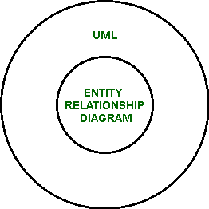

# UML 和 ER 图的区别

> 原文:[https://www . geesforgeks . org/UML 和 er 图之间的区别/](https://www.geeksforgeeks.org/difference-between-uml-and-er-diagram/)

**1。[统一建模语言(UML)](https://www.geeksforgeeks.org/unified-modeling-language-uml-introduction/) :**
UML 是一种可视化表示软件系统的建模语言。

**2。 [ER 图](https://www.geeksforgeeks.org/introduction-of-er-model/) :**
ER 图是现实世界实体及其相互关系的图示。

**UML 与 ER 图的区别:**

| 南号码 | 种类 | 用户模式 | 电流变图 |
| --- | --- | --- | --- |
| 1. | 完全形式 | UML 代表统一建模语言。 | ER 图代表实体关系图。 |
| 2. | 定义 | 它是一种通用的建模语言，用于可视化软件系统的设计。 | 它是现实世界实体及其相互关系的图形表示。 |
| 3. | 关系 | 它是 ER 图的父图。 | 它是 UML 的孩子。 |
| 4. | 使用 | 它用于设计整个软件。 | 它仅用于设计数据库。 |
| 5. | 规模 | 主要用于大规模软件开发的情况。 | 信息技术可以用于各种规模的数据库开发。 |
| 6. | 成分 | 它有用例和工作流。 | 它有实体、属性和关系。 |
| 7. | 涉及的图表 | 它包括用例图和活动图。 | 它本身就包含在表象中。 |
| 8. | 主要用户 | 它被开发者用来理解程序的流程。 | 这是为了让股东和企业所有者了解，了解他们的要求已得到正确满足。 |
| 9. | 叙述 | 描述了控制流程。 | 描绘了关系。 |
| 10. | 系统模型化 | 这是一种动态建模的形式，因为它可以描述在什么时间执行什么活动。 | 它描述了静态建模(不像 UML，它没有描述活动的状态)。 |
| 11. | 州 | 它包括最终状态和初始状态。 | 它没有国家代表。 |
| 12. | 使用的形状 | 它使用圆形、圆角矩形、箭头、菱形、矩形条等。 | 它只使用 3 种形状(椭圆形、矩形和菱形)。 |
| 13. | 泳道的使用 | 它使用泳道。 | 它不使用泳道。 |
| 14. | 时间 | 它可以表示活动期间花费的时间。 | 它没有描绘时间。 |
| 15. | 类型 | 它有两种类型，结构 UML 图和行为 UML 图 | 它没有类型，但是它包含实体、关系和属性，每一个都有几种类型。 |

