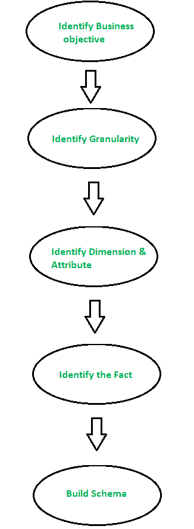

# 维度数据建模

> 原文:[https://www.geeksforgeeks.org/dimensional-data-modeling/](https://www.geeksforgeeks.org/dimensional-data-modeling/)

流行图式–[星空图式](https://www.geeksforgeeks.org/star-schema-in-data-warehouse-modelling/)、[雪花图式](https://www.geeksforgeeks.org/data-warehouse-modelling-snowflake-schema/)T4

**维度数据建模**是数据仓库设计中使用的数据建模技术之一。

```
Goal: Improve the data retrieval.
```

维度建模的概念是由拉尔夫·金博尔提出的，它由*事实和维度*表组成。由于该建模的主要目标是改善数据检索，因此针对*选择操作*进行了优化。使用这种模型的优点是，我们可以以这样一种方式存储数据，即一旦存储在数据仓库中，就更容易存储和检索数据。维度模型是许多 OLAP 系统使用的数据模型。



**图–**尺寸模型的步骤

创建维度数据建模的步骤:

*   **第一步:确定业务目标–**
    第一步是确定业务目标。销售、人力资源、市场营销等。是一些根据组织需要的例子。由于这是数据建模最重要的一步，业务目标的选择也取决于该过程可用数据的质量。

*   **第 2 步:识别粒度–**
    粒度是存储在表中的最低级别的信息。Grain 描述了业务问题及其解决方案的详细程度。

*   **第三步:识别维度及其属性–**
    维度是物体或事物。维度以支持对业务问题有意义的回答的方式对数据仓库事实和度量进行分类和描述。数据仓库将描述性属性组织为维度表中的列。例如，数据维度可能包含年、月和工作日等数据。

*   **第 4 步:识别事实–**
    可测量的数据由事实表保存。大多数事实表行都是数值，如价格或单位成本等。

*   **第 5 步:构建模式–**
    我们在这一步中实现了维度模型。模式是一种数据库结构。有两种流行的方案:[星空模式](https://www.geeksforgeeks.org/star-schema-in-data-warehouse-modelling/)和[雪花模式](https://www.geeksforgeeks.org/data-warehouse-modelling-snowflake-schema/)。