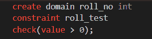
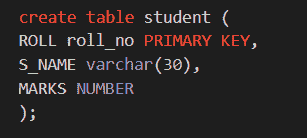
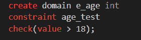
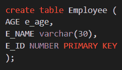

# 数据库管理系统中的域约束

> 原文:[https://www.geeksforgeeks.org/domain-constraints-in-dbms/](https://www.geeksforgeeks.org/domain-constraints-in-dbms/)

在数据库管理系统中，约束是确保授权用户修改数据库时不会干扰数据一致性的一组规则，约束是在 DDL 命令(如“更改”和“创建”命令)中指定的。数据库管理系统中有几种类型的约束，它们是:

*   域约束
*   实体完整性约束
*   引用完整性约束
*   关键制约因素

在本文中，我们将只讨论域约束。

### 领域约束

域约束是用户定义的列，帮助用户根据数据类型输入值。如果遇到错误的输入，它会向用户发出消息，说明该列没有正确完成。或者换句话说，它是一个属性，指定该属性可以保存的所有可能的值，如整数、字符、日期、时间、字符串等。它定义了属性的域或值集，并确保属性所取的值必须是来自其域的原子值(不能分割)。

```
Domain Constraint = data type(integer / character/date / time / string / etc.) + 
                    Constraints(NOT NULL / UNIQUE / PRIMARY KEY / 
                                FOREIGN KEY / CHECK / DEFAULT)
```

**域约束类型:**

有两种类型的约束属于域约束，它们是:

**1。域约束–不为空:**空值是未赋值的值，或者我们也可以说是未知的或缺失的属性值，默认情况下，一列可以保存空值。现在我们知道了，Not Null 约束限制一个列不接受 Null 值，这意味着它只限制一个字段始终包含一个值，这意味着如果不在字段中添加值，就不能插入新记录或更新记录。

**示例:**在‘员工’数据库中，每个员工都必须有一个与之关联的姓名。

```
Create table employee
(employee_id varchar(30),
employee_name varchar(30) not null,
salary NUMBER);
```

**2。域约束–检查:**它定义了每行必须满足的条件，这意味着它将列的值限制在范围之间，或者我们可以说它就像将数据保存到列之前的条件或过滤器检查。它确保当元组插入到关系中时，必须满足 check 子句中给出的谓词。

**例:**我们需要检查员工表输入的身份证号是否大于 0。

```
Create table employee
(employee_id varchar(30) not null check(employee_id > 0),
employee_name varchar(30),
salary NUMBER);
```

上面的示例在 employee_id 列上创建了 CHECK 约束，并指定 employee_id 列必须只包含大于 0 的整数。

**注意:**在 DBMS 中，表是行和列的组合，其中我们有一些与之关联的唯一属性名。基本上，域是表中唯一的一组值。让我们举个例子，假设我们有一个学生表，它由 3 个属性组成，如名称、滚动号和标记。现在“无滚动”属性只能有与之相关的数字，并且不包含任何字母。所以我们可以说它只包含整数的定义域，它只能是大于 0 的正数。

**例 1:**

创建一个“学生”表，其中“ROLL”字段的值大于 0。

**域:**



**表:**



上面的例子只接受大于 0 的辊号。

**例 2:**

创建一个“雇员”表，其中“年龄”字段的值大于 18。

**域:**



**表:**



以上示例仅接受年龄大于 18 岁的员工。