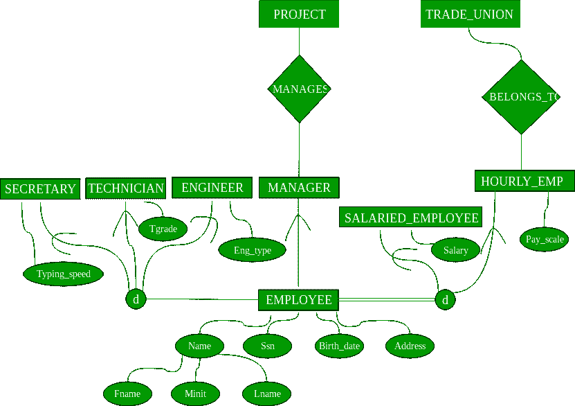

# 增强型 ER 模型

> 原文:[https://www.geeksforgeeks.org/enhanced-er-model/](https://www.geeksforgeeks.org/enhanced-er-model/)

**先决条件–**[ER 模型介绍](https://www.geeksforgeeks.org/database-management-system-er-model/)
如今数据的复杂度越来越高，使用传统的 ER 模型进行数据库建模变得越来越困难。为了降低建模的复杂性，我们必须对现有的 ER 模型进行改进或增强，使其能够以更好的方式处理复杂的应用程序。
增强的实体关系图是高级数据库图，非常类似于常规的 ER 图，表示复杂数据库的需求和复杂性。
是显示子类和超类的图解技术；专业化和普遍化；工会或类别；聚合等。

**泛化和特化–**
这些都是现实实体中非常常见的关系。然而，这种关系后来被添加进来，作为经典 er 模型的增强扩展。**专门化的**类通常被称为**子类**，而**一般化的类**被称为超类，这可能是受面向对象编程的启发。一个子类最好通过**“IS-A 分析”**来理解。以下陈述希望对您的思维有所帮助:“技术人员是员工”、“笔记本电脑是电脑”。

实体是另一个实体的专用类型/类。例如，技术人员是大学系统中的特殊员工。教师是特殊类别的员工。我们称这种现象为泛化/特化。在这里的例子中，雇员是一个广义的实体类，而技术员和教员是雇员的专业类。

**示例–**T2【子类】关系的这个示例实例。这里我们有四组员工:秘书、技术员和工程师。员工是其余三个集合的超类，单个子类是员工集合的子集。

*   属于子类的实体与某个超类实体相关。比如 emp，1001 号是秘书，打字速度是 68。Emp no 1009 是一名工程师(子类)，她的职业是“电气”，等等。
*   子类实体“继承”了超类的所有属性；例如，员工 1001 将具有属性 eno、姓名、工资和打字速度。

**上例增强型 ER 模型–**

**约束–**对“子类”关系有两种类型的约束。

1.  **全部或部分–**如果每个超类实体都与某个子类实体相关联，则子类关系为全部，否则为部分。子类别“基于工作类型的员工类别”是部分子类别-不一定每个员工都是(秘书、工程师和技术人员)之一，即这三种类型的工会是所有员工的适当子集。而其他分类“受薪雇员和计时雇员”是总数；来自子类的实体的联合等于总员工集，即每个员工都必须是其中的一员。
2.  **重叠或不相交–**如果超集合中的一个实体可以在多个子类集合中相关(可以出现)，那么它是重叠子类，否则不相交。这两个例子:基于工作类型和工资/小时雇员分类是分离的。

**注意–**这些约束是相互独立的:可以是“重叠且全部或部分”或“不相交且全部或部分”。此外，子类具有传递性。

**多重继承(多个**超类**)—**
一个实体可以是多个实体类型的子类；这样的实体是多个实体的子类，并且具有多个超类；“教学助理”可以同时子类化“员工”和“学生”。大学系统中的教师可以是雇员和校友的子类。在多重继承中，子类的属性是所有超类属性的并集。

**联合–**

*   图书馆成员的集合是教师、学生和工作人员的**联盟**。联合关系表示任一类型；例如，图书馆成员可以是教职员工或学生。
*   以下两个例子展示了如何在 ERD 描述**UNION**-车主是个人和公司的联合，而 RTO 注册车辆是汽车和卡车的联合。

您可能会在 Sub class 和 UNION 中看到一些混淆；考虑上图中的一个例子，车辆是轿车和卡车的超级级别；这也是子类的一个非常正确的例子，但是这里使用它的方式不同，我们说 RTO 注册车辆是汽车和车辆的联合，它们不继承车辆的任何属性，汽车和卡车的属性是完全独立的集合，在子类化的情况下，汽车和卡车将继承车辆类的属性。

**参考文献–**

[cs.toronto.edu](http://www.cs.toronto.edu/~jm/2507S/Notes04/EER.pdf)

本文由 [**卡丹·帕特尔**](https://auth.geeksforgeeks.org/profile.php?user=kd&list=practice) 供稿。如果你喜欢 GeeksforGeeks 并想投稿，你也可以使用[write.geeksforgeeks.org](https://write.geeksforgeeks.org)写一篇文章或者把你的文章邮寄到 review-team@geeksforgeeks.org。看到你的文章出现在极客博客主页上，帮助其他极客。

如果你发现任何不正确的地方，或者你想分享更多关于上面讨论的话题的信息，请写评论。