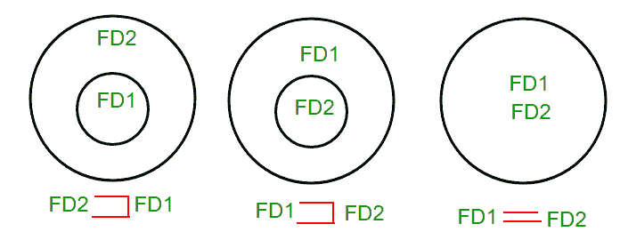

# 功能依赖的等价性

> 原文:[https://www . geeksforgeeks . org/等价功能依赖集/](https://www.geeksforgeeks.org/equivalence-of-functional-dependencies-sets/)

为了理解函数依赖集(FD 集)的等价性，在[这篇](https://www.geeksforgeeks.org/finding-attribute-closure-and-candidate-keys-using-functional-dependencies/)文章  中给出了关于属性闭包的基本思想

给定一个具有不同 FD 集的关系，我们必须找出一个 FD 集是另一个的子集，还是两者相等。

**如何找到两个 FD 集之间的关系？**

设 FD1 和 FD2 是关系 r 的两个 FD 集。

1.  如果 FD1 的所有 FDs 都可以来源于 FD2 中存在的 FDs，我们可以说 FD2 是⊃ FD1。
2.  如果 FD2 的所有 FDs 都可以来源于 FD1 中存在的 FDs，我们可以说 FD1 是⊃ FD2。
3.  如果 1 和 2 都为真，则 FD1=FD2。

这三种情况都可以用维恩图表示为:

**Q .我们举个例子来说明两个 FD 集之间的关系。具有两个 FD 集的关系 R(A，B，C，D)FD1 = { A->B，B- > C，AB- > D}和 FD2 = {A- > B，B- > C，A- > C，A- > D}**

**第一步。**检查 FD1 的所有 FDs 是否都存在于 FD2 中

*   集 FD1 中的 A->B 存在于集 FD2 中。
*   集 FD1 中的 B->C 也存在于集 FD2 中。
*   AB->D 存在于集合 FD1 中，但不直接存在于 FD2 中，但我们将检查是否可以导出它。对于集 FD2，(AB) + = {A，B，C，D}。这意味着 AB 可以在功能上确定 A、B、C 和 D。因此 AB- > D 也将在集合 FD2 中成立。

由于集 FD1 中的所有 FDs 在集 FD2 中也成立，因此 FD2 ⊃ FD1 为真。

**第二步。**检查 FD1 中是否存在所有 FD2 的 FDs

*   集 FD2 中的 A->B 存在于集 FD1 中。
*   集 FD2 中的 B->C 也存在于集 FD1 中。
*   一个->C 存在于 FD2 中，但不直接存在于 FD1 中，但我们会检查是否可以导出它。对于集 FD1，(A) + = {A，B，C，D}。这意味着 A 可以在功能上确定 A、B、C 和 d。因此 A- > C 也将保留在集 FD1 中。
*   一个->D 存在于 FD2 中，但不直接存在于 FD1 中，但我们会检查是否可以导出它。对于集 FD1，(A) + = {A，B，C，D}。这意味着 A 可以在功能上确定 A、B、C 和 D。因此 A- > D 也将保留在集 FD1 中。

由于集 FD2 中的所有 FDs 在集 FD1 中也成立，因此 FD1 ⊃ FD2 为真。

**第三步。**由于 FD2 ⊃ FD1 和 FD1 ⊃ FD2 都为真，FD2 =FD1 为真。这两个 FD 集在语义上是等价的。

* * *

**Q .我们再举一个例子来说明两个 FD 集之间的关系。具有两个 FD 集的关系 R2(A，B，C，D)FD1 = { A->B，B- > C，A- > C}和 FD2 = {A- > B，B- > C，A- > D}**

**第一步。**检查 FD1 的所有 FDs 是否都存在于 FD2 中

*   集 FD1 中的 A->B 存在于集 FD2 中。
*   集 FD1 中的 B->C 也存在于集 FD2 中。
*   一个->C 存在于 FD1 中，但不直接存在于 FD2 中，但我们会检查是否可以导出它。对于集合 FD2，(A) + = {A，B，C，D}。这意味着 A 可以在功能上确定 A、B、C 和 d。所以 A- > C 也将在集合 FD2 中保持。

由于集 FD1 中的所有 FDs 在集 FD2 中也成立，因此 FD2 ⊃ FD1 为真。

**第二步。**检查 FD1 中是否存在所有 FD2 的 FDs

*   集 FD2 中的 A->B 存在于集 FD1 中。
*   集 FD2 中的 B->C 也存在于集 FD1 中。
*   一个->D 存在于 FD2 中，但不直接存在于 FD1 中，但我们会检查是否可以导出它。对于集 FD1，(A) + = {A，B，C}。这意味着 A 不能在功能上决定 D，所以 A- > D 在 FD1 中不成立。

由于集 FD2 中的所有 FDs 在集 FD1、FD2 和⊄ FD1 中不成立。

**第三步。**在这种情况下，FD2 ⊃ FD1 和 FD2 ⊄ FD1，这两个 FD 集在语义上是不等价的。

本文由 Sonal Tuteja 供稿。如果你发现任何不正确的地方，或者你想分享更多关于上面讨论的话题的信息，请写评论。