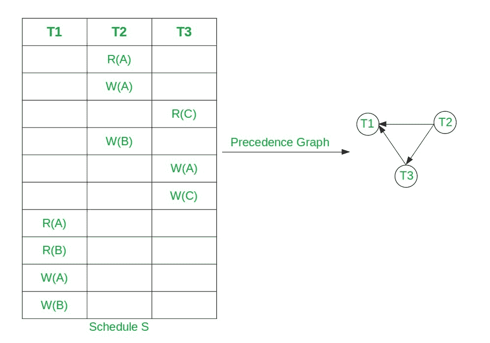

# DBMS 中冲突可串行化调度的等价串行调度

> 原文:[https://www . geesforgeks . org/等效-串行-冲突时间表-可序列化-数据库中的时间表/](https://www.geeksforgeeks.org/equivalent-serial-schedule-of-conflict-serializable-schedule-in-dbms/)

**先决条件:** [冲突可串行化，](https://www.geeksforgeeks.org/conflict-serializability-in-dbms/) [优先图](https://www.geeksforgeeks.org/precedence-graph-for-testing-conflict-serializability-in-dbms/)

**冲突可串行化调度:**如果一个调度可以通过交换不冲突的操作转化为串行调度，则称之为冲突可串行化调度。通过在冲突可串行化调度的[优先图](https://www.geeksforgeeks.org/precedence-graph-for-testing-conflict-serializability-in-dbms/)上应用[拓扑排序](https://www.geeksforgeeks.org/topological-sorting/)，可以找到冲突可串行化调度的串行调度。

**注意:**优先[冲突序列调度的图](https://www.geeksforgeeks.org/graph-data-structure-and-algorithms/)总是[T5】有向无环图](https://www.geeksforgeeks.org/all-topological-sorts-of-a-directed-acyclic-graph/) 。

**方法:**按照以下步骤寻找优先图的拓扑排序:

*   [为给定的优先图找到所有节点的索引](https://www.geeksforgeeks.org/finding-in-and-out-degrees-of-all-vertices-in-a-graph/)，并将其存储在辅助数组中。
*   现在，对于具有**索引** **0** 的每个节点，执行以下操作:
    *   打印当前节点 **T** 作为拓扑排序的顺序。
    *   让节点 **T** 成为同度 **0** 的节点。
    *   从图形中移除 **T** 和所有连接到 **T** 的边。
    *   完成上述步骤后，更新所有节点的索引。
*   经过以上步骤，可以计算出给定优先图的拓扑排序。

以下是上述方法的图示:

假设，冲突序列时间表为**S:R2(A)W2(A)R3(C)W2(B)W3(A)W3(C)R1(A)R2(B)W1(A)W2(B)**

[](https://media.geeksforgeeks.org/wp-content/uploads/20210109111854/gfg.jpg)

*   此处节点 **T2** 有索引 **0** 。
*   因此，选择 **T2** 并移除 **T2** 以及从其连接的所有边。
*   现在 **T3** 已经进入 **0** 了。因此，选择 **T3** 并去除边缘 **T3→T1** 。
*   最后选择 **T3** 。所以拓扑排序是 **T2，T3，T1** 。
*   因此，给定冲突可串行化调度的等价串行调度是 **T2→T3→T1** ，即**S2:R2(A)W2(A)W2(B)R3(C)W3(A)W3(C)R1(A)R2(B)W1(A)W1(B)**。

冲突可序列化计划可能有多个等效的串行计划。

下面是使用拓扑排序获得 CSS 的串行调度的实现:

## C++

```
// C++ program to print serial schedule
// of CSS using Topological sorting
#include <bits/stdc++.h>
using namespace std;

class PrecedenceGraph {

    // No. of vertices
    int V;

    // Pointer to an array containing
    // adjacency vector
    vector<int>* adj;

    // Vector to store SerialSchedule
    vector<int> serialSchedule;

    // Function  declarations
    void computeIndegree(int* indegree);
    int findZeroIndegree(int* indegree,
                         bool* visited);

public:
    // Constructor
    PrecedenceGraph(int V);

    // Function declarations
    void addEdge(int v, int w);
    void topologicalSort();
    void printSchedule();
};

// Function to create the precedence
// graph
PrecedenceGraph::PrecedenceGraph(int V)
{
    this->V = V;
    adj = new vector<int>[V];
}

// Function to add the edge to the
// precedence graph
void PrecedenceGraph::addEdge(int v,
                              int w)
{
    adj[v].push_back(w);
}

// Function to compute indegree of nodes
void PrecedenceGraph::computeIndegree(
    int* indegree)
{
    for (int i = 1; i < V; i++) {

        // Traverse the adjacency list
        // of node i
        for (int j = 0;
             j < adj[i].size(); j++) {
            int node = adj[i][j];

            // Update the indegree
            // of node
            indegree[node]++;
        }
    }
}

// Function to find node with
// zero indegree
int PrecedenceGraph::findZeroIndegree(
    int* indegree, bool* visited)
{
    for (int i = 1; i < V; i++) {

        // If node is not visited
        // and have indegree 0
        if (!visited[i]
            && indegree[i] == 0) {

            // Mark node visited
            visited[i] = true;

            // Return node
            return i;
        }
    }

    // All nodes are visited
    return -1;
}

// Function to find the topological
// Sorting of the given graph
void PrecedenceGraph::topologicalSort()
{
    // Create and initialize
    // visited array
    bool* visited = new bool[V]();

    // Create and initialize
    // indegree array
    int* indegree = new int[V]();

    computeIndegree(indegree);

    // Check if the node with
    // indegree 0 is available
    int node = findZeroIndegree(
        indegree, visited);

    bool nodeAvailable = false;

    if (node != -1) {
        nodeAvailable = true;
    }
    while (nodeAvailable) {

        // Add node to serial schedule
        serialSchedule.push_back(node);

        for (int i = 0;
             i < adj[node].size(); i++) {

            // Delete all edges of current
            // node and update indegree
            indegree[adj[node][i]]--;
        }

        // Find next node with indegree 0
        node = findZeroIndegree(indegree,
                                visited);

        if (node == -1) {

            // Node with zero indegree
            // not available
            nodeAvailable = false;
        }
    }
}

// Function to print the serial schedule
void PrecedenceGraph::printSchedule()
{
    for (int i : serialSchedule) {
        cout << "T" << i << " ";
    }
}

// Driver Code
int main()
{
    // Create a precedence graph
    // given in the above diagram
    PrecedenceGraph graph(4);
    graph.addEdge(2, 1);
    graph.addEdge(2, 3);
    graph.addEdge(3, 1);

    // Find topological ordereing
    graph.topologicalSort();

    // Print Schedule
    cout << "Equivalent Serial"
         << " Schedule is :";
    graph.printSchedule();
}
```

**Output:** 

```
Equivalent Serial Schedule is :T2 T3 T1
```

***时间复杂度:**O(N)*
T5**辅助空间:** O(N)