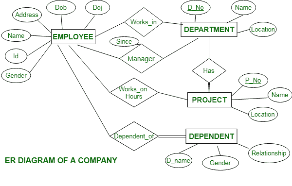

# 某公司 ER 图

> 原文:[https://www.geeksforgeeks.org/er-diagram-of-a-company/](https://www.geeksforgeeks.org/er-diagram-of-a-company/)

[ER 图](https://www.geeksforgeeks.org/introduction-of-er-model/)称为实体关系图，用于分析数据库的结构。它显示了实体及其属性之间的关系。ER 模型提供了一种交流方式。

公司电流变图描述如下:

*   公司有几个部门。
*   每个部门可能有几个地点。
*   部门由名称、D_no、位置来标识。
*   经理控制一个特定的部门。
*   每个部门都与多个项目相关联。
*   员工通过姓名、身份证、地址、出生日期和加入日期来识别。
*   一个员工只在一个部门工作，但可以从事几个项目。
*   我们还跟踪员工在单个项目上的工作小时数。
*   每个员工都有受抚养人
*   受抚养人有姓名、性别和关系。

**公司 ER 图:**

此公司 ER 图说明了公司的关键信息，包括员工、部门、项目和受抚养人等实体。它允许理解实体之间的关系。

**实体**及其**属性**为

*   **员工实体:**员工实体的属性有姓名、身份证、地址、性别、Dob、Doj。
    标识是员工实体的主键。
*   **部门实体:**部门实体的属性为 D_no、名称、地点。
    D_no 是部门实体的主键。
*   **项目实体:**项目实体的属性为 P_No、名称、位置。
    P_No 是项目实体的主键。
*   **依赖实体:**依赖实体的属性为 D_no、性别、关系。

**关系**是:

*   **员工在部门工作–**
    多个员工在一个部门工作，但一个员工不能在多个部门工作。
*   **经理控制一个部门–**
    员工在该部门经理手下工作，经理记录员工加入该部门的日期。
*   **部门有多个项目–**
    一个部门有多个项目，但一个项目不能归属于多个部门。
*   **员工在项目上工作–**
    一名员工在多个项目上工作，记录该员工在单个项目上工作的小时数。
*   **员工有家属–**
    每个员工都有家属。每个受抚养人只依赖一名员工。