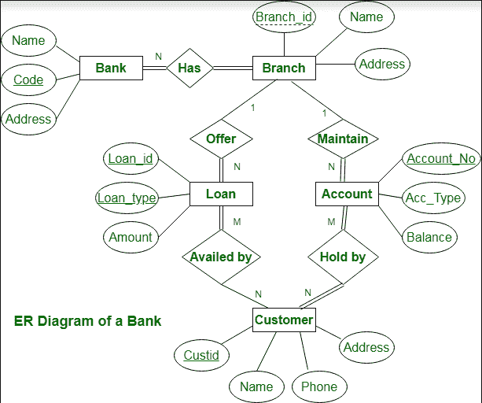

# 银行管理系统 ER 图

> 原文:[https://www . geesforgeks . org/er-银行管理系统图/](https://www.geeksforgeeks.org/er-diagram-of-bank-management-system/)

[ER 图](https://www.geeksforgeeks.org/introduction-of-er-model/)称为实体-关系图。它用于分析数据库的结构。它显示了实体及其属性之间的关系。ER 模型提供了一种交流方式。

银行 ER 图描述如下:

*   银行有客户。
*   银行由名称、代码、总部地址来标识。
*   银行有分行。
*   分支机构由分支机构编号、分支机构名称和地址标识。
*   客户通过姓名、客户 id、电话号码、地址来识别。
*   客户可以有一个或多个帐户。
*   账户由账号、acc 类型、余额标识。
*   客户可以获得贷款。
*   贷款由贷款 id、贷款类型和金额确定。
*   账户和贷款与银行分行有关。

**银行管理系统 ER 图:**

此银行 ER 图说明了有关银行的关键信息，包括分行、客户、账户和贷款等实体。它让我们了解实体之间的关系。

**实体**及其**属性**为:

*   **银行主体:**银行主体的属性为银行名称、代码、地址。
    代码是银行实体的主键。
*   **客户实体:**客户实体的属性为 Customer_id、姓名、电话号码、地址。
    客户标识是客户实体的主键。
*   **分支实体:**分支实体的属性为 Branch_id、名称、地址。
    分行标识是分行实体的主键。
*   **账户主体:**账户主体的属性有账号、账户类型、余额。
    账号是账户主体的主键。
*   **贷款主体:**贷款主体的属性为贷款 _id、贷款 _ 类型、金额。
    贷款标识是贷款主体的主键。

[关系](https://www.geeksforgeeks.org/attributes-to-relationships-in-er-model/)是:

*   **银行有分支机构= > 1 : N**
    一家银行可以有多个分支机构，但是一个分支机构不能属于多个银行，所以银行和分支机构的关系是一对多的关系。

*   **分支机构维护账户= > 1 : N**
    一个分支机构可以有多个账户，但是一个账户不能属于多个分支机构，所以分支机构和账户之间是一对多的关系。

*   **分支机构提供贷款= > 1 : N**
    一个分支机构可以有多个贷款，但一个贷款不能属于多个分支机构，所以分支机构和贷款的关系是一对多的关系。

*   **客户持有的账户= > M : N**
    一个客户可以有多个账户，一个账户也可以由一个或多个客户持有，所以账户和客户之间是多对多的关系。

*   **客户获得的贷款= > M : N**
    (假设贷款可以由多个客户共同持有)。
    一个客户可以有多个贷款，一个或多个客户也可以使用一笔贷款，所以贷款和客户之间是多对多的关系。