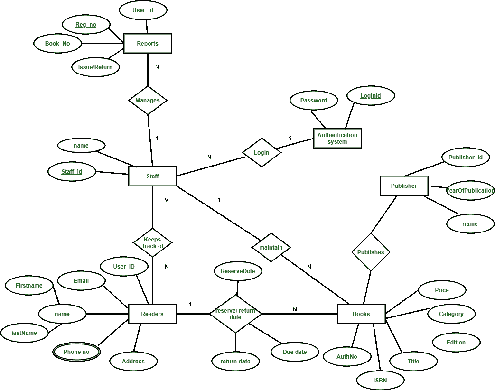

# 图书馆管理系统 ER 图

> 原文:[https://www . geesforgeks . org/er-图书馆管理系统图/](https://www.geeksforgeeks.org/er-diagram-of-library-management-system/)

[ER 图](https://www.geeksforgeeks.org/introduction-of-er-model/)被称为实体关系图，用于分析数据库的结构。它显示了实体及其属性之间的关系。ER 模型提供了一种交流方式。

图书馆管理系统数据库通过以下考虑事项跟踪读者

*   该系统通过包含登录 Id 和密码的单点认证系统来跟踪员工。
*   工作人员维护图书目录，包括书号、书名、价格(以印度卢比表示)、类别(小说、一般、故事)、版本、作者编号和详细信息。
*   出版者有出版者标识、图书出版年份和图书名称。
*   读者用他们的用户 id、电子邮件、姓名(名、姓)、电话号码(允许多个条目)、通信地址进行注册。工作人员跟踪读者。
*   读者可以归还/预订印有发行日期和归还日期的书籍。如果在规定的时间内没有归还，也可能有到期日。
*   工作人员还生成具有读者 id、报告注册号、书号和退货/发货信息的报告。

图书馆管理系统 ER 图

此图书馆 ER 图说明了关于图书馆的关键信息，包括员工、读者、图书、出版商、报告和认证系统等实体。它允许理解实体之间的关系。

**实体及其属性–**

*   **图书实体:**有授权号、isbn 号、书名、版本、类别、价格。国际标准书号是图书实体的主键。
*   **阅读器实体:**有用户标识、邮箱、地址、电话号码、姓名。Name 是名字和姓氏的复合属性。电话号码是多值属性。用户标识是读者实体的主键。
*   **出版单位:**有出版时间、出版年份、名称。公钥是主键。
*   **认证系统实体:**有 LoginID 和以 LoginId 为主键的密码。
*   **报表主体:**有用户标识、登记号、账簿号、发出/退回日期。Reg_no 是报表实体的主键。
*   **人员实体:**有名称和人员标识，人员标识为主键。
*   **预留/归还关系集:**有三个属性:预留日期、到期日期、归还日期。

**[实体间的关系](https://www.geeksforgeeks.org/attributes-to-relationships-in-er-model/)–**

*   一个读者可以预订 N 本书，但一本书只能被一个读者预订。关系 1:N。
*   一个出版商可以出版许多书，但一本书只能由一个出版商出版。关系 1:N。
*   工作人员跟踪读者。关系是 M:N。
*   员工维护多个报告。关系 1:N。
*   员工维护多个帐簿。关系 1:N。
*   认证系统为多个员工提供登录。关系是 1:N。