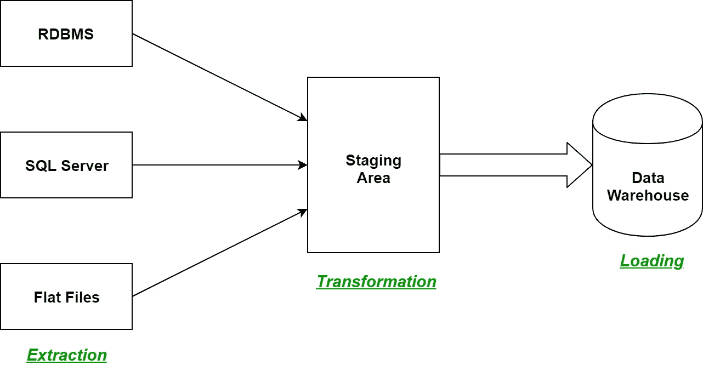
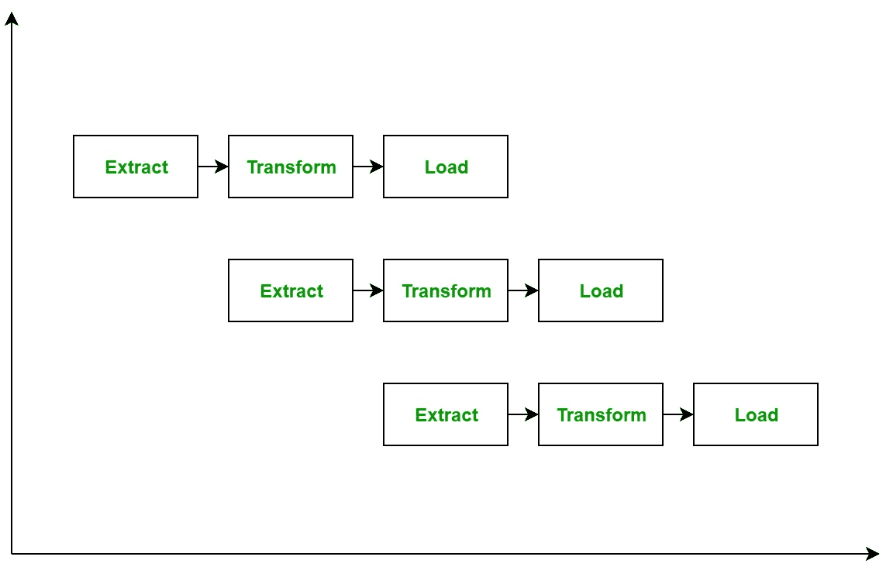

# 数据仓库中的 ETL 流程

> 原文:[https://www . geesforgeks . org/ETL-数据仓库中的流程/](https://www.geeksforgeeks.org/etl-process-in-data-warehouse/)

ETL 是数据仓库中的一个过程，它代表**提取**、**转换**和**加载**。这是一个过程，在这个过程中，ETL 工具从各种数据源系统中提取数据，在暂存区中对其进行转换，最后将其加载到数据仓库系统中。

让我们深入了解 ETL 过程的每一步:

1.  **抽取:**
    ETL 过程的第一步是抽取。在这一步中，来自各种源系统的数据被提取到暂存区，这些数据可以是各种格式，如关系数据库、无 SQL、XML 和平面文件。重要的是从各种源系统中提取数据，并首先将其存储到暂存区，而不是直接存储到数据仓库中，因为提取的数据有各种格式，也可能被破坏。因此，将它直接加载到数据仓库中可能会损坏它，并且回滚会更加困难。因此，这是 ETL 过程中最重要的步骤之一。
2.  **转换:**
    ETL 过程的第二步是转换。在这一步骤中，一组规则或函数被应用于提取的数据，以将其转换为单一标准格式。它可能涉及以下过程/任务:
    *   过滤–仅将某些属性加载到数据仓库中。
    *   清理–用一些默认值填充空值，将美国、美国和美洲映射到美国，等等。
    *   连接–将多个属性连接成一个。
    *   拆分–将单个属性拆分为多个属性。
    *   排序–根据某个属性(通常是键属性)对元组进行排序。
3.  **加载:**
    ETL 过程的第三步也是最后一步是加载。在这一步中，转换后的数据最终被加载到数据仓库中。有时，通过非常频繁地将数据加载到数据仓库中来更新数据，有时会在更长但有规律的时间间隔后进行更新。加载的速率和周期仅取决于要求，并且因系统而异。

ETL 过程也可以使用流水线概念，即一旦提取了一些数据，就可以对其进行转换，并且在此期间可以提取一些新数据。当转换后的数据被加载到数据仓库中时，已经提取的数据可以被转换。ETL 过程流水线的框图如下所示:

**ETL 工具:**最常用的 ETL 工具有 Sybase、Oracle Warehouse builder、CloverETL 和 MarkLogic。