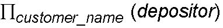

# 关系代数的示例查询

> 原文:[https://www . geesforgeks . org/example-query-on-relational-代数/](https://www.geeksforgeeks.org/example-queries-on-relational-algebra/)

下面给出了一些数据库的例子和一些基于此的查询。

**(1)。**假设有一个银行数据库，包括以下表格:

客户(客户名称，客户街道，客户城市)

分行(分行名称、分行城市、资产)

账户(分行名称、账号、余额)

贷款(分行名称、贷款编号、金额)

存款人(客户名称、账号)

借款人(客户名称，贷款号)

**<u>查询:</u>** 找到所有从银行贷款并且在银行也有账户的客户的名字。

解决方案:

**<u>步骤 1 :</u>** 确定构建结果查询所需的关系。

查询的前半部分(即贷款客户的姓名)显示“借款人”信息。

所以关系 1–>借款人。

查询的后半部分需要客户名称和账号，可以从存款人关系中获取。

因此，关系 2—>存款人。

**<u>第二步:</u>** 从第一步得到的关系中找出你需要的列。

**<u>第 1 栏:</u>** 借款人客户名称

**<u>第 2 列:</u>** 存款人客户名称

**<u>第三步:</u>** 确定要使用的操作员。我们需要找出出现在****借款人**表和**存款人**表中的**客户名称。****

**因此，要使用的运算符—->交集。**

**最终查询将是**

****