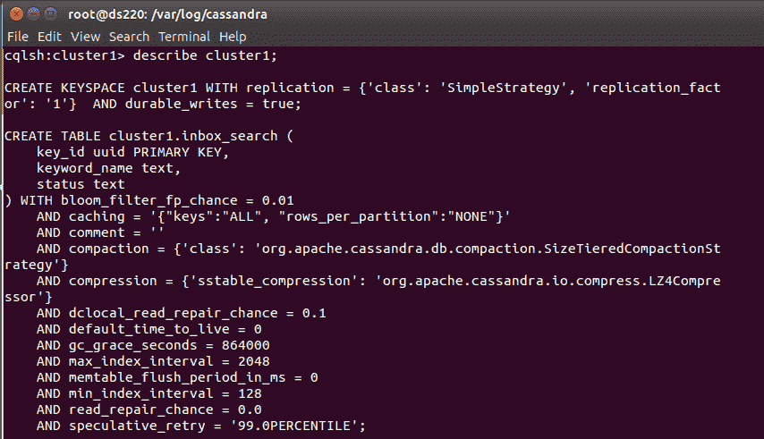
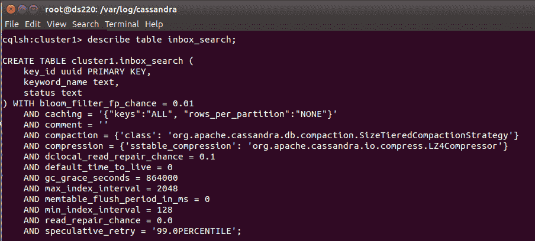
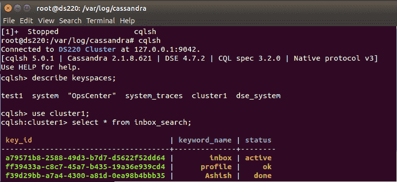
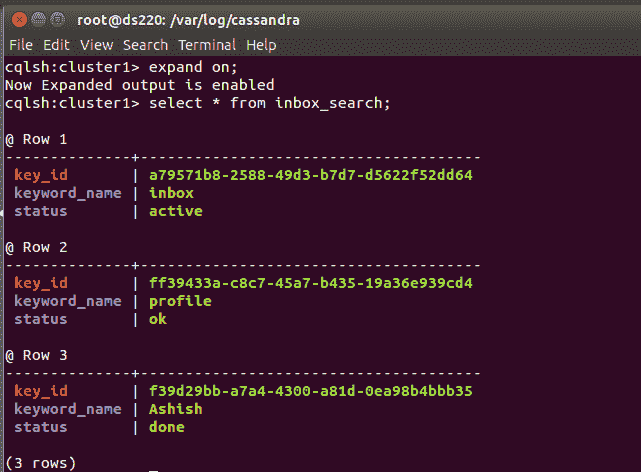
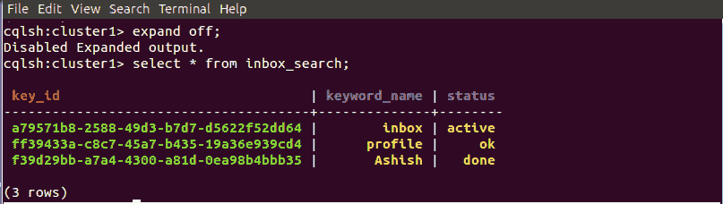

# 在卡珊德拉扩展命令

> 原文:[https://www . geesforgeks . org/expand-on-command-in-Cassandra/](https://www.geeksforgeeks.org/expand-on-command-in-cassandra/)

先决条件–[卡珊德拉](https://www.geeksforgeeks.org/introduction-to-apache-cassandra/)
在本文中，我们将讨论 cqlsh shell 命令，如展开打开、展开关闭、描述键空间、描述表，还将讨论已实现的 cqlsh 查询。

首先，我们将在 cqlsh 中创建键空间。下面给出了创建键空间的 cqlsh 查询。

```
create keyspace cluster1
with REPLICATION = {'class' : 'SimpleStrategy', 
                    'replication_factor':'1'}; 
```

现在，在成功创建 cluter1 键空间之后。我们将使用它来创建一个表。

```
use cluster1;

cqlsh:cluster1> create table inbox_search
 (
  key_id UUID primary key,
  keyword_name text,
  status text
 ); 
```

现在，我们将向表中插入一些数据(inbox_search)。

```
Insert into inbox_search(key_id, keyword_name, status)
values(uuid(), 'inbox', 'active');

Insert into inbox_search(key_id, keyword_name, status)
values(uuid(), 'profile', 'ok');

Insert into inbox_search(key_id, keyword_name, status)
values(uuid(), 'Ashish', 'done'); 
```

现在，要验证结果，请参见下面给出的输出和实现的 cqlsh 查询。

**要验证密钥空间，请使用以下 cqlsh 查询。**



**为了验证该表使用了以下 cqlsh 查询。**



**要验证 use keyspace 命令是否使用了以下 cqlsh 查询。**



现在，我们将讨论在 cqlsh 中扩展命令。expand on 命令用于将结果展开成单独的行。让我们来看看。



现在，我们还可以使用“展开关闭”命令不展开结果，通常情况下，“展开关闭”是默认设置。下面给出了一个实现的 cqlsh 查询来验证它的工作结果。

