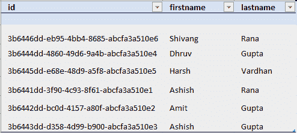
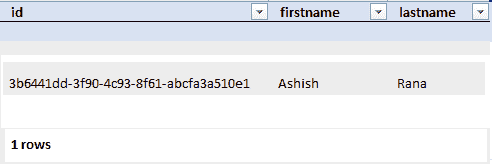

# 在 Cassandra 中导出和导入数据

> 原文:[https://www . geesforgeks . org/export-and-import-data-in-Cassandra/](https://www.geeksforgeeks.org/export-and-import-data-in-cassandra/)

先决条件–[卡珊德拉](https://www.geeksforgeeks.org/introduction-to-apache-cassandra/)
在本文中，我们将讨论如何通过 cqlsh 查询导出和导入数据。
我们一个一个来讨论。

首先，我们将创建一个表，即数据，其中 id、名字、姓氏是示例练习的字段。
我们来看看。

**表名:**数据

```
CREATE TABLE Data ( 
  id UUID PRIMARY KEY, 
  firstname text,
  lastname text 
); 
```

现在，我们将插入一些数据来导出和导入示例练习的数据。让我们来看看。

```
INSERT INTO Data (id, firstname, lastname ) 
VALUES (3b6441dd-3f90-4c93-8f61-abcfa3a510e1, 'Ashish', 'Rana');

INSERT INTO Data (id, firstname, lastname) 
VALUES (3b6442dd-bc0d-4157-a80f-abcfa3a510e2, 'Amit', 'Gupta');

INSERT INTO Data (id, firstname, lastname) 
VALUES (3b6443dd-d358-4d99-b900-abcfa3a510e3, 'Ashish', 'Gupta');

INSERT INTO Data (id, firstname, lastname) 
VALUES (3b6444dd-4860-49d6-9a4b-abcfa3a510e4, 'Dhruv', 'Gupta');

INSERT INTO Data (id, firstname, lastname)   
VALUES (3b6445dd-e68e-48d9-a5f8-abcfa3a510e5, 'Harsh', 'Vardhan');

INSERT INTO Data (id, firstname, lastname) 
VALUES (3b6446dd-eb95-4bb4-8685-abcfa3a510e6, 'Shivang', 'Rana'); 
```

现在，我们将使用下面给出的 cqlsh 查询导出数据。让我们来看看。

```
cqlsh>COPY Data(id, firstname, lastname) 
TO 'AshishRana\Desktop\Data.csv' WITH HEADER = TRUE; 
```

CSV 文件创建如下:

```
Using 7 child processes 
```

开始复制列为[id，名字，姓氏]的数据。

```
Processed: 6 rows; Rate: 20 rows/s; Avg. rate: 30 rows/s
6 rows exported to 1 files in 0.213 seconds. 
```

现在，我们将从表“数据”中删除数据，以便从已经创建的 CSV 文件中再次导入。

```
truncate Data; 
```

现在，我们将再次导入数据。要导入数据，请使用下面给出的 cqlsh 查询。

```
COPY Data (id, firstname, lastname)
FROM 'AshishRana\Desktop\Data.csv' 
WITH HEADER = TRUE; 
```

行被导入:

```
Using 7 child processes 
```

开始复制列为[id，名字，姓氏]的数据。

```
Processed: 6 rows; Rate: 10 rows/s; Avg. rate: 14 rows/s
6 rows imported from 1 files in 0.423 seconds (0 skipped). 
```

验证结果是否成功导入。让我们来看看。

```
SELECT * 
FROM Data; 
```

**输出:**



要复制表中的特定行，请使用下面给出的 cqlsh 查询。
首先，从表中导出数据，然后在这两个步骤之后截断，按照下面给出的步骤进行。

```
COPY Data FROM STDIN; 
```

执行完上面的 cqlsh 查询后，行提示变为[copy]让我们看一下。

```
Using 7 child processes 
```

正在启动集群 1 的副本。带有列[id、名字、姓氏]的数据。

```
[Use . on a line by itself to end input]
[copy] 
```

现在，插入要导入的表的行值。

```
[copy] 3b6441dd-3f90-4c93-8f61-abcfa3a510e1, 'Ashish', 'Rana'
[copy] .    // keep it in mind at the end insert the period 
```

在成功执行上面给定的 cqlsh 查询后，会给你下面给定的结果。让我们来看看。

```
Processed: 1 rows; Rate: 0 rows/s; Avg. rate: 0 rows/s
1 rows imported from 1 files in 36.991 seconds (0 skipped). 
```

现在，让我们验证一下结果。

```
SELECT * 
FROM Data; 
```

**输出:**

