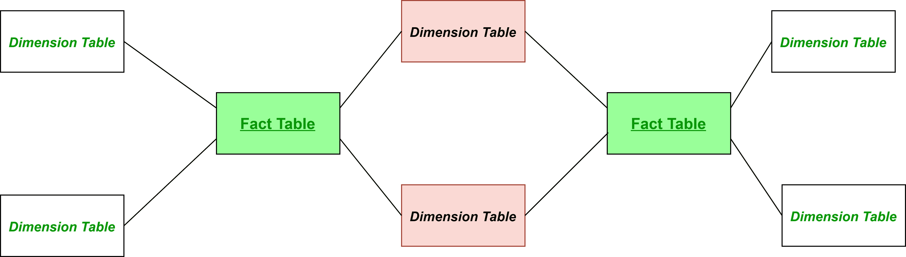
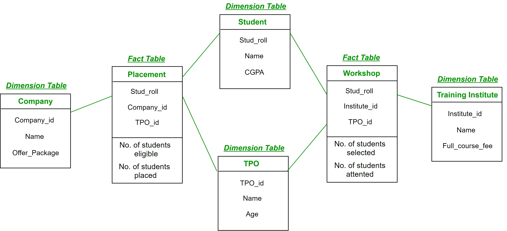

# 数据仓库建模中的事实星座

> 原文:[https://www . geesforgeks . org/fact-数据仓库中的星座-建模/](https://www.geeksforgeeks.org/fact-constellation-in-data-warehouse-modelling/)

**事实星座**是表示多维模型的模式。它是具有一些公共维度表的多个事实表的集合。它可以被视为几个星形模式的集合，因此也被称为*星系模式*。它是数据仓库设计中广泛使用的模式之一，比星型和雪花型模式复杂得多。对于复杂系统，我们需要事实星座。

**Figure –** General structure of Fact Constellation

这里，粉红色的维度表是两个星型模式中常见的。绿色的事实表是它们各自星型模式的事实表。

**例:**

在上面的演示中:

*   **安置**是一个*事实表*，具有属性:(梭哈 _roll，公司 _id，TPO_id)和事实:(符合条件的学生人数，安置的学生人数)。
*   **Workshop** 是一个*事实表*，具有属性:(Stud_roll，Institute_id，TPO_id)和事实:(选择的学生人数，参加研讨会的学生人数)。
*   **公司**是一个*维度表*，具有属性:(公司 _id、名称、优惠 _ 套餐)。
*   **学生**是一个*维度表*，有属性:(学生 _roll，Name，CGPA)。
*   **TPO** 是一个*维度表*，具有属性:(TPO_id，姓名，年龄)。
*   **培训学院**是一个*维度表*，属性为:(学院 _id，名称，完整 _ 课程 _ 费用)。

因此，有两个事实表，即**位置**和**车间**，它们是具有维度表的两个不同星型模式的一部分–*公司*、*学生*和 *TPO* 在具有事实表的星型模式中*位置*和维度表–*培训学院*、*学生*和 *TPO* 在具有事实表的星型模式中*车间*。两个恒星模式都有两个共同的维度表，因此形成了一个事实星座或星系模式。

**优势:**提供灵活的模式。
**劣势:**复杂得多，因此难以实施和维护。