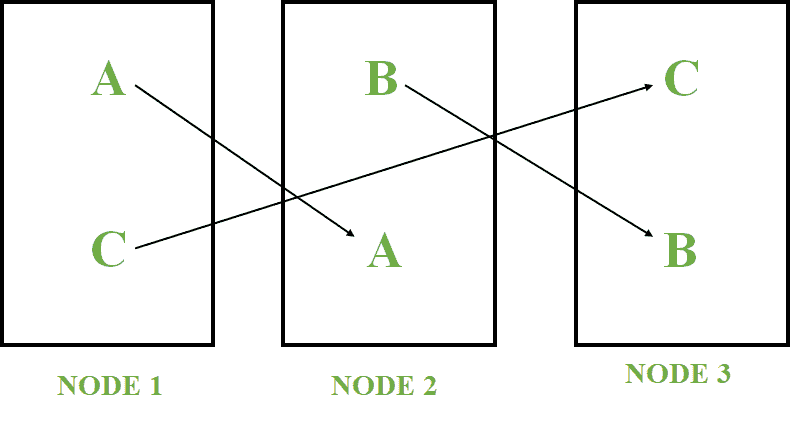

# 惠普 Vertica 的特点

> 原文:[https://www.geeksforgeeks.org/features-of-hp-vertica/](https://www.geeksforgeeks.org/features-of-hp-vertica/)

以下是**惠普 Vertica** 的特性，以及为什么您应该将它与传统的数据库管理系统分开使用。惠普 Vertica 是一款数据库产品，用于处理海量数据或大数据。它是为分析目的而构建的关系数据库管理系统。

**惠普 Vertica 的特点:**
如下:

1.  **列方向:**
    在 HP vertica 中，数据以列的形式存储，而不是以行的形式存储。数据列存储的主要原因是为了最大限度地减少读写操作，也为了更快地检索查询输出。
2.  **高级压缩:**
    编码和压缩技术用于优化查询性能和节省存储空间。查询性能并节省存储空间。编码是将数据转换成标准格式的过程。编码数据可由 Vertica 直接处理。

压缩是将数据转换成压缩格式的过程。Vertica 无法直接处理压缩数据。数据必须先解压缩。最常用的编码和压缩方法是游程编码(RLE)、Deltaval 编码和 LZO(基于莱姆佩尔-齐夫-奥伯胡默)压缩。

*   **High Availability:**
    Vertica is designed for high availability. High availability is the ability of the database to continue running even if a node goes down. If a node fails, a copy is available on one of the surviving nodes as shown below.

    

    Vertica 通过查询其他节点自动恢复丢失的数据。

    *   **Massive Parallel Processing:**
    Vertica is a shared nothing architecture, it allows each node in the cluster to work on its portion of database when running a query.

    公共网络是用来与外界交流的。专用网络用于节点内通信(查询计划、查询结果、数据加载)。

    我们可以连续实时地将数据加载到任何节点。通过让查询执行的一个节点发起者和其他节点作为执行者，请求将被平均分配和管理。

    *   **应用集成:**
    惠普垂直整合来自不同地点或不同数据源的数据，这就是所谓的应用集成。ETL(提取、转换和加载)工具用于从不同的数据库中提取数据，并将它们转换为标准形式，并将其放入另一个数据库存储库中。*   **Automatic Databases Design:**
    To efficiently design the databases automatically, HP vertica uses a tool known as the database designer. When data is loaded into vertica from a row-store data source, vertica transforms the data into column-based projections.

    投影不是在创建表时形成的，而是在最初将数据加载到数据库表时形成的。