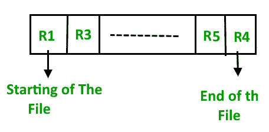
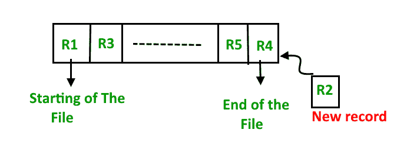
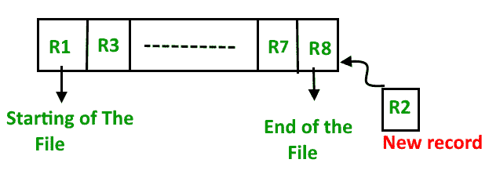
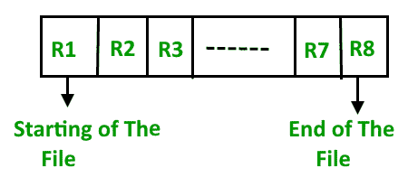
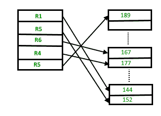
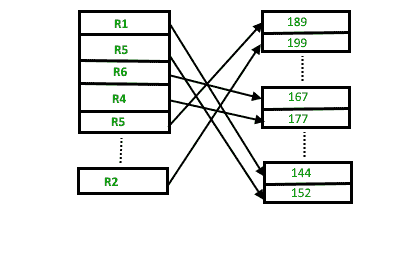

# DBMS 中的文件组织|集合 1

> 原文:[https://www . geesforgeks . org/file-organization-in-DBMS-set-1/](https://www.geeksforgeeks.org/file-organization-in-dbms-set-1/)

数据库由大量数据组成。数据被分组在关系数据库管理系统的一个表中，每个表都有相关的记录。用户可以看到数据是以表格的形式存储的，但实际上这种巨大的数据量是以文件的形式存储在物理内存中的。

**文件–**文件是记录在磁盘、磁盘表和光盘等二级存储上的相关信息的命名集合。

**什么是档案组织？**
文件组织是指构成文件的各种记录之间的逻辑关系，特别是在识别和访问任何特定记录的方式方面。简单来说，按照一定的顺序存储文件称为文件组织。**文件结构**指标签和数据块以及任何逻辑控制记录的格式。

### 文件组织的类型–

已经引入了各种方法来组织文件。基于访问或选择，这些特定方法有优点也有缺点。因此，程序员需要根据自己的需求来决定最适合的文件组织方法。
文件组织的一些类型有:

*   顺序文件组织
*   堆文件组织
*   哈希文件组织
*   B+树文件组织
*   集群文件组织

我们将在本文的后续部分讨论每种文件组织，以及每种文件组织方法的差异和优缺点。

### 顺序文件组织–

文件组织最简单的方法是顺序法。在这种方法中，文件以顺序方式一个接一个地存储。有两种方法可以实现此方法:

*   **堆文件方法–**这个方法很简单，我们按照顺序存储记录，也就是按照记录插入表中的顺序一个接一个地存储。

1.  **插入新记录–**
    让 R1、R3 等直到 R5 和 R4 成为序列中的四个记录。在这里，记录只不过是任何表中的一行。假设必须在序列中插入一条新记录 R2，那么它就被简单地放在文件的末尾。

*   **排序文件方法–**在该方法中，正如名称本身所暗示的，每当必须插入新记录时，总是以排序(升序或降序)的方式插入。记录的排序可以基于任何主键或任何其他键。

1.  **插入新记录–**
    让我们假设有一个预先存在的四个记录的排序序列 R1，R3，等等直到 R7 和 R8。假设必须在序列中插入一个新记录 R2，那么它将被插入到文件的末尾，然后它将对序列进行排序。

**顺序文件组织的优缺点–**
**优点–**

*   快速高效的海量数据处理方法。
*   设计简单。
*   文件可以很容易地存储在磁带上，即更便宜的存储机制。

**cons–**

*   时间浪费，因为我们不能跳到一个需要的特定记录上，但我们必须以一种需要时间的顺序方式前进。
*   排序文件方法效率低，因为它需要时间和空间来对记录进行排序。

### 堆文件组织–

堆文件组织使用数据块。在这种方法中，记录被插入到文件的末尾，数据块中。这种方法不需要排序或排序。如果一个数据块已满，新的记录就存储在另一个数据块中。这里，另一个数据块不必是下一个数据块，但它可以是存储器中的任何数据块。存储和管理新记录是数据库管理系统的责任。

**插入新记录–**
假设堆中有四条记录 R1、R5、R6、R4 和 R3，并且假设必须在堆中插入一条新记录 R2，因为最后一个数据块，即数据块 3 已满，它将被插入到 DBMS 选择的任何数据块中，比如数据块 1。

如果我们想在堆文件组织中搜索、删除或更新数据，我们将从文件的开头遍历数据，直到得到请求的记录。因此，如果数据库非常庞大，搜索、删除或更新记录将花费大量时间。

**堆文件组织的利弊–**
**利弊–**

*   提取和检索记录比顺序记录更快，但仅限于小型数据库。
*   当一次有大量数据需要加载到数据库中时，这种文件组织方法是最适合的。

**cons–**

*   未使用内存块的问题。
*   对于大型数据库来说效率低下。

读取下一个集合: [(DBMS 文件组织-集合 2) |在 DBMS 中散列](https://www.geeksforgeeks.org/hashing-in-dbms/)