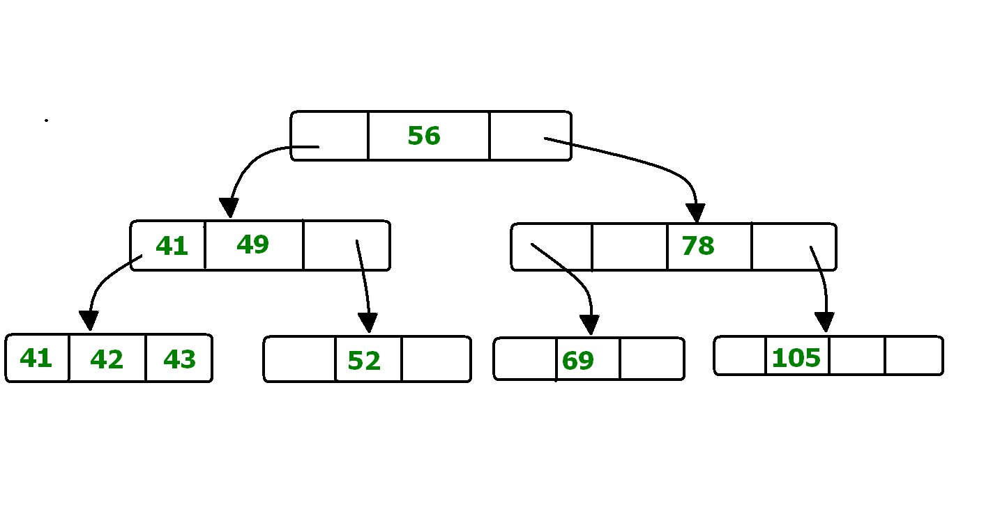
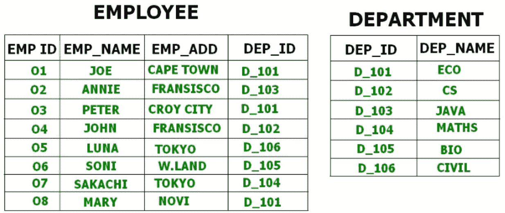
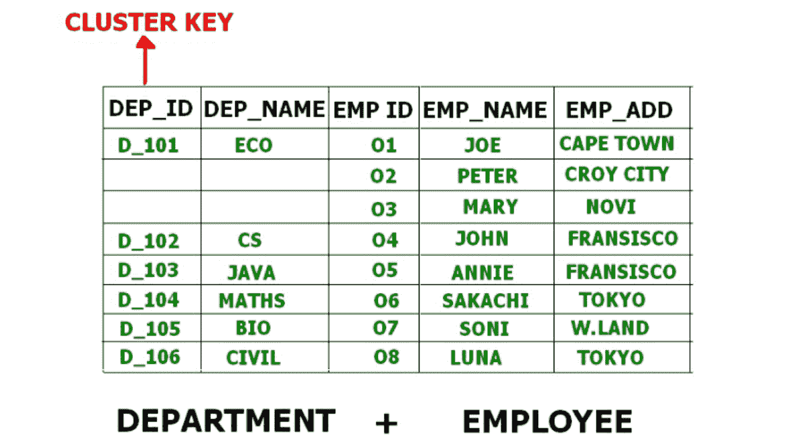

# 数据库管理系统中的文件组织|第 3 集

> 原文:[https://www . geesforgeks . org/file-organization-in-DBMS-set-3/](https://www.geeksforgeeks.org/file-organization-in-dbms-set-3/)

先决条件–[数据库管理系统|文件组织–集合 1](https://www.geeksforgeeks.org/dbms-file-organization-set-1/) 、[文件组织–集合 2](https://www.geeksforgeeks.org/hashing-in-dbms/)

### B+树文件组织–

B+ Tree，顾名思义，它使用树状结构将记录存储在文件中。它使用关键字索引的概念，其中主键用于对记录进行排序。对于每个主键，都会生成一个索引值，并与记录进行映射。记录的索引是文件中记录的地址。

B+ Tree 与二叉查找树非常相似，唯一的区别是它可以有两个以上的孩子，而不是只有两个。所有信息都存储在叶节点中，中间节点充当指向叶节点的指针。叶节点中的信息始终保持为排序的顺序链表。

在上图中，56 是根节点，也称为树的主节点。
这里的中间节点，只是由叶节点的地址组成。它们不包含任何实际记录。叶节点由实际记录组成。所有叶节点都是平衡的。

**b+树文件组织的优缺点–**

**优势–**

*   树遍历更容易更快。
*   搜索变得很容易，因为所有记录都只存储在叶节点中，并按顺序链表排序。
*   B+树大小没有限制。它可能会随着数据大小的增加/减少而增长/缩小。

**cons–**

*   静态表效率低。

### 集群文件组织–

在集群文件组织中，两个或更多相关表/记录存储在一个称为集群文件中。这些文件在同一个数据块中将有两个或多个表，用于将这些表映射在一起的关键属性只存储一次。

因此，它降低了在不同文件中搜索和检索各种记录的成本，因为它们现在被合并并保存在一个集群中。
例如，我们有两个表或关系“员工”和“部门”。这些表格相互关联。

因此，允许使用连接操作组合这些表，并可以在集群文件中看到这些表。

如果我们必须插入、更新或删除任何记录，我们可以直接这样做。数据根据主键或完成搜索的键进行排序。**簇键**是执行表连接的键。

**集群文件组织的类型–**有两种方法可以实现:

1.  **索引聚类–**
    在索引聚类中，记录根据聚类关键字分组并存储在一起。上面提到的员工和部门关系的示例是索引集群的示例，其中记录基于部门标识。
2.  **哈希簇–**
    这与索引簇非常相似，唯一的区别是，我们不是基于簇密钥存储记录，而是生成哈希键值，并用相同的哈希键值存储记录。