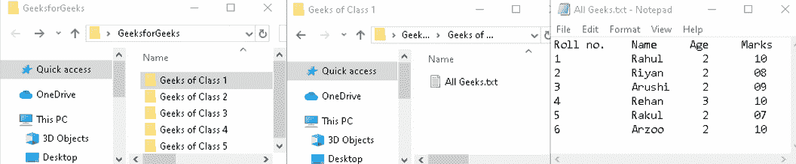

# 文件处理系统(FPS)

> 原文:[https://www.geeksforgeeks.org/file-processing-system-fps/](https://www.geeksforgeeks.org/file-processing-system-fps/)

在早期，数据是用纸和笔手工存储的，但在计算机被发现后，同样的任务可以用文件来完成。计算机**文件**是在计算机的存储设备中唯一记录数据的资源。有各种各样的数据存储格式。例如，文本文件可以存储在。txt 格式，而图片可以存储在。png 格式等。

对于计算机文件，关于数据(元数据)的数据可以存储在不同的行中，用空格、逗号或制表符分隔，以类似于表格。为了便于访问，每个文件都放在相关的文件夹中。这可以从下面记事本的截图中了解到。对于一所名为 GeeksforGeeks 的学校，有 1 到 5 个班级，数据可以通过以下方式存储在文件系统中。

**注–**
这里，学校 GeeksforGeeks 有几个班级，通过文件夹描述(1 班的 Geeks，2 班的 Geeks 等。).文件夹里有一些文件，上面有学生的详细资料。细节以表格形式存储，使用空格。

**文件处理系统:**
在计算机科学中，文件处理系统(FPS)是一种存储、检索和处理存在于各种文件中的数据的方式。

文件用于存储各种文档。所有文件都根据其类别进行分组。文件名相互之间有很大的关系，并且排列得当，以便于访问文件。在文件处理系统中，如果需要插入、删除、修改、存储或更新数据，必须知道文件的整个层次结构。

**文件处理系统优势:**

*   **成本友好–**
    文件处理系统的安装和使用费非常低，甚至没有。(在大多数情况下，免费工具内置于计算机中。)

*   **易于使用–**
    文件系统需要非常基本的学习和理解，因此可以轻松使用。

*   **高可扩展性–**
    用户可以根据自己的需要，非常轻松地从较小的文件切换到较大的文件。

**文件处理系统的缺点:**

*   **访问时间慢–**
    直接访问文件非常困难，需要知道文件夹的整个层次结构才能访问特定的文件。这需要很多时间。

*   **冗余数据的存在–**
    相同的数据可以存在于两个或多个文件中，这将占用更多的磁盘空间。

*   **数据不一致–**
    由于数据冗余，存储在不同位置的相同数据可能彼此不匹配。

*   **数据完整性问题–**
    数据库中的数据应该是一致和正确的。为了实现这一点，数据必须满足某些约束。

*   **恢复损坏数据的难度–**
    在文件处理系统的情况下，恢复或备份丢失和损坏的数据几乎是不可能的。

*   **缺乏原子性–**
    在数据库中执行的操作必须是原子性的，即操作要么作为一个整体发生，要么根本不发生。

*   **并发访问中的问题–**
    当多个用户同时操作数据库中的一个公共数据时，由于缺乏并发控制，就会出现异常。

**注–**
数据库管理系统(DBMS)用于消除 FPS 的缺点。