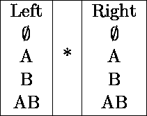
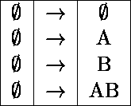
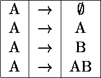
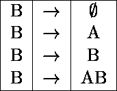
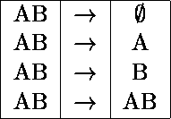

# 在关系中寻找附加的功能依赖关系

> 原文:[https://www . geesforgeks . org/find-additional-functional-dependencies-in-a-relationship/](https://www.geeksforgeeks.org/finding-additional-functional-dependencies-in-a-relation/)

[函数依赖关系](https://www.geeksforgeeks.org/functional-dependency-and-attribute-closure/)只是数据库中两组属性之间的一个约束。规范化中使用了函数依赖。函数依赖关系用箭头→表示。A 对 B 的功能依赖用 A → B 来表示，功能依赖对于发现数据库设计的好坏起着至关重要的作用。

```
A→B
```

上述函数依赖关系的发音为:

1.  坚定的 b
2.  功能确定的 b
3.  乙在功能上依赖于甲
4.  对于给定的 A 值，我们可以在函数上确定 b 的值。

a 和 B 可以是一组属性，它们不必总是单个属性。

```
Example : 
AB→B,  A→ ACB etc. 
```

在给定关系的情况下，根据数据库设计的语义，大多数情况下我们还会得到一组函数依赖。

最有趣的是，我们可以通过对给定的函数依赖关系应用一些规则来产生更多的**附加函数依赖关系**。

**例:**
用函数依赖 F 给出一个关系 R(AB){ A→B，B→A }。找出可从关系 r 上的给定函数依赖导出的附加函数依赖

**说明:**

**步骤-1:** 找出可能的函数依赖的集合:
假设函数依赖为 A→B，函数依赖在这里有左侧是 A，在这里有右侧是 B。
因此我们可以在任何一方拥有的有效属性如下:



因此，可能的函数依赖数= 4*4 = 16

**步骤 2:** 列出所有可能的函数依赖关系，关系 R 的两个属性 AB:

以下是关系 R 的 2 个属性 AB 的所有 16 个可能的函数依赖的列表:









**步骤 3:** 检查可能的功能依赖关系是否可导出:

在这一步中，我们通过使用属性的闭包集来检查可能的函数依赖是否可由给定的函数依赖集导出。

**φ→φ:**是可导的，因为它是一个微不足道的函数依赖。
**A→【φ:**可导，因为φ是 A 的子集
**A→A :** 可导，因为它是一个微不足道的函数依赖。
**A→B :** 可由给定的函数依赖关系 A→B 推导出来。
**A→AB :** 可由 A 的闭包集给出 AB 推导出来。
**B→**可导出，因为φ是 B 的子集
**B→A :** 可从给定的函数依赖关系 B→A.
**B→B :** 可导出，因为它是一个微不足道的函数依赖关系。
**B→AB :** 可导，因为 B 的闭包集给出了 AB。
**AB→【φ:**可推导，因为它是一个微不足道的函数依赖。
**AB→A :** 可推导，因为它是一个微不足道的函数依赖。
**AB→B :** 可推导，因为它是一个微不足道的函数依赖。
**AB→AB :** 可推导，因为它是一个微不足道的函数依赖。

其余可能的依赖关系无效。

因此，关系 R 上给定的函数依赖 A→B and B→A 可以确定的附加函数依赖总数为 13，包括 A→B，B→A 如下:

```
Φ→Φ, A→Φ, A→A, A→B, A→AB, B→Φ, B→A, B→B, B→AB, AB→Φ, AB→A, AB→B, AB→AB 
```