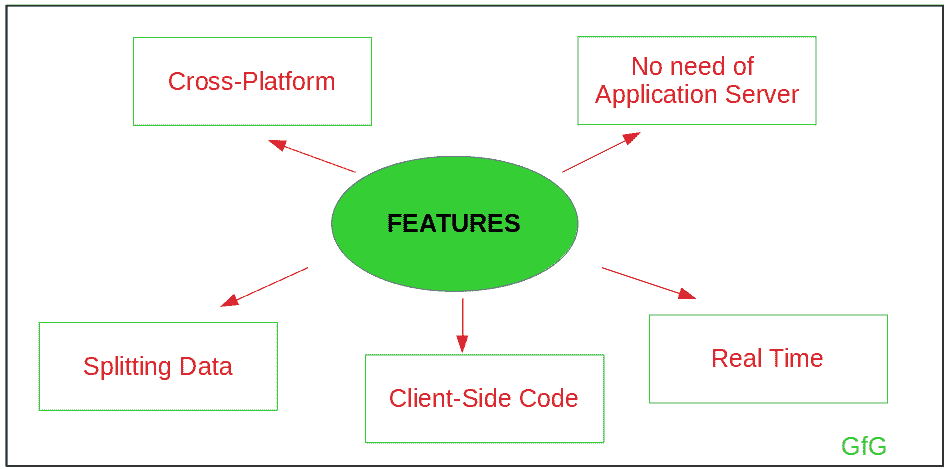
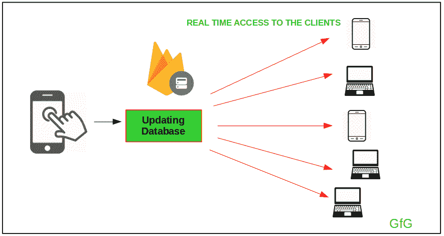
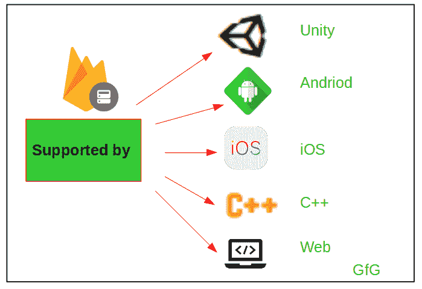
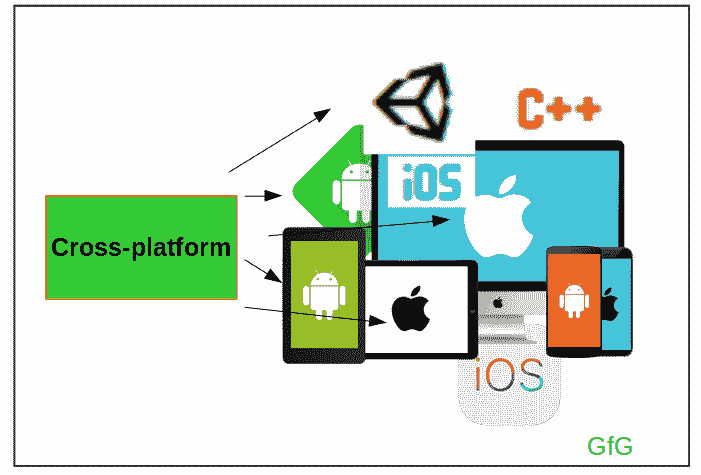
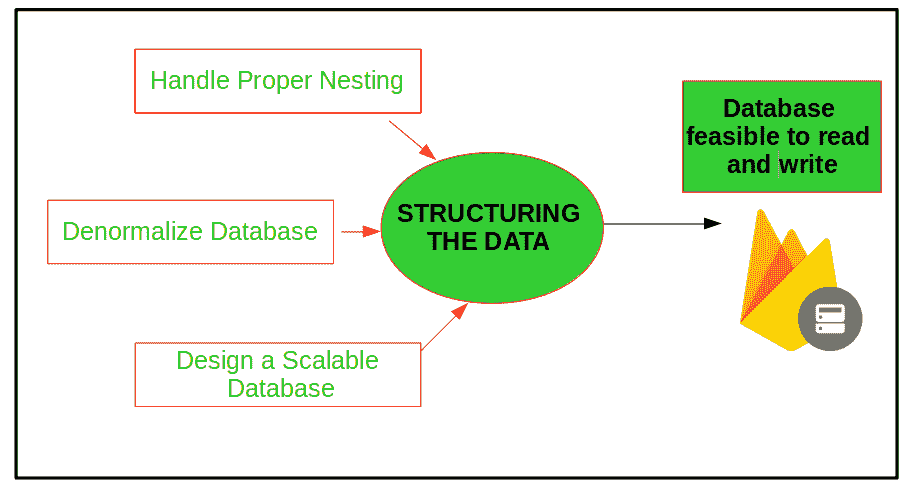
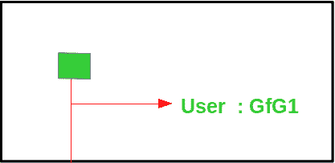
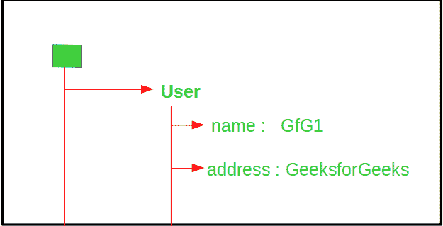

# 安卓操作的 Firebase 实时数据库示例

> 原文:[https://www . geeksforgeeks . org/firebase-real base-database-operations-in-Android-with-examples/](https://www.geeksforgeeks.org/firebase-realtime-database-with-operations-in-android-with-examples/)

**Firebase 实时数据库**是一个云托管的数据库，即它运行在云上，对用户的访问是作为服务提供的。它以 [JSON (Javascript 对象符号)](https://www.geeksforgeeks.org/javascript-json/)格式存储数据，这是一种存储或传输数据的格式。所有连接到它的用户都可以实时访问数据。

### <u>Firebase 实时数据库的特点？</u>

<u>T3】</u>

[](https://media.geeksforgeeks.org/wp-content/uploads/20190421131550/gfg211.png)

1.  **实时**:由于实时使用了数据同步，设备/客户端很快就会收到每一个更新。
    [](https://media.geeksforgeeks.org/wp-content/uploads/20190421141241/gfg53.png)
2.  **不需要应用服务器**:由于可以从移动设备或浏览器直接访问数据库，因此不需要应用服务器。
3.  **Support by various languages and platforms**:

    [](https://media.geeksforgeeks.org/wp-content/uploads/20190421135645/gfg43.png)

4.  **拆分数据**:客户端可以为同一个项目跨多个数据库实例拆分数据。
5.  **客户端代码**:数据安全的动态应用可以直接从客户端代码访问。
6.  **跨平台**:可以为安卓、iOS、Web、iOS 以及 JavaScript SDK 等各种平台搭建后端。
    [](https://media.geeksforgeeks.org/wp-content/uploads/20190421133645/gfg33.png)

### <u>构建实时数据库:</u>

Firebase 实时数据库将数据存储为一个大的 [JSON](https://www.geeksforgeeks.org/javascript-json/) 树。它容易存储简单的数据，但非结构化的分层数据难以组织。与 SQL 不同，这里没有表。

*   **什么是 JSON 树模型？**
    JSON 树模型的灵感来源于 JSON( JavaScript 对象符号)，用于表示 JSON 文档，该文档通常由内存中的键值对组成。
*   **为什么要结构化数据(这样做有什么好处)？**
    *   如果数据存储在格式良好的结构中，那么就很容易保存和检索。
    *   对结构化数据的查询变得很容易。
    *   以结构化格式引用数据变得可行。
*   **Key points to remember while structuring the data:**

    在向数据库中写入和读取数据之前，开发人员的主要目标应该是构建数据库的结构。
    [](https://media.geeksforgeeks.org/wp-content/uploads/20190423182443/gfg63.png)

    1.  **Consider the Nesting Limit:**
        The Nesting of the data should be done in a proper way such that it should be easy to read it using Listeners(Listeners are used to reading the data from the database). Avoid unnecessary nesting of levels in the database. Firebase also allows only 32 levels of Nesting.

        **例如:**

        ```
        // JSON Format Structuring Simple Example
        {
        "userinfo":
         {
          "a":
           {
            "name": "GfG1",
            "address":"GeeksForGeeksOne",
            "order_details":
            {
               "p1":
                   {
                    "product_id":"1",
                    "quantity":"5",
                    "price":"500",
                    "address_of_delivery":"xyz, abc, ..."
                   },

               "p2":
                   {
                    "product_id":"2",
                    "quantity":"10",
                    "price":"1000",
                    "address_of_delivery":"xyz2, abc, ..."
                   }

            }
          },

          "b":
           {
            "name": "GfG2",
            "address":"GeeksForGeeksTwo",
            "order_details":
            {
               "p1":
                   {
                    "product_id":"1",
                    "quantity":"12",
                    "price":"1500",
                    "address_of_delivery":"pqr, abc, ..."
                   },

               "p2":
                   {
                    "product_id":"2",
                    "quantity":"18",
                    "price":"1000",
                    "address_of_delivery":"pqr2, abc, ..."
                   }

            }
          }
          }
        }

        ```

        在这个例子中，检索用户名的数据是非常困难的，因为我们必须访问 users_info 的子节点，该子节点下载具有几 MB 大小的数据(在这个例子中，名称、orders_details、地址等被下载)。

    2.  **Design a Denormalized form of Data:**
        The Flattening of the data should be done correctly, means that data should be split into different parts without any ambiguity. This is generally referred to as denormalisation, where in order to improve read performance we develop redundancy in the data.

        **例如:**

        ```
        // JSON Format Example with Denormalized form for example in Point 1
        {
         "user_info":
            {
              "a":    
                 {
                "name": "GfG1",
                "address":"GeeksForGeeksOne"    
                 },

               "b":
                 {
                "name": "GfG2",
                "address":"GeeksForGeeksTwo"
                 }    
            },
         "order_details":
            {
             "a":
                {
                 "p1":
                  {
                    "product_id":"1",
                    "quantity":"5",
                    "price":"500",
                    "address_of_delivery":"xyz, abc, ..."
                   },    

                    "p2":
                 {
                    "product_id":"2",
                    "quantity":"10",
                    "price":"1000",
                    "address_of_delivery":"xyz2, abc, ..."
                 }    
                },
            "b":
               {
               "p1":
                   {
                    "product_id":"1",
                    "quantity":"12",
                    "price":"1500",
                    "address_of_delivery":"pqr, abc, ..."
                   },

               "p2":
                   {
                    "product_id":"2",
                    "quantity":"18",
                    "price":"1000",
                    "address_of_delivery":"pqr2, abc, ..."
                   }    

               }    
            }

        }

        ```

        在本例中，数据被拆分为 user_info 和 order_deatils。因此，数据的可访问性更快，因此不需要下载过大的不必要数据。这里，检索用户姓名的数据非常简单，因为我们必须访问 users_info 的子节点，该子节点只下载具有姓名和地址详细信息的数据，而不处理订单的详细信息。

    3.  **Create a structure which is Dynamic in Nature:**
        The structuring of the data should be such that it should be scalable. Sometimes in order to have easy accessibility of the data, duplication needs to be implemented in the database.

        **例如:**

        ```
        // JSON Format Example explaining the Scaling property
        {
         "student_info":
           {
            "1":
            {
              "name":"GfG1",
               "roll_no":"1",
               "exam_board":"abc"    
            },

            "2":
            {
              "name":"GfG2",
               "roll_no":"2",
               "exam_board":"pqr"    
            },

            "3":
            {
               "name":"GfG3",
               "roll_no":"3",
               "exam_board":"abc"    
            }
           },

         "board_info":
           {
            "abc":
                 {    
                "student_names":
                       {
                      "GfG1":true,
                      "GfG2":false,
                      "GfG3":true    
                       }    
                 },

            "pqr":
                 {    
                "student_names":
                       {
                      "GfG1":false,
                      "GfG2":true,
                      "GfG3":false    
                       }    
                 }
           }

        }

        ```

        在上面的例子中，为了方便地访问数据库，板的名称存储在每个学生的信息中，并且板信息存储学生的姓名和他拥有的板。如果我们没有将数据存储在板信息下，那么就很难收集拥有特定板的学生的姓名。

### <u>将数据写入/插入 Firebase 实时数据库</u>

将数据写入 Firebase 是一项非常简单的任务。但是在将数据写入/插入实时数据库之前，应该完成数据的**结构化。将数据插入或写入 Firebase 实时数据库是在安卓系统中使用功能**设置值()**完成的。将数据插入 Firebase 实时数据库可以被视为 CRUD 操作之一。**

**设定值():**该功能用于:

*   替换引用位置的数据
*   如果引用位置没有数据，则直接在该位置写入数据

可以传递给它的值/类型有:

*   [弦](https://www.geeksforgeeks.org/strings-in-java/)
*   [地图](https://www.geeksforgeeks.org/map-interface-java-examples/)
*   [列表](https://www.geeksforgeeks.org/list-interface-java-examples/)
*   [加倍](https://www.geeksforgeeks.org/java-lang-double-class-java/)
*   [布尔](https://www.geeksforgeeks.org/java-lang-boolean-class-java/)
*   [长](https://www.geeksforgeeks.org/java-lang-long-class-in-java/)
*   [自定义对象](https://www.geeksforgeeks.org/classes-objects-java/):这里需要考虑的是，具有默认构造函数的自定义对象也可以作为参数传递给函数。

**将数据写入/插入 Firebase 实时数据库的步骤:**
考虑我们必须将用户的**名称**存储到数据库中

1.  **创建数据库参考:**

    ```
    // Consider that we have to store
    // this in the database

    String name = "GfG1" ;

    ```

2.  **使用子()函数找到要存储值的数据的引用:**

    ```
    // Create an object of Firebase Database Reference

    DatabaseReference reference;
    reference = FirebaseDatabase.getInstance().getReference();  

    ```

3.  **Use the referenced object and setValue() function with the value to be stored as an argument to it in order to write the data:**

    ```
    //Inserts the data to the database

    reference.child("user").setValue(name); 

    ```

    **输出:**
    [](https://media.geeksforgeeks.org/wp-content/uploads/20190423195758/gfg72.png)

**示例 2:** 让我们考虑另一个将**用户定义对象**存储到数据库的示例

*   **第一步:**

    ```
    // Create a class User

    class User
    {
        String name;
        String address;

         User()
         {
             name = "";
             address = "";
         }

         User(String name, String address)
         {
            this.name = name;
            this.address = address;
         }

    } 

    ```

*   **第二步:**

    ```
    // Create a user-defined object

    User user1 = new User("GfG1", "GeeksForGeeks");

    ```

*   **STEP 3:**

    ```
    // Create an object of Firebase Database Reference

    DatabaseReference reference ;
    reference = FirebaseDatabase.getInstance().getReference();  

    // Insert the user-defined object to the database 

    reference.child("user").setValue(user1); 

    ```

    **输出:**
    [](https://media.geeksforgeeks.org/wp-content/uploads/20190423200625/gfg92.png)