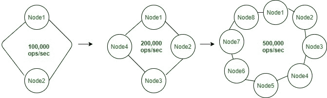

# 阿帕奇卡珊德拉的五大好处

> 原文:[https://www . geesforgeks . org/五大优势-apache-cassandra/](https://www.geeksforgeeks.org/five-main-benefits-of-apache-cassandra/)

在本文中，我们将讨论 Apache Cassandra 的 5 个主要优势，其中可扩展性、高可用性、高容错性、高性能、多数据中心和混合云支持是主要因素。

先决条件–[阿帕奇卡珊德拉简介](https://www.geeksforgeeks.org/introduction-to-apache-cassandra/)

1.  **Scalability :**
    In Cassandra, If a system will be scalable then your business would not miss out on opportunities during heavily trafficked periods.

    **示例–**
    假设您有一个电子商务网站，并且您的业务在线，但是如果由于许多用户同时涌入该网站，甚至出现一分钟的中断，将会给您的业务带来巨大的金钱损失。Cassandra 帮助您使您的系统可扩展。所以，这就是为什么可伸缩性很重要。

    

    
**Figure –** Scalability

2.  **High Availability :**
    In Cassandra, High Availability via data replication at the different-different location and on different data centers which gives the high availability.

    该架构是对等的，也是无主架构，意味着每个节点都可以执行读写操作。这使得数据能够跨数据中心和地理位置快速复制。

    **示例–**
    如果您的数据及其副本位于不同的位置和不同的中心，那么如果一个数据中心发生故障，但您的系统可用，并且可以从不同的位置和不同的数据中心进行访问。

3.  **高容错:**
    在 Cassandra 中，无主控、对等的架构和数据复制功能，当节点离线时，应用程序永远不会变慢或失败。
    在 Cassandra 中，节点发生故障时不需要任何人工干预。在 Cassandra 中，容错是自动的，因为数据的副本在不同的节点上可用，如果一个节点发生故障，则可以从另一个节点访问数据。
4.  **高性能:**
    在卡珊德拉，高性能是主要因素之一。当我们谈论高性能时，更具体地说，我们可以说速度很重要。例如，餐馆的服务、包裹的快速送达以及我们应用程序的零延迟。
5.  **多数据中心和混合云支持:**
    在卡珊德拉，你可以访问多个数据中心，也可以使用混合云支持。而 Cassandra 被设计为一个分布式系统，用于跨多个数据中心部署大量节点。

**key to multi-data center deployment :**

*   **N 复制因子和副本放置策略–**
    在 Cassandra 中，您可以定义网络拓扑策略，该策略能够在数据中心和机架级别精细调整副本的数量和位置。
*   **N 飞贼–**
    在 Cassandra 中，对于多数据中心部署，您需要通过自动检测(机架推断飞贼)或在属性文件(属性文件飞贼)中指定的详细信息，确保飞贼拥有完整准确的网络信息。
*   **N 一致性级别–**
    在 Cassandra 中，为具有多个数据中心的场景专门设计的一致性级别。