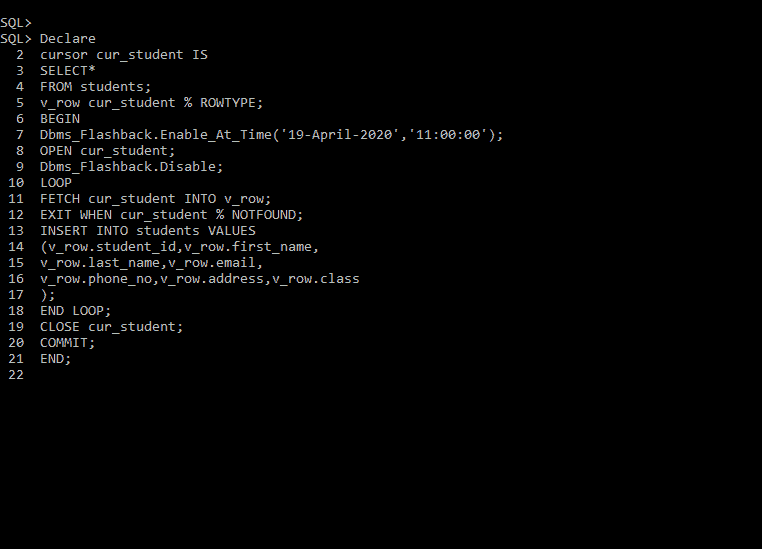

# 闪回查询

> 原文:[https://www.geeksforgeeks.org/flashback-queries/](https://www.geeksforgeeks.org/flashback-queries/)

**闪回查询**允许用户查看过去的数据，如果用户正在删除某些数据或表，那么闪回查询为我们提供了一个再次查看该数据并对其执行操作的机会。

在闪回查询中，我们有一个闪回区的概念，在闪回区中，我们存储已删除的数据，以便将来需要时查看。

要使用闪回查询功能，我们的服务器必须根据自动撤消管理进行配置。如果我们的系统支持传统的回滚方法，那么我们就不能在这样的系统上执行闪回查询。

我们可以使用包 DBMS_FLASHBACK 来启用闪回查询。该软件包使我们能够通过指定系统更改号或过去的确切时间来查看过去的数据。

**如何使用 DBMS_FLASHBACK :**

```
EXECUTE Dbms_Flashback.Enable_At_System_Change_Number(647392649);
EXECUTE Dbms_Flashback.Enable_At_Time('19-APR-2020 11:00:00); 
```

**闪回查询示例:**
如果我们想查看一个被误删的过去数据。数据由学生表组成，将于 2020 年 4 月 19 日上午 11:05 删除。要访问数据，我们可以使用闪回查询，要么给出确切的时间，要么提到系统更改号。



**限制闪回查询:**

1.  闪回查询仅适用于支持自动撤消管理的系统。
2.  具有传统回滚方法的系统不支持闪回查询。
3.  在执行闪回查询时，我们不能使用 DDL(数据定义语言)或 DML(数据操作语言)。
4.  闪回查询不会反转 DDL(数据定义语言)命令。
5.  闪回查询可以在 DDL(数据定义语言)命令中执行操作。
6.  我们不能对函数、包、过程和触发器应用闪回查询。