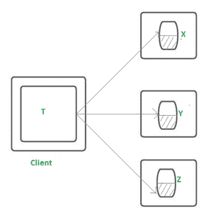
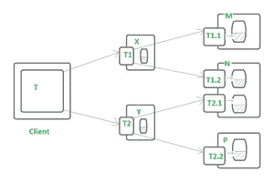
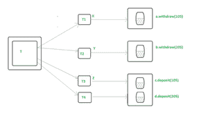

# 平面&嵌套分布式事务

> 原文:[https://www . geesforgeks . org/flat-nested-distributed-transactions/](https://www.geeksforgeeks.org/flat-nested-distributed-transactions/)

**简介:**
事务是一系列必须以符合 ACID 的方式完成的对象操作。

*   [**【原子性】**](https://www.geeksforgeeks.org/acid-properties-in-dbms/)**—**
    交易完全完成或根本不完成。
*   [**【一致性】**](https://www.geeksforgeeks.org/acid-properties-in-dbms/)**–**
    是指从一种一致状态过渡到另一种一致状态的术语。
*   [**隔离**](https://www.geeksforgeeks.org/acid-properties-in-dbms/)**–**
    与其他交易分开进行。
*   [**耐久–**](https://www.geeksforgeeks.org/acid-properties-in-dbms/) **一旦完成，则持久。**

**[**交易–命令**](https://www.geeksforgeeks.org/sql-transactions/#:~:text=SET%20TRANSACTION%20%5B%20READ%20WRITE%20%7C%20READ,last%20COMMIT%20or%20ROLLBACK%20command.) **:****

*   ****开始–**
    发起新交易。**
*   ****提交–**
    结束事务，并保存事务期间所做的更改。此外，它还允许其他事务看到您所做的修改。**
*   ****中止–**
    结束事务，事务期间所做的所有更改都将被撤消。**

****分配各种角色成功运行事务:****

*   ****客户–**
    交易由客户发出。**
*   ****协调器–**
    整个事务的执行由其控制(处理开始、提交&中止)。**
*   ****服务器–**
    每个访问或修改资源的组件都受到事务控制。事务服务器必须知道协调器。事务服务器向协调器注册其在事务中的参与。**

**访问由不同服务器处理的对象的平面或嵌套事务被称为分布式事务。
当分布式事务到达其末端时，为了维护事务的原子性属性，事务中涉及的所有服务器必须提交事务或中止事务。
为了做到这一点，其中一台服务器承担了协调器的工作，这需要确保所有服务器获得相同的结果。
协调器完成此任务的方法由所选协议决定。最广泛使用的协议是[“两阶段提交协议](https://www.geeksforgeeks.org/two-phase-commit-protocol-distributed-transaction-management/)”该协议使服务器能够相互通信，以便共同决定是提交还是中止整个事务。**

****Flat &嵌套分布式事务:**
如果一个客户端事务在多台服务器上调用动作，则称其是分布式的。分布式事务可以用两种不同的方式构建:**

1.  **平面交易**
2.  **嵌套事务**

****平面事务:**
平面事务只有一个起始点(开始)和一个结束点(提交或中止)。它们通常非常简单，通常用于短期活动，而不是大型活动。
一个客户端在一个平面事务中向多个服务器发出请求。例如，事务 T 是一个平面事务，它对服务器 X、Y 和 z 中的对象执行操作。
在继续下一个请求之前，一个平面客户端事务完成前一个请求。因此，每个事务都按顺序访问服务器对象。
当服务器利用锁定时，事务一次只能等待一个对象。**

**

平面交易** 

****单一交易的限制:****

*   **一旦发生事故，所有的工作都会丢失。**
*   **一次只能使用一个数据库管理系统。**
*   **不可能部分回滚。**

****嵌套事务:**
在其起始点和结束点包含其他事务的事务称为嵌套事务。所以事务的嵌套是在一个事务中完成的。这里的嵌套事务称为子事务。
嵌套事务中的顶层事务可以打开子事务，每个子事务可以打开更多的子事务，直至任何嵌套深度。
一个客户端的事务 T 打开两个子事务，T1 和 T2，访问服务器 X 和 Y 上的对象，如下图所示。
访问服务器 M、N 和 P 上的对象的 T1.1、T1.2、T2.1 和 T2.2 由子事务 T1 和 T2 打开。**

**

嵌套事务** 

**子事务的并发执行是在嵌套事务策略的同一级别完成的。在上图中，T1 和 T2 调用不同服务器上的对象，因此它们可以并行运行，因此是并发的。
T1.1、T1.2、T2.1、T2.2 是四个子交易。这些子事务也可以并行运行。**

**考虑一个分布式事务，其中客户转移:**

*   **卢比 105 从账户 A 转到账户 C**
*   **随后，Rs。205 从 B 账户转到 d 账户。**

**它可以被认为是:**

```
Transaction T :
Start
Transfer Rs 105 from A to C : 
Deduct Rs 105 from A(withdraw from A) & Add Rs 105 to C(depopsit to C)
Transfer Rs 205 from B to D : 
Deduct Rs 205 from B (withdraw from B)& Add Rs 205 to D(depopsit to D)
End
```

****假设:****

1.  **帐户 A 在服务器 X 上**
2.  **帐户 B 在服务器 Y 上，并且**
3.  **帐户 C 和 D 在服务器 z 上。**

**交易涉及四个请求——两个存款请求和两个取款请求。现在它们可以被视为事务 T 的子事务(T1、T2、T3、T4)
如下图所示，事务 T 被设计为一组四个嵌套事务:T1、T2、T3 和 T4。**

****优势:**
性能高于顺序调用四个操作的单个事务。**

**

嵌套事务** 

**因此，交易可以分为以下子交易:**

```
//Start the  Transaction
T = open transaction
//T1
openSubtransaction
a.withdraw(105);
//T2
openSubtransaction
b.withdraw(205);
//T3
openSubtransaction
c.deposit(105);
//T4
openSubtransaction
d.deposit(205);
//End the trsnaction
close Transaction
```

****协调者的角色:**
当分布式事务提交时，为了适当的协调，参与事务执行的服务器必须能够相互通信。
当客户端发起一个事务时，一个“openTransaction”请求被发送到任何一个协调服务器。被联系的协调器执行“开放事务”，并将事务标识符返回给客户端。**

**分布式事务标识符在分布式系统中必须是唯一的。
一个简单的方法是生成一个包含两部分的 TID——创建它的服务器的‘服务器标识符’(例如:IP 地址)和该服务器唯一的号码。
发起事务的协调器成为分布式事务的协调器，负责中止或提交事务。**

**管理事务访问的对象的每个服务器都是事务的参与者&提供一个我们称之为*参与者*的对象。参与者负责与协调员一起完成提交过程。**

**协调员每次都会在参与者列表中记录新的参与者。每个参与者都认识协调者&协调者认识所有的参与者。这使他们能够收集提交时所需的信息，从而协调工作。**