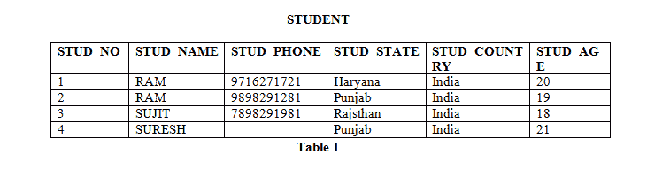

# 功能依赖和属性闭包

> 原文:[https://www . geesforgeks . org/functional-dependency-and-attribute-closure/](https://www.geeksforgeeks.org/functional-dependency-and-attribute-closure/)

**功能依赖**

如果具有相同属性 A 值的两个元组也具有相同属性 B 值，则关系中的函数依赖 A->B 成立。例如，在表 1 所示的关系 STUDENT 中，函数依赖

```
STUD_NO->STUD_NAME, STUD_NO->STUD_PHONE hold
```

但是

```
STUD_NAME->STUD_ADDR do not hold
```

[](https://media.geeksforgeeks.org/wp-content/uploads/image23.png)

**如何找到一个关系的函数依赖关系？**

关系中的函数依赖关系依赖于关系的域。考虑表 1 中给出的学生关系。

*   我们知道 STUD_NO 对每个学生来说都是独一无二的。所以梭哈 _NO->梭哈 _NAME，梭哈 _NO->梭哈 _PHONE，梭哈 _NO->梭哈 _STATE，梭哈 _NO->梭哈 _COUNTRY 和梭哈 _NO ->梭哈 _AGE 都将为真。
*   同样，如果两个记录具有相同的梭哈状态，那么梭哈状态->梭哈国家将为真，它们也将具有相同的梭哈国家。
*   对于关系学生 _ 课程，课程 _ 编号->课程 _ 名称将为真，因为具有相同课程 _ 编号的两个记录将具有相同的课程 _ 名称。

**功能依赖集:**关系的功能依赖集或 FD 集是关系中存在的所有 FD 的集合。例如，表 1 中所示的关系学生的功能描述集为:

```
 { STUD_NO->STUD_NAME, STUD_NO->STUD_PHONE, STUD_NO->STUD_STATE, STUD_NO->STUD_COUNTRY, 
  STUD_NO -> STUD_AGE, STUD_STATE->STUD_COUNTRY }
```

 **属性闭包:**属性集的属性闭包可以定义为一组属性，这些属性可以由属性集在功能上确定。

**如何找到一个属性集的属性闭包？**
要查找属性集的属性闭包:

*   将属性集的元素添加到结果集中。
*   递归地向结果集添加元素，这些元素可以从结果集的元素中确定。

使用表 1 的 FD 集，属性闭包可以确定为:

```
(STUD_NO)+ = {STUD_NO, STUD_NAME, STUD_PHONE, STUD_STATE, STUD_COUNTRY, STUD_AGE}
(STUD_STATE)+ = {STUD_STATE, STUD_COUNTRY}
```

**如何利用属性闭包找到候选键和超级键？**

*   如果属性集的属性闭包包含关系的所有属性，则属性集将是关系的超级键。
*   如果该属性集的任何子集都不能在功能上确定关系的所有属性，则该集也将是候选关键字。例如，使用表 1 的 FD 集，

(梭哈 _ 编号，梭哈 _ 名称)+= {梭哈 _ 编号，梭哈 _ 名称，梭哈 _ 电话，梭哈 _ 状态，梭哈 _ 国家，梭哈 _ 年龄}

(螺柱编号)+= {螺柱编号，螺柱名称，螺柱电话，螺柱状态，螺柱国家，螺柱年龄}

(STUD_NO，STUD_NAME)将是超级键，但不是候选键，因为它的子集(STUD_NO)+等于关系的所有属性。所以，STUD_NO 将是一个候选键。

**GATE 问题:考虑关系方案 R = {E，F，G，H，I，J，K，L，M，M}以及 R 上的函数依赖集{{E，F} - > {G}、{F} - > {I，J}、{E，H} - > {K，L}、K - > {M}、L - > {N}，R 的关键是什么？(GATE-CS-2014)**T2【a . { E，F}
B. {E，F，H}
C. {E，F，H，K，L}
D. {E}

**答案:**找到所有给定选项的属性闭包，我们得到:
{E，F}+ = {EFGIJ}
{E，F，H}+ = {EFHGIJKLMN}
{E，F，H，K，L }+= { { EFHGIJKLMN } }
{ E }+= { E }
{ EFH }+和{EFHKL}+结果集所有属性，但 EFH 最小。所以这将是候选键。所以正确的选项是(B)。

**如何检查一个 FD 是否可以从给定的 FD 集合中导出？**

要检查 FD A->B 是否可以从 FD 集合 F 中导出，

1.  用 FD 集 f 求(A)+值。
2.  如果 B 是(A)+，那么 A->B 为真，否则不为真。

**GATE 问题:在具有属性 A、B、C、D 和 E 的模式中，给出了以下一组功能依赖关系**
**{A - > B、A - > C、CD - > E、B - > D、E - > A}**
**以上一组不暗示以下哪一个功能依赖关系？(GATE IT 2005)**T8 a . CD->AC
b . BD->CD
c . BC->CD
d . AC->BC

**回答:**使用问题中给出的 FD 集，
(CD)+ = {CDEAB}表示 CD - > AC 也成立。
(BD)+ = {BD}意思是 BD - > CD 装不下真。所以这个 FD 在 FD 集合中没有隐含。所以(B)是必选项。
其他可以用同样的方法检查。

**质数和非质数属性**

属于任何候选关系键的属性称为主属性，其他属性是非主属性。比如 STUDENT 关系中的 STUD_NO 是素属性，其他都是非素属性。

**GATE 问题:考虑一个关系方案 R = (A，B，C，D，E，H)，以下函数依赖项在该关系方案上保持:{ A–>B，BC–>D，E–>C，D–>A }。R 的候选键有哪些？【GATE 2005】**
(a)AE，BE
(b) AE，BE，DE
(c) AEH，BEH，BCH
(d) AEH，BEH，DEH

**回答:** (AE)+ = {ABECD}不是所有属性的集合。所以 AE 不是候选键。因此，选项 A 和 B 是错误的。
(AEH)+= { ABCDHE }
(BEH)+= { BEHDA }
(BCH)+= { BCHDA }不是所有属性的集合。所以 BCH 不是候选人关键。因此，选项 C 是错误的。
所以正确答案是 d。

本文由 **Sonal Tuteja** 供稿。如果你喜欢 GeeksforGeeks 并想投稿，你也可以使用[contribute.geeksforgeeks.org](http://www.contribute.geeksforgeeks.org)写一篇文章或者把你的文章邮寄到 contribute@geeksforgeeks.org。看到你的文章出现在极客博客主页上，帮助其他极客。

如果你发现任何不正确的地方，或者你想分享更多关于上面讨论的话题的信息，请写评论。