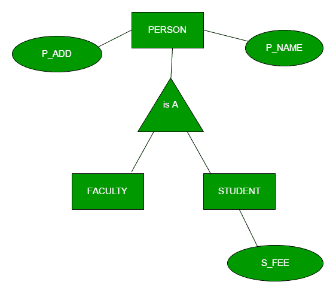
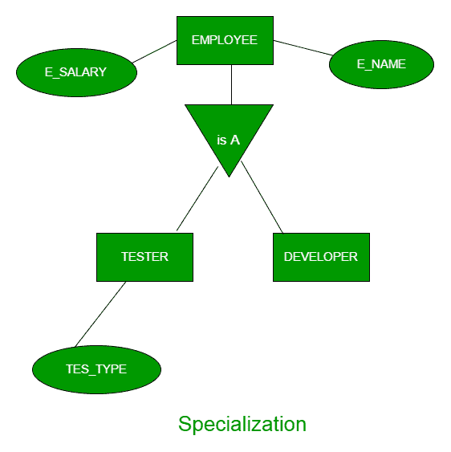
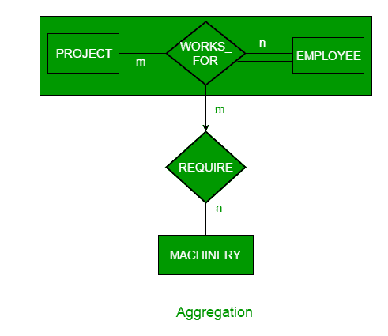

# ER 模型中的泛化、特化和聚合

> 原文:[https://www . geesforgeks . org/generalization-specification-and-aggregation-in-er-model/](https://www.geeksforgeeks.org/generalization-specialization-and-aggregation-in-er-model/)

**先决条件–**[ER 模型介绍](http://gdevtest.geeksforgeeks.org/database-management-system-er-model/)
ER 模型中的泛化、特化、聚合用于数据抽象，其中抽象机制用于隐藏一组对象的细节。

**泛化–**
泛化是从一组实体中提取公共属性并从中创建广义实体的过程。这是一种自下而上的方法，在这种方法中，如果两个或多个实体有一些共同的属性，它们可以被推广到更高级别的实体。例如，STUDENT 和 FACULTY 可以被推广到一个更高层次的实体，叫做 PERSON，如图 1 所示。在这种情况下，像 P_NAME、P_ADD 这样的公共属性成为更高实体(PERSON)的一部分，而像 S_FEE 这样的专用属性成为专用实体(STUDENT)的一部分。

**特殊化–**
在特殊化中，一个实体根据其特征被划分为子实体。这是一种自上而下的方法，其中较高级别的实体被专门化为两个或更多较低级别的实体。例如，雇员管理系统中的雇员实体可以专门分为开发人员、测试人员等。如图 2 所示。在这种情况下，常见的属性如 E_NAME、E_SAL 等。成为更高实体(EMPLOYEE)的一部分，像 TES_TYPE 这样的专用属性成为专用实体(TESTER)的一部分。

**聚合–**
ER 图不能表示实体和关系之间的关系，这在某些场景中可能是必需的。在这些情况下，与其对应实体的关系被聚合成更高级别的实体。聚合是一种抽象，通过它我们可以将关系表示为更高级别的实体集。

例如，为项目工作的员工可能需要一些机器。因此，需要在关系工程和实体机械之间建立需求关系。使用聚合，WORKS_FOR 与其实体 EMPLOYEE 和 PROJECT 的关系被聚合为单个实体，并且在聚合的实体和 MACHINERY 之间创建关系 REQUIRE。

**通过模式表示聚合–**

要表示聚合，请创建包含以下内容的架构:

1.  聚合关系的主键
2.  关联实体集的主键
3.  描述性属性(如果存在)。

本文由 **Sonal Tuteja** 供稿。如果你喜欢 GeeksforGeeks 并想投稿，你也可以使用[contribute.geeksforgeeks.org](http://contribute.geeksforgeeks.org)写一篇文章或者把你的文章邮寄到 contribute@geeksforgeeks.org。看到你的文章出现在极客博客主页上，帮助其他极客。

如果你发现任何不正确的地方，或者你想分享更多关于上面讨论的话题的信息，请写评论。