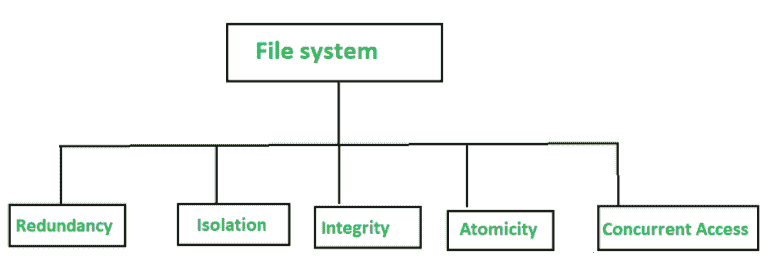

# 数据库管理系统入门

> 原文:[https://www . geesforgeks . org/入门数据库管理系统/](https://www.geeksforgeeks.org/getting-started-with-database-management-system/)

**[数据库管理系统(DBMS)](https://www.geeksforgeeks.org/dbms/)** 是一组相互关联的数据和一组访问这些数据的程序的集合。数据的集合称为数据库，其中包含企业的相关信息。数据库系统的主要目的是为用户提供数据的抽象视图，这意味着系统隐藏了数据如何存储和维护的某些细节。

**数据库管理系统的目的:**
将组织信息保存在文件处理系统中有主要缺点，为了克服这些问题，使用了数据库管理系统。下图显示了文件处理系统中的问题类型。

1.  **数据冗余:**
    长期以来，不同的程序员创建的文件具有不同的结构，程序可能由不同的程序员用不同的语言编写。

例如，如果一个学生选择两个科目(音乐和数学)，同一学生的地址和电话号码会出现在由数学系和音乐系学生记录组成的文件中。现在，如果一个学生在音乐系更改了他的电话号码，那么这些更改不会反映在数学系的记录中，这将导致数据重复和数据冗余，还会导致数据不一致。因为同一个学生在两个系有不同的记录。

*   **数据隔离:**
    在文件处理系统中，数据分散在不同的文件中，如果文件的格式不同，那么编写用于检索数据的应用程序是困难的，因为访问不同格式的文件来编写程序既耗时又困难。*   **Integrity Problems :**
    Suppose the university maintains the account for each department and records the balance amount in each department and keeps the constraints that account should not fall below the specified value now developers add the code for enforcing this constraint in various application programs.

    现在，当以后添加其他约束时，就很难在各种程序中实施约束。所以，当来自不同文件的几个数据项的约束不同时，就会导致完整性问题。

    *   **Atomicity Problem :**
    Suppose a program to transfer 500$ from the account department A to the account of department B, now if a system failure occurs during the execution of the program there is possibility that the $500 was removed from the account of department A but has been not credited to the account of department B which lead to inconsistent database state.

    因此，传输必须是原子性的，即借方和贷方要么全部发生，要么都不发生，因此在文件处理系统中保持原子性是困难的。

    *   **Concurrent access anomalies :**
    For the sake of overall performance of the system and faster response, many systems allow multiple users to update the data simultaneously.

    例如，考虑账户余额为 10000 美元的 A 部门。如果两个部门职员几乎同时分别借记部门账户余额 400 美元和 300 美元，并行执行的结果可能会使预算处于不正确的状态。因此，使用文件系统可能会导致数据状态不一致。

    **数据库系统应用:**

    **1。企业信息:**

    *   **销售–**
        获取客户、产品和购买信息。
    *   **会计–**
        用于支付、收款、账户余额等会计信息。
    *   **人力资源–**
        了解员工、工资、工资税和福利的信息。

    **2。银行和金融:**

    *   **信用卡交易–**
        用于信用卡购物和生成月结单。
    *   **银行业务–**
        获取客户信息、账户、贷款和银行交易。

    **3。大学:**

    *   学生信息。
    *   课程注册。
    *   标准企业信息，如人力资源和会计，如费用存款和会费明细。

    **4。电信:**

    *   记录通话记录。
    *   用于生成每月账单。
    *   用于存储关于通信网络的信息