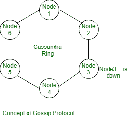

# 卡珊德拉八卦协议

> 原文:[https://www.geeksforgeeks.org/gossip-protocol-in-cassandra/](https://www.geeksforgeeks.org/gossip-protocol-in-cassandra/)

在本文中，我们将简要地看一下在 [Apache Cassandra](https://www.geeksforgeeks.org/apache-cassandra-nosql-database/) 数据库中实现的流言协议。在本文中，我们将讨论 Gossip 协议以及 Cassandra 如何实现节点之间的协调以及节点如何保持同步。

在 Cassandra 中，所有节点都是相同的，并且具有对等架构，不存在主从节点的概念。在 Cassandra 中，所有节点都通过流言协议相互通信。流言是卡珊德拉节点用来使他们的数据相互一致的消息系统。

**什么是八卦协议？**
流言是 Cassandra 节点的消息系统，虚拟节点用于使它们的数据彼此一致，并用于强制集群中的复制因子。因此，让我们将 Cassandra 集群想象成一个环形系统，其中每个节点包含数据库中每个表的特定分区。并且，只能与相邻节点通信。

**卡珊德拉如何实现节点间的协调？**
让我们考虑一个集群中有 6 个节点的例子。一、二、三、四、五、六，你可以看到三号节点已经关闭。所以，有一个问题，卡珊德拉在这种情况下会怎么表现。因此，流言是一种对等通信协议，在这种协议中，节点定期交换关于他们自己和他们知道的其他节点的状态信息。

流言协议每秒运行一次，与集群中最多三个其他节点交换状态消息。
在 Cassandra 中，Gossip 协议非常有用，因为节点之间会交换关于自己和其他被他们说闲话的节点的信息，所以所有节点都可以快速了解集群中的其他节点。

**节点如何保持同步？**
如果任何节点发生故障，八卦协议就是这样工作的。让我们讨论一下流言协议的定义。流言消息有一个相关的版本，因此在流言交换期间，其他信息会被特定节点的最新状态覆盖。

当我们有四个节点的法定人数和两个节点不麻烦时，我们可以分割。当网络恢复时，我们又有了一个由六个节点组成的集群，所以一切都连接起来了。然后，我们需要对这两个节点中的状态做一些事情。因此，我们需要将仲裁集群中的这些新状态与其他节点合并。而且，八卦协议会选择最新的状态，所以有可能会丢失状态。