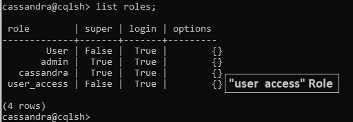
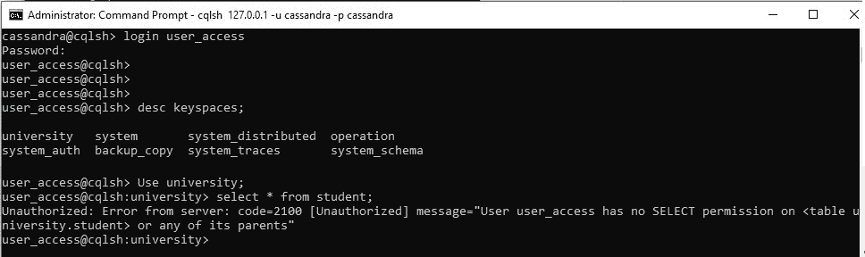
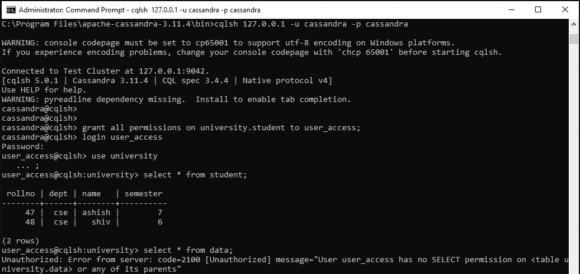
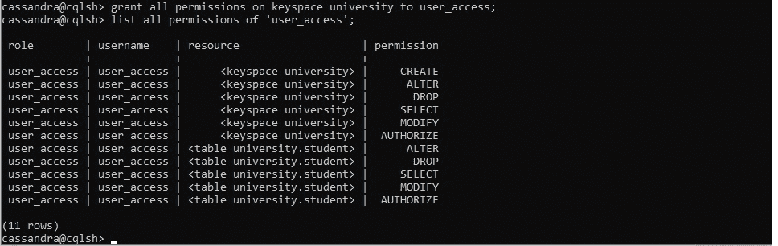
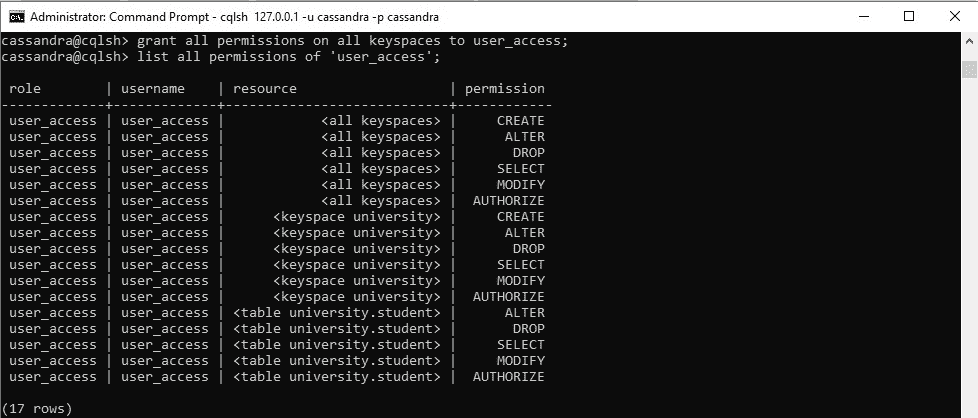

# 授予卡珊德拉角色权限

> 原文:[https://www . geesforgeks . org/授予角色权限-in-cassandra/](https://www.geeksforgeeks.org/granting-permissions-to-roles-in-cassandra/)

在本文中，我们将讨论如何在 [Cassandra](https://www.geeksforgeeks.org/introduction-to-apache-cassandra/) 中授予角色权限。首先，我们将创建一个新角色，并展示它如何访问数据库。

**创建新角色:**
在这一步，我们要创建一个新角色，这样 user_access 就是一个新角色，想要访问数据库。使用以下 cqlsh 查询创建新角色。

```
cassandra@cqlsh> create role user_access
   ... with password = 'user_access'
   ... and LOGIN = true;

```

**输出:**



现在，如果我们可以使用下面的 cqlsh 查询看到“user_access”角色访问。

```
cassandra@cqlsh> list all permissions of 'user_access';

 role | resource | permissions
------+----------+-------------

(0 rows)
cassandra@cqlsh>

```

目前，它无法访问现有的密钥空间“大学”。让我们来看看。

```
cassandra@cqlsh> login user_access
Password:user_access
user_access@cqlsh> 
```

**输出:**



要解决此错误“未经授权:来自服务器的错误:代码= 2100[未经授权]消息=“用户用户访问对没有选择权限

or any of its parents” we can give the grant permissions to access.

考虑一下，如果我们只想访问大学键空间上的“学生”表，那么我们可以使用下面的 cqlsh 查询。

```
cassandra@cqlsh> 
```

将对 university.student 的所有权限授予 user _ access

只有我们可以授予访问“university.student”表的权限。

**输出:**



现在，如果我们想授予对大学键空间上所有表的访问权限，请使用下面的 cqlsh 查询。

```
cassandra@cqlsh>
```

将 keyspace 大学的所有权限授予 user _ access

我们可以使用“列出所有权限”来查看所有权限。

**输出:**



如果我们想授予对整个数据库的访问权限，那么就使用下面的 cqlsh 查询。

```
cassandra@cqlsh>
```

将所有密钥空间上的所有权限授予 user _ access

**输出:**

