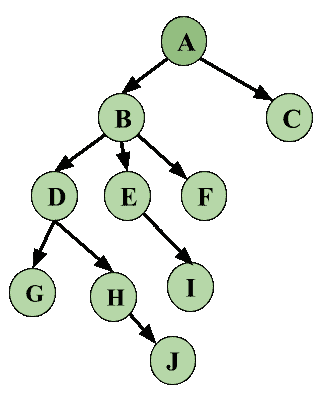

# 数据库管理系统中基于图形的并发控制协议

> 原文:[https://www . geesforgeks . org/graph-based-concurrency-control-protocol-in-DBMS/](https://www.geeksforgeeks.org/graph-based-concurrency-control-protocol-in-dbms/)

基于图的协议是实现基于锁的协议的另一种方式。

众所周知，基于锁的协议的主要问题是避免死锁和确保严格的调度。我们已经看到严格的时间表是可能的，遵循[严格或严格 2-PL](https://www.geeksforgeeks.org/dbms-concurrency-control-protocol-two-phase-locking-2-pl-ii/) 。我们甚至已经看到，如果我们遵循[保守 2-PL](https://www.geeksforgeeks.org/dbms-concurrency-control-protocol-two-phase-locking-2-pl-iii/) ，死锁是可以避免的，但是这个协议的问题是它不能实际使用。基于图的协议被用作 2-PL 的替代方案。*基于树的协议是基于图的协议*的简单实现。

该协议的一个先决条件是我们知道访问数据库项目的顺序。为此，我们对一组**数据库项目(D) *{d 1 、d 2 、d 3 、…..，d n }*** 。部分排序实现后的协议表述为-

*   如果***dI–>dj***则访问 d i 和 d j 的任何事务必须在访问 d j 之前访问 d i 。
*   意味着集合 **D** 现在可以被视为一个有向无环图(DAG)，称为*数据库图*。

**基于树的协议–**

*   数据库项目的部分顺序决定了树状结构。
*   只允许使用排他锁。
*   T i 的第一个锁可以在任何数据项上。随后，只有当数据 Q 的父项当前被 T i 锁定时，数据 Q 才能被 T i 锁定。
*   数据项可以随时解锁。

遵循基于树的协议确保**冲突可串行化和无死锁**调度。我们不需要像在 2-PL 协议中那样等待解锁数据项，从而增加了并发性。

现在，让我们看一个例子，下面是一个*数据库图*，它将被用作随后锁定项目的参考。

**图像–**数据库图

让我们看一个基于上述数据库图的例子。我们在这个时间表中有三个事务，这是一个框架示例，也就是说，我们将只看到锁定和解锁是如何工作的，让我们保持简单，不要通过在数据上添加操作来使这变得复杂。

|  | **T1T3】** | **T2T3】** | **T3T3】** |
| **1** | 锁定-X(A) |  |  |
| **2** | 锁-十(乙) |  |  |
| **3** |  | 锁定-X(D) |  |
| **4** |  | 锁定-十(高) |  |
| **5** |  | 解锁-X(D) |  |
| **6** | 锁定-X(E) |  |  |
| **7** | 锁定-X(D) |  |  |
| **8** | 解锁-X(B) |  |  |
| **9** | 解锁-X(E) |  |  |
| **10** |  |  | 锁-十(乙) |
| **11** |  |  | 锁定-X(E) |
| **12** |  | 解锁-X(H) |  |
| **13** | 锁-十(乙) |  |  |
| **14** | 锁定-X(G) |  |  |
| **15** | 解锁-X(D) |  |  |
| **16** |  |  | 解锁-X(E) |
| **17** |  |  | 解锁-X(B) |
| **18** | 解锁-X(G) |  |  |

从上面的例子中，首先看到调度是冲突可序列化的。锁的可串行化可以写成**T2–>T1–>T3**。
锁定和解锁的数据项遵循与上述相同的规则，并遵循数据库图表。

因此，让我们再次修改基于图的协议的关键点是什么。
**优势–**

*   确保冲突可序列化计划。
*   确保无死锁计划
*   解锁可以随时完成

有一些优点也有一些缺点。
**劣势–**

*   有时可能会发生不必要的锁定开销，比如如果我们同时想要 D 和 E，那么至少我们必须锁定 B 来遵循协议。
*   ***Cascading Rollbacks*** is still a problem. We don’t follow a rule of when Unlock operation may occur so this problem persists for this protocol.

    总的来说，该协议因其实现死锁自由的独特方式而广为人知。

    参考资料:数据库系统概念，第五版[西尔伯沙茨，柯思，苏达山]，第 16 章。