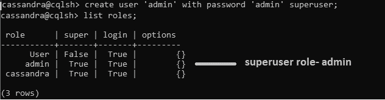
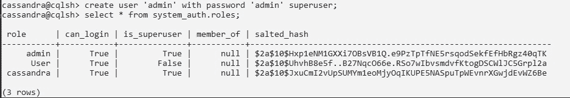
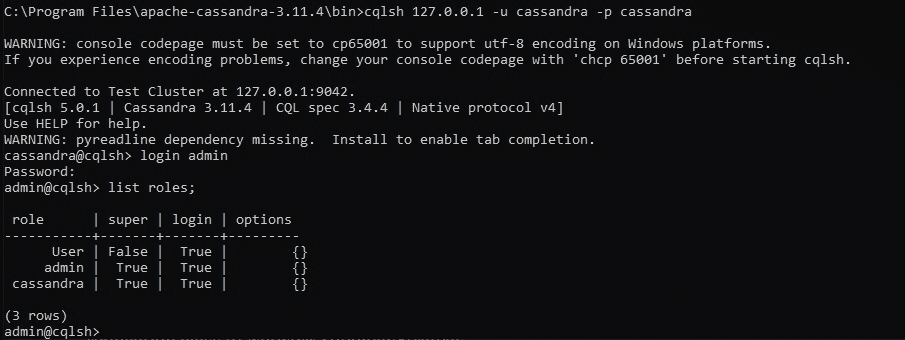
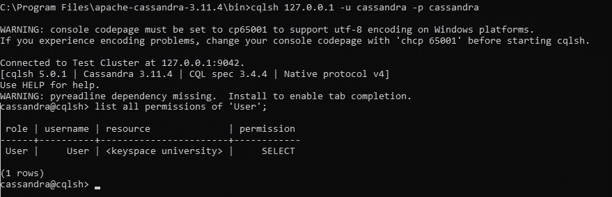
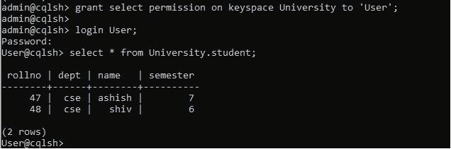

# 在卡珊德拉处理超级用户账户

> 原文:[https://www . geesforgeks . org/handling-super-account-in-Cassandra/](https://www.geeksforgeeks.org/handling-superuser-account-in-cassandra/)

在本文中，我们将讨论如何在 [Cassandra](https://www.geeksforgeeks.org/introduction-to-apache-cassandra/) 中处理超级用户帐户。在本课中，我们将学习如何创建超级用户帐户，如何将权限授予其他用户，如何授予访问权限等。

在 cassandra 中，处理默认超级用户帐户“Cassandra”的最佳做法是创建一个自定义管理员帐户。超级用户帐户帮助卡珊德拉管理角色。

**1。在 Cassandra 中创建超级用户帐户:**
要创建超级用户帐户，请使用以下 cqlsh 查询。

```
cassandra@cqlsh> 
create user 'admin' with password 'admin' superuser; 
```

要查看超级用户角色信息“admin ”,我们可以使用 list roles 命令。



现在，如果我们想查看与超级用户角色相关的所有信息，那么使用下面的 cqlsh 查询。

```
cassandra@cqlsh> 

select * 
from system_auth.roles; 
```

**输出:**



**2。登录超级用户帐户:**
现在，我们将使用管理员(超级用户)凭据登录。

```
cassandra@cqlsh> login admin
Password: admin
admin@cqlsh>  
```

**输出:**



**3。授予权限:**
现在，我们将了解如何在特定的键空间上使用授予访问权限，这样，如果我们想将大学键空间上的读取访问权限授予“用户”角色，那么我们将使用授予命令。

```
admin@cqlsh> 
grant select permission on keyspace University to 'User'; 
```

现在，我们可以看到超级用户授予特定角色的权限。

**输出:**



**4。登录普通用户账户:**
从学生表和学生表的键空间读取数据是大学。

**输出:**

