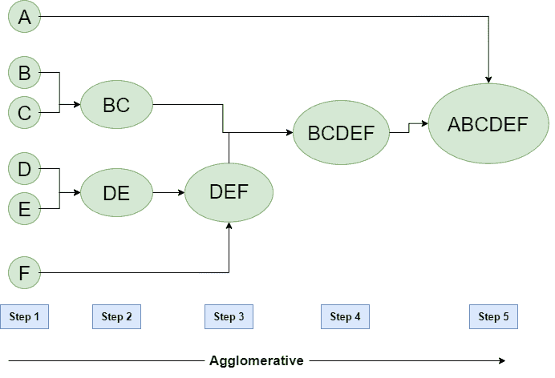
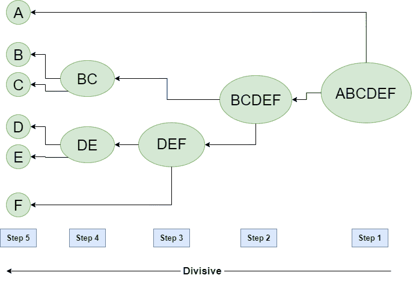

# 数据挖掘中的层次聚类

> 原文:[https://www . geesforgeks . org/数据挖掘中的分层聚类/](https://www.geeksforgeeks.org/hierarchical-clustering-in-data-mining/)

一种**层次聚类**方法通过将数据分组到一个聚类树中来工作。分层聚类首先将每个数据点视为一个单独的聚类。然后，它重复执行后续步骤:

1.  确定最接近的两个集群，以及
2.  合并 2 个最大可比聚类。我们需要继续这些步骤，直到所有集群合并在一起。

在层次聚类中，目标是产生一系列层次嵌套的聚类。一个名为**树图**(树图是一个统计合并或拆分序列的树状图)的图表以图形方式表示了这个层次结构，并且是一个倒树，描述了因子合并(自下而上视图)或聚类分解(自上而下视图)的顺序。

生成层次聚类的基本方法是:

**1。聚集:**
最初将每个数据点视为一个**个体**集群，在每一步，**合并**集群中最近的对。(是自下而上的方法)。起初，每个数据集都被认为是一个独立的实体或簇。在每次迭代中，集群与不同的集群合并，直到形成一个集群。

凝聚层次聚类算法是:

*   计算一个聚类与所有其他聚类的相似度(计算邻近矩阵)
*   将每个数据点视为一个单独的集群
*   合并高度相似或彼此接近的集群。
*   重新计算每个聚类的邻近矩阵
*   重复步骤 3 和 4，直到只剩下一个集群。

让我们用树形图来看看这个算法的图形表示。

**注:**
这只是实际算法如何工作的一个演示，在假设聚类之间的所有接近度之下，没有执行任何计算。

假设我们有六个数据点 **A、B、C、D、E、F** 。

**Figure –** Agglomerative Hierarchical clustering

*   **步骤-1:**
    将每个字母表视为单个聚类，并计算一个聚类与所有其他聚类的距离。
*   **第二步:**
    在第二步中，可比较的集群被合并在一起形成单个集群。假设集群(B)和集群(C)彼此非常相似，因此我们在第二步中将它们与集群(D)和(E)类似地合并，最后我们得到集群
    [(A)、(BC)、(DE)、(F)]
*   **步骤-3:**
    我们根据算法重新计算邻近度，将两个最近的聚类([(DE)、(F)]合并在一起，形成新的聚类为[(A)、(BC)、(DEF)]
*   **第 4 步:**
    重复同样的过程；集群 DEF 和 BC 是可比较的，并合并在一起形成一个新的集群。我们现在只剩下集群[(A)、(BCDEF)]。
*   **步骤-5:**
    最后剩下的两个集群合并在一起形成一个集群[(ABCDEF)]。

**2。分裂的:**
我们可以说分裂的层次聚类恰恰是凝聚的层次聚类的**的对立面**。在划分层次聚类中，我们将所有数据点视为一个单独的聚类，在每次迭代中，我们将数据点从不可比的聚类中分离出来。最终，我们只剩下了 N 个集群。

**Figure –** Divisive Hierarchical clustering
