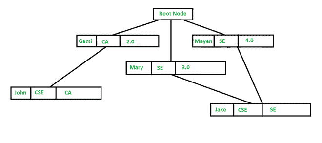
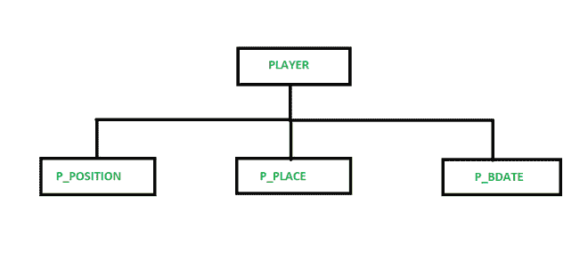

# 数据库管理系统中的层次模型

> 原文:[https://www.geeksforgeeks.org/hierarchical-model-in-dbms/](https://www.geeksforgeeks.org/hierarchical-model-in-dbms/)

**层次模型:**
这是 20 世纪 50 年代由 IBM 开发的数据模型中最古老的模型之一。在层次模型中，数据被视为表的集合，或者我们可以说形成层次关系的段。在这种情况下，数据被组织成树状结构，其中每个记录由一个父记录和多个子记录组成。即使片段通过逻辑关联连接成链状结构，那么即时结构也可以是具有多个分支的扇形结构。我们称这种不合逻辑的联想为方向联想。

在层次模型中，逻辑关联所指向的段称为**子段**，另一段称为**父段**。如果有一个片段没有父片段，那么这个片段将被称为**根**，没有子片段的片段被称为**叶**。分层模型的主要缺点是节点之间可能存在一对一和一对多的关系。

**层次模型的应用:**

*   分层模型在实践中通常被用作语义模型，因为许多真实世界的事件在本质上是分层的，如生物结构、政治或社会结构。
*   由于磁盘存储系统固有的分层结构，如磁道、柱面等，分层模型也通常用作物理模型。有各种各样的例子，如国际商用机器公司的信息管理系统、NCSS 的 NOMAD 等。

**示例 1:** 考虑下面的 Student 数据库系统分层模型。

层次模型

在上面给出的数字中，我们的学生很少，注册的课程也很少，一门课程只能分配给一个学生，但是一个学生可以注册任意数量的课程，这种关系变成了一对多。我们可以用下面的关系表来表示给定的层次模型:

**教员表**

<figure class="table">

| **名称** | dep | **课程讲授** |
| 约翰 | 中学生毕业考试 | 加拿大 |
| 上等的 | 中学生毕业考试 | 如果 |
| 皇室的 | 中学生毕业考试 | 数据库管理系统 |

**学生表**

<figure class="table">

| **名称** | **课程-报名** | **等级** |
| Gami | 加拿大 | Two |
| 玛丽 | 如果 | Three |
| 梅恩 | 如果 | Four |

**例 2:** 考虑以下板球数据库系统分层模型方案。

层次模型

这里，在这个例子中，对于每个玩家，有他玩的一些位置集(P_POSITION)，一组位置(P_PLACE)，还有一组玩家的生日(P_BDATE)。在上图中，每个节点代表一个逻辑记录类型，并由它的字段列表显示。子节点表示一组记录，这些记录连接到父类型的每个记录，这是由于从子节点到父节点的多对多关系。在上图中，根节点 PLAYER 声明，对于每个玩家，将有一组位置、一组地点(只有一个)和一组出生日期(只有一个)。

**分层模型的优势:**

*   由于数据库基于这种体系结构，各层之间的关系在逻辑上很简单，因此它具有非常简单的分层数据库结构。
*   它具有数据共享，因为所有数据都保存在一个公共数据库数据中，因此数据共享变得实用。
*   它提供了数据安全性，这个模型是第一个提供数据安全性的数据库模型。
*   还有数据完整性，因为它是基于亲子关系的，而且父母和孩子之间总是有联系的。

**分层模型的缺点:**

*   尽管这个模型在概念上很简单，也很容易设计，但实现起来却相当复杂。
*   这种模型也缺乏灵活性，因为新表或段的变化通常会产生非常复杂的系统管理任务。这里，删除一个片段可能会导致其下所有片段的非自愿删除。
*   它没有标准，因为这个模型的实现没有提供任何具体的标准。
*   它也受到限制，因为许多常见的关系不符合层次模型所要求的 1 到 N 的格式。

</figure>

</figure>