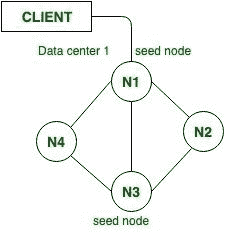
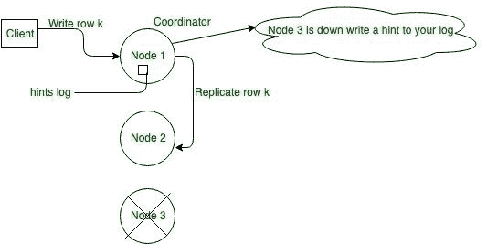

# 卡珊德拉的高可用性机制

> 原文:[https://www . geesforgeks . org/高可用性机制 in-cassandra/](https://www.geeksforgeeks.org/high-availability-mechanism-in-cassandra/)

在本文中，我们将通过使用以下关键术语来了解 Cassandra 中的高可用性机制。

```
1. Seed Node
2. Gossip Communication Protocol
3. Failure Detection 
4. Hinted Handoff  
```

让我们逐一讨论。

**1。种子节点:**
在 Apache Cassandra 中，它是集群中第一个启动的节点。如果我们想配置种子节点，那么我们可以在 Cassandra.yaml 文件中进行配置，这是 Cassandra 中用于更改任何配置设置的主文件。种子节点有助于在 Cassandra 中为加入集群的新节点进行引导。

种子节点也有助于提供关于另一个节点的信息。当一个新节点上线时，它会对种子节点进行闲扯，以获取集群中其他节点的信息。



<center>**Figure –** Seed Node</center>

**启动序列:**
在卡珊德拉启动序列中是扮演重要角色的。start sequence 给出了初始序列，所以，逐个启动种子节点，然后启动其他节点。

最佳实践:在 Cassandra 中，为集群中的每个数据中心设置多个种子节点始终是一个好的实践。

**监听器地址和存储端口:**
在节点间通信中，我们使用监听器 _ 地址和存储端口在 Cassandra 中进行通信。Cassandra 的默认端口 id 是 7000。在 Cassandra 中，集群中每个节点的端口 id 必须相同。

```
listener_address= ip address of node 
storage_port = 7000 (by default) 
```

**2。流言通信协议:**
在卡珊德拉中，节点周期性地(每秒)交换关于它们自己以及它们所知道的其他节点的状态信息(例如，死的或活的)。在卡珊德拉，流言传播协议也被称为流行病协议。对于集群来说，这是一种快速、分散的自动了解自身的方法，对于集群中的节点信息非常有帮助。

在允许快速重启的流言通信协议中，流言信息由每个节点本地保存。理解持久性的含义对于评估不同的数据存储系统很重要。

持久性是“一种结果在其原因被消除后的继续”。在计算机系统中存储数据的情况下，这意味着数据在其创建过程结束后仍然存在。换句话说，要使数据存储被认为是持久的，它必须写入非易失性存储。

**关键:**
任何数据中心的种子节点列表在集群中的每个节点上都必须相同，这是一项重要的任务

**3。故障检测:**
在故障检测的情况下，节点根据流言状态和历史在本地确定，并相应地调整集群中的路由。Phi 应计是故障检测算法的重要算法。它表示节点的死状态和活状态之间的连续怀疑级别，表示节点失败的置信度。它可以是网络性能，它必须优先考虑的工作负载问题，等等。

如果检测到一个节点出现故障，那么其他节点会定期尝试与出现故障的节点闲聊，看看它是否恢复在线。

现在，让我们看一下使用 CQL 查询来检查节点的状态。默认情况下，cqlsh 连接到 127.0.0.1。获取主机 id、版本等信息。使用了以下 CQL 查询。

```
SELECT peer, data_center, host_id, 
            preferred_ip, rack, release_version, 
            rpc_address, schema_version 
FROM system.peers; 
```

要获取一个节点的信息，请在 Cassandra 中使用以下 CQL 命令。

```
nodetool gossipinfo 
```

要通过执行以下操作终止节点:

```
nodetool stopdaemon  
```

检查节点 1 上的 gossipinfo。请注意，节点 2 的八卦信息仍然存在，因为它是集群的一部分，但是它的状态是关闭。

**4。暗示切换:**
在 Cassandra 中，这是高可用性机制的重要方面之一。它有助于减少故障节点重新加入群集的恢复时间，并通过容忍不一致的读取来确保绝对的写入可用性。如图所示，如果复制副本在写入发生时关闭，另一个健康的复制副本会存储一个提示，如果所有相关复制副本都关闭，协调器或本地会存储该提示。

```
 Hint = location [failed replica] 
              + affected [row key] 
              + actual data being written  
```

**注意:**
在卡珊德拉中，当负责该令牌范围的节点再次启动时，提示将被传递。

**反熵:**
在高可用性机制的情况下反熵是副本同步机制，以确保所有节点上的数据都是最新的。

**示例:**
一般来说，建议在集群中有足够的节点和足以避免写请求失败的复制因子。例如，考虑一个由三个节点组成的集群，节点 1、节点 2 和节点 3，复制因子为 2。当一行 K 被写入协调器(在这种情况下是节点 A)时，即使节点 3 关闭，也可以满足 ONE 或 QUORUM 的一致性级别。为什么呢？节点 1 和节点 2 都将接收数据，因此符合一致性级别要求。节点 1 提示为节点 3 存储，并在节点 3 出现时写入。同时，协调器可以确认写入成功。



<center>**Figure –** Hinted Handoff: Repair during write path</center>