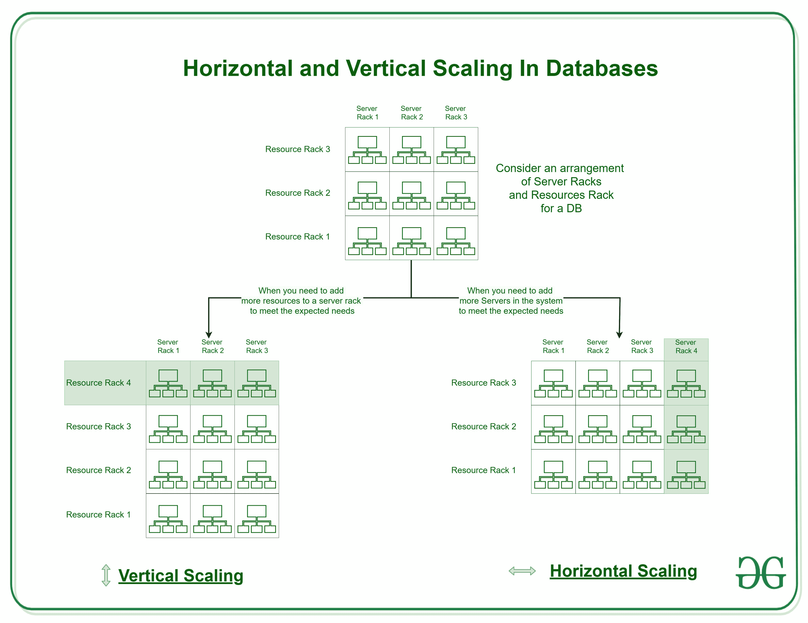

# 数据库中的水平和垂直缩放

> 原文:[https://www . geeksforgeeks . org/横向和纵向扩展数据库/](https://www.geeksforgeeks.org/horizontal-and-vertical-scaling-in-databases/)

**缩放**改变系统的大小。在扩展过程中，我们要么压缩系统，要么扩展系统，以满足预期需求。缩放操作可以通过在当前系统中添加资源以满足较小的期望，或者通过在现有系统中添加新系统，或者两者都添加来实现。

**缩放类型:**

缩放可以分为两种类型:

1.  **Vertical Scaling:** When new resources are added in the existing system to meet the expectation, it is known as vertical scaling. 

    考虑由现有系统组成的服务器和资源机架。(如图)。现在当现有的系统无法满足预期需求，只需要增加资源就可以满足预期需求时，这就被认为是纵向扩展。
    纵向扩展是基于在现有系统上增加更多功率(CPU、RAM)的思路，基本上就是增加更多的资源。
    垂直缩放不仅容易，而且比水平缩放便宜。它也需要更少的时间来修复。

2.  **Horizontal Scaling:** When new server racks are added in the existing system to meet the higher expectation, it is known as horizontal scaling. 

    考虑由现有系统组成的服务器和资源机架。(如图)。现在当现有系统无法满足预期需求，仅仅增加资源无法满足预期需求时，我们需要增加全新的服务器。这被认为是水平缩放。
    水平扩展是基于向我们的资源池中添加更多机器的想法
    水平扩展很困难，并且比垂直扩展成本更高。这也需要更多的时间来修复。

**水平和垂直缩放的差异:**

<figure class="table">

| 水平缩放 | 垂直缩放 |
| --- | --- |
| 当在现有系统中添加新的服务器机架以满足更高的期望时，称为水平扩展。 | 当在现有系统中添加新资源以满足期望时，这被称为垂直扩展 |
| 它横向扩展了现有系统的规模。 | 它纵向扩展了现有系统的规模。 |
| 升级更容易。 | 升级比较困难，可能会停机。 |
| 很难实施 | 它很容易实现 |
| 成本更高，因为新服务器机架包含大量资源 | 它更便宜，因为我们只需要增加新的资源 |
| 做这件事需要更多的时间 | 做这件事花费的时间更少 |

</figure>