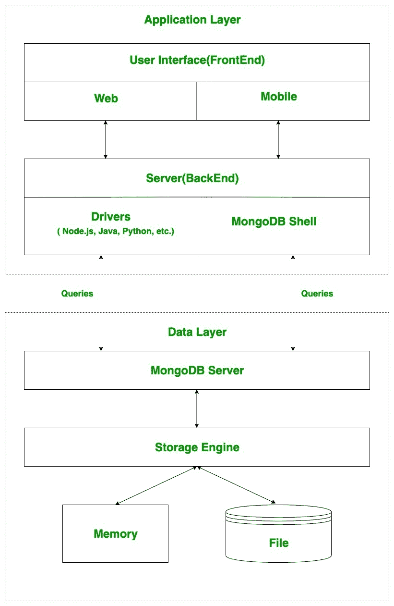

# 【MongoDB 是如何工作的？

> 原文:[https://www.geeksforgeeks.org/how-mongodb-works/](https://www.geeksforgeeks.org/how-mongodb-works/)

MongoDB 是一个面向文档的开源数据库。它用于存储大量数据，也允许您使用这些数据。MongoDB 不是基于类似表的关系数据库结构，而是提供了一种完全不同的数据存储和检索机制，这就是为什么被称为 NoSQL 数据库的原因。这里，术语“NoSQL”的意思是“非关系的”。存储的格式叫做 BSON(类似于 JSON 格式)。

现在，让我们看看这个 MongoDB 实际上是如何工作的？但是在开始工作之前，首先，让我们讨论一下 MongoDB 的一些重要部分–

*   **驱动程序:**服务器上存在用于与 MongoDB 通信的驱动程序。MongoDB 支持的驱动程序有 C、C++、C#和。Net、Go、Java、Node.js、Perl、PHP、Python、Motor、Ruby、Scala、Swift、Mongoid。
*   **MongoDB Shell:**MongoDB Shell 或 mongo shell 是 MongoDB 的交互式 JavaScript 接口。它用于查询、数据更新，还执行管理操作。
*   **存储引擎:**它是 MongoDB 的重要组成部分，一般用于管理数据在内存和磁盘上的存储方式。MongoDB 可以有多个搜索引擎。你可以使用你自己的搜索引擎，如果你不想使用你自己的搜索引擎，你可以使用默认的搜索引擎，被称为 *WiredTiger 存储引擎*，这是一个优秀的存储引擎，它可以高效地处理你的数据，如阅读、写作等。

## MongoDB 的工作–

下图显示了 MongoDB 的工作原理:

MongoDB 分两层工作–

*   **应用层**和
*   **数据层**

**应用层**也被称为**最终抽象层**，它有两部分组成，第一部分是**前端(用户界面)**第二部分是**后端(服务器)**。前端是用户在网络或手机的帮助下使用蒙古数据库的地方。这个网页和手机包括网页、手机应用、安卓默认应用、IOS 应用等。后端包含一个服务器，用于执行服务器端逻辑，还包含驱动程序或 mongo shell，用于在查询的帮助下与 MongoDB 服务器交互。

这些查询被发送到**数据层**中的 MongoDB 服务器。现在，MongoDB 服务器接收查询并将接收到的查询传递给存储引擎。MongoDB 服务器本身不直接读取或写入数据到文件或磁盘或内存。在将接收到的查询传递给存储引擎之后，存储引擎负责读取或写入文件或内存中的数据，基本上是管理数据。

**注意:**与内存相比，文件的读写速度较慢。