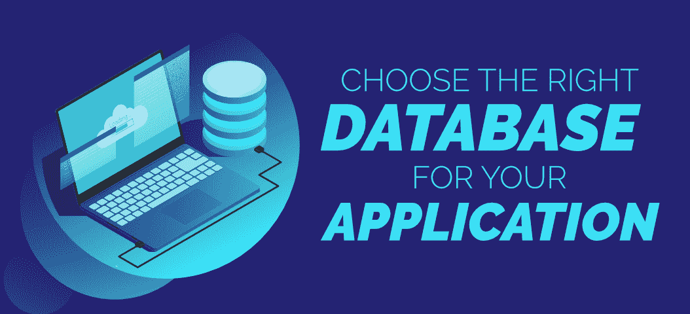
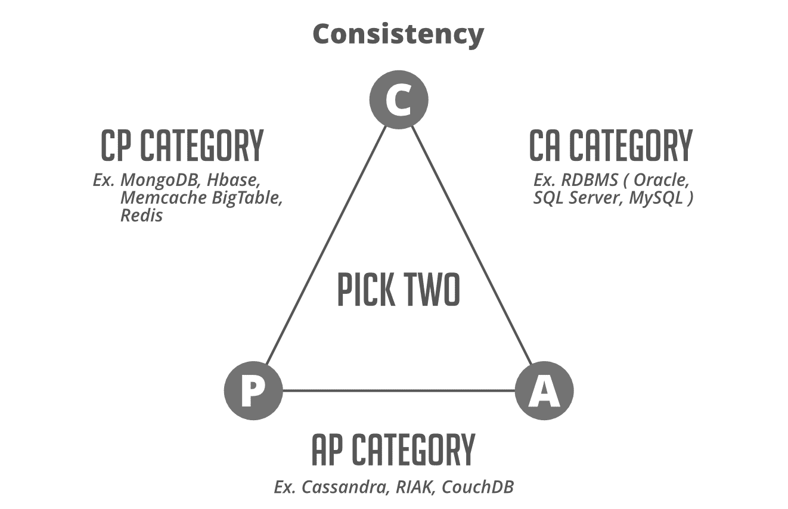

# 如何为您的应用选择合适的数据库？

> 原文:[https://www . geesforgeks . org/如何为您的应用选择合适的数据库/](https://www.geeksforgeeks.org/how-to-choose-the-right-database-for-your-application/)

***“我就选 X 吧，是我认识和合作过的 DB”**。*
大多数开发人员和学生在为项目选择数据库时都会使用这种说法。如果性能不是系统的一个重要要求，使用您已经熟悉的数据库是完全可以的，但是考虑一种情况，当您的应用程序增长，几年后您的应用程序开始面临一些问题。解决这个问题将成为开发人员和管理员头疼的问题。不管你是从头开始做一个项目，还是已经在做一个成熟的项目，重要的是要知道数据库的局限性，并确定何时在项目中添加另一种类型的数据库。

市场上有超过 **300 个数据库管理系统**，选择一个对开发者来说可能是压倒性的。在**关系型** (MySQL、PostgreSQL、Oracle DB 等)和**非关系型** (MongoDB、Apache HBase、Cassandra 等)数据库中有各种各样的选项，但是你需要理解**它们都不适合各种项目需求**。他们每个人都有一些优点和缺点。让我们看一些案例研究，说明您应该如何为您的应用程序选择合适的数据库。

### 选择正确的数据库

***当你在设计一个给定的系统时，你如何做出这个决定？*** 。

有这么多数据库可用，选择一个数据库而不是另一个是一个复杂的决定。嗯，没有真正的公式可以遵循，但有一些事情你应该考虑。这不是一个容易的决定，但是擅长这个的人会赚很多钱。首先，抛开你会发现一个真正的数据库比其他任何东西都好的想法。现在，在考虑具体的数据库之前，花点时间问几个与您的项目相关的重要问题……

*   当应用程序成熟时，您希望存储多少数据？
*   在高峰负载时，您希望同时处理多少用户？
*   您的应用程序需要什么样的可用性、可扩展性、延迟、吞吐量和数据一致性？
*   您的数据库模式多久更改一次？
*   您的用户群体的地理分布是怎样的？
*   你的数据的自然“形状”是什么？
*   您的应用程序需要在线事务处理(OLTP)、分析查询(OLAP)还是两者都需要？
*   在生产中，您期望读取与写入的比率是多少？
*   你最喜欢的编程语言是什么？
*   你有预算吗？如果是，它是否包括许可证和支持合同？
*   您对发送到数据库的无效数据有多严格？(理想情况下，您会非常严格，并在将数据保存到数据库之前进行服务器端数据验证)

现在，让我们谈谈将回答上述问题的一些关键方面，这些方面将帮助您为您的应用选择合适的数据库……

### 1.综合

选择合适的数据库时最需要考虑的是**需要整合到一起的系统是什么？**确保您的数据库管理系统可以与项目中的其他工具和服务集成。不同的技术对于不同的其他技术有不同的连接器。例如，如果您有一个大型分析工作，目前正在运行一个 **Apache spark** ，那么您可能希望将自己限制在可以轻松连接到 Apache spark 的外部数据库中。现在假设您有一个前端系统，它实际上依赖于一个到后端的 SQL 接口，并且您正在考虑从一个单一的数据库转移到一个非关系数据库。只有当您要迁移的非关系数据库提供某种类似于 SQL 的接口，并且可以从前端应用程序轻松迁移到该接口时，这才是一个好的选择。因此，考虑一下系统中需要协同工作的部分，看看它们是否能够与现有的现成组件协同工作，以及这些组件是否得到了良好的维护和更新。
另一个例子是 ArangoDB，它有很好的性能，但是这个数据库管理系统的库还很年轻，缺乏支持。将 arangdb 与其他工具结合使用可能会有风险，因此社区建议对于复杂的项目避免使用 arangdb。

### 2.缩放要求

在安装生产数据库之前，了解扩展需求非常重要。你到底在说多少数据？随着时间的推移，它真的会无限增长吗？如果是这样的话，那么你需要某种数据库技术，这种技术不仅限于你可以存储在一台电脑上的数据。您需要考虑像 Cassandra 或 MongoDB 或 HBase 这样的东西，在那里您可以将数据的存储实际分布在整个集群中，并且**水平扩展**而不是垂直扩展。由于扩展问题，许多数据库无法处理成千上万的用户查询万亿字节或千兆字节的数据。
在选择数据库时，你还需要考虑**的事务率或吞吐量**，这意味着你打算每秒得到多少请求。具有高吞吐量的数据库可以支持许多并发用户。如果我们说的是成千上万，那么一个单一的数据库服务也是行不通的。当你在一些大型网站上工作时，这一点尤其重要，因为在这些网站上，我们有很多网络服务器，同时为很多人提供服务。您将不得不选择一个分布式数据库，并允许您更均匀地分布这些事务的负载。在这些情况下，NoSQL 数据库是一个很好的选择，而不是关系数据库管理系统。

### 3.支持考虑

考虑一下您的数据库可能需要的支持。***你有内部的专业知识来加速这项新技术，并对其进行适当的配置吗？*** 这将比你想象的更难，尤其是如果你在现实世界中使用它，或者在你的最终用户那里有个人身份信息的任何情况下。在这种情况下，您需要确保考虑系统的安全性。事实是，我们已经讨论过的大多数 NoSQL 数据库，如果你用它们的默认设置来配置它们，将会完全没有安全性。任何人都可以连接到这些东西，检索数据，并将数据写入其中。因此，确保你有一个人知道他们在做什么，以安全的方式设置它。如果您所在的大型组织内部有这些专家，那就太好了，但是如果您所在的组织规模较小，您可能不得不选择提供专业付费支持的技术，这些技术可以在服务器的初始管理过程中指导您完成初始设置决策。您也可以外包管理员以获得支持。像 MongoDB 这样的企业解决方案有付费支持，如果我们谈论 Apache 项目，那么有一些公司提供付费专业支持。

### 4.CAP 考虑因素

CAP 代表**一致性、可用性和分区容差**。该定理指出，您无法在单个数据库中实现最佳级别的所有属性，因为项目之间存在自然的权衡。你一次只能从三个中选择两个**，这完全取决于你根据自己的需求确定的优先级。例如，如果您的系统需要可用和分区容忍，那么您必须愿意接受一致性要求中的一些延迟。
**传统关系数据库**自然适合 **CA** 端，而**非关系数据库**引擎大多满足 **AP 和 CP** 需求。** 

*   **一致性**意味着任何读请求都将返回最近的写操作。对于 SQL 数据库，数据一致性通常是“强”的，对于 NoSQL 数据库，一致性可能是从“最终”到“强”的任何东西。
*   **可用性**是指无响应的节点必须在合理的时间内做出响应。并非每个应用程序都需要以 99.999%的可用性全天候运行，但很可能您更喜欢可用性更高的数据库。
*   **分区容差**表示即使网络或节点出现故障，系统也将继续运行。

应用程序的类型将决定你想要什么，只有你知道实际的需求。如果您的系统停机几秒钟或几分钟，实际上可以吗？如果不能，那么可用性应该是您最关心的问题。如果你处理的是真实的交易信息，比如股票交易或金融交易，你可能更看重一致性。尝试选择最适合您想要做出的权衡的技术。

### 5.模式或数据模型

关系数据库以**固定和预定义的结构**存储数据。这意味着当您开始开发时，您必须根据表和列来定义您的数据模式。每次需求改变时，您都必须改变模式。这将导致创建新的列、定义新的关系、反映应用程序中的变化、与数据库管理员讨论等。
NoSQL 数据库在处理数据方面提供了更多的**灵活性**。不需要指定模式来开始使用应用程序。此外，NoSQL 数据库没有对可以一起存储的数据类型进行限制。它允许您根据需求的变化添加更多的新类型。在应用程序构建过程中，大多数开发人员更喜欢高编码速度和高敏捷性。事实证明，NoSQL 数据库在这方面是一个更好的选择，尤其是对于需要快速实现的**敏捷开发**来说。

你真的需要照顾好所有提到的 5 点，但最重要的是，最重要的建议是**保持一切简单**。不要因为一个数据库在市场上闪闪发光、新潮就选择它。如果您不需要设置高度复杂的 NoSQL 集群或需要大量维护的东西，如 MongoDB 或 HBase，您有所有这些维护配置的外部服务器，如果您不需要，请不要这样做。想想您的系统需要的最低要求。如果你不需要处理大规模的问题，那么就不需要使用 NoSQL 数据库，你可以选择 MySQL，在某个地方会很好。除非您真的需要，否则没有必要在您的组织内部署一个没有良好专业知识的全新系统。简单的技术和简单的架构将更容易维护。毕竟，当你在凌晨 3:00 醒来时，你不会感到高兴，因为一些随机的服务器在这个过于复杂的数据库系统上崩溃了，而这个系统是你毫无理由地建立的。**所以尽可能保持一切简单。**