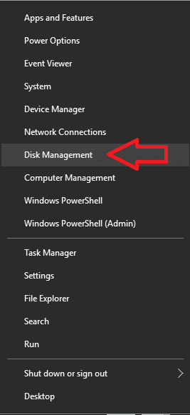
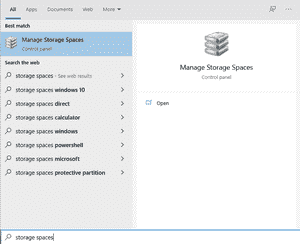
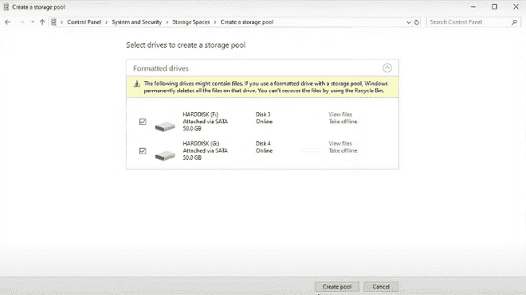
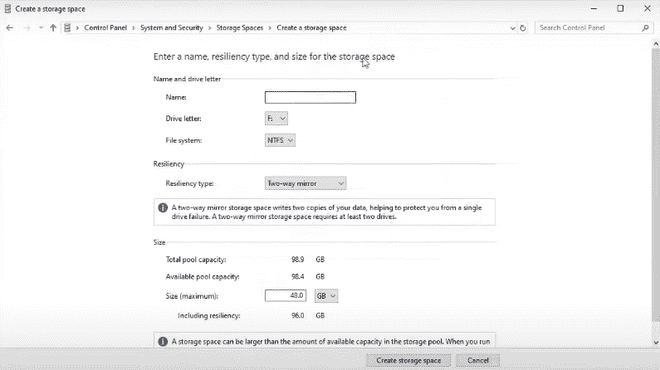
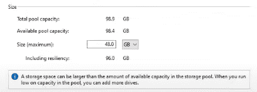
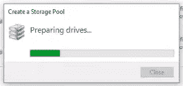
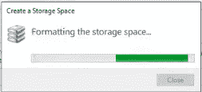

# 如何配置 RAID？

> 原文:[https://www.geeksforgeeks.org/how-to-configure-raid/](https://www.geeksforgeeks.org/how-to-configure-raid/)

本文将指导您在计算机上配置 RAID

**什么是 RAID？**
RAID(独立磁盘冗余阵列)是一种将相同数据存储在多个不同硬盘或固态驱动器中的方法，用于在驱动器/硬件出现故障时保护数据。

简而言之，这是一种存储数据的方法，有助于使信息更加冗余，并且在硬件故障的情况下数据是可恢复的。

**RAID 模式类型:**

**RAID 0:**

*   数据均匀地存储在两个或多个存储磁盘之间
*   磁盘的性能很高
*   更大的尺寸和更快的速度
*   没有冗余
*   如果任何一个驱动器出现故障，存储在任何驱动器中的所有数据都会丢失。

#### RAID 1:

*   也称为镜像磁盘
*   两个或多个驱动器中保存了相同的信息
*   如果一个驱动器出现故障，存储在其中的数据在其他驱动器中仍然可用，因此不会丢失数据
*   传输速度很慢
*   总驱动器大小很小
*   数据是多余的

#### RAID 5:

*   至少要连接 3 个或更多磁盘
*   数据均匀地存储在所有磁盘中，使数据在发生硬件故障时安全且可恢复
*   奇偶校验分割是在磁盘之间完成的
*   由于阵列中连接了多个磁盘，因此体积大，速度快
*   数据非常冗余
*   如果出现故障，将使用其他磁盘上的数据重建数据

有更多的 RAID 模式可以用于一些定制的用户需求。

**例如**:

*   RAID 3
*   RAID 4
*   RAID 6
*   RAID 10
*   克隆

**如何配置/设置磁盘阵列？**

**在 Windows 10 上配置 RAID:**

1.安装两个或多个硬盘或固态硬盘，让计算机启动。

2.备份硬盘上的所有内容，因为我们将在设置 RAID 时对它们进行格式化。

3.右键单击屏幕左下方的“开始”按钮，打开“磁盘管理”。

4.验证是否所有驱动器都工作正常且可见。

5.在窗口搜索栏上搜索管理存储空间

6.在新打开的窗口中，选择“创建新的池和存储空间”选项。

7.如果系统提示您批准更改，请**单击是。**

8.然后仔细选择要为您的 RAID 阵列配置的新驱动器。

9.使用下拉菜单选择弹性类型下的 RAID 类型。

10.对于 RAID 0，选择简单。

11.对于 RAID 1，选择双向镜像或三向镜像。这将在多个驱动器中分别创建相同数据的 2 个或 3 个副本。根据您的需求选择您的 RAID 类型。

12.如果需要对现有驱动器进行任何更改，请在“大小”下设置新的驱动器大小。

13.选择创建存储空间来创建您的 RAID 阵列。

14.耐心等待该过程完成，然后在磁盘管理中检查是否可以看到一个大小合适的驱动器。

15.如果处理过程中一切顺利，没有任何错误，您将成功创建自己的 RAID 阵列！！

16.现在，当数据仅保存在一个驱动器上时，您的数据将更加安全，并且不会出现硬件故障。

这是您自己的磁盘阵列的完整设置。