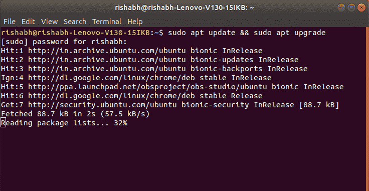
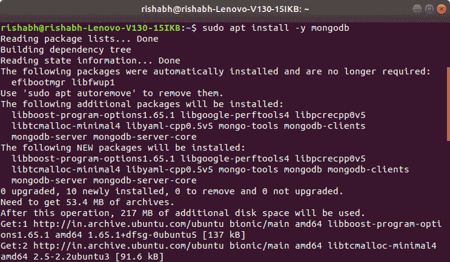
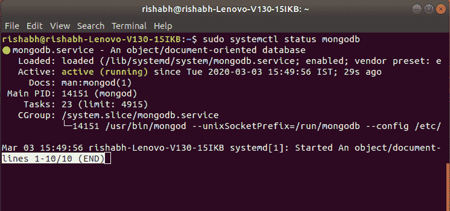
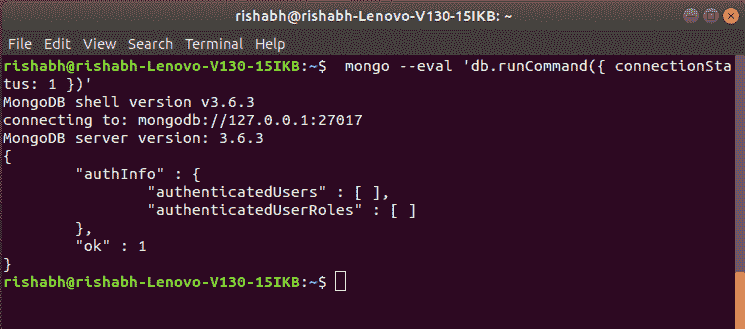
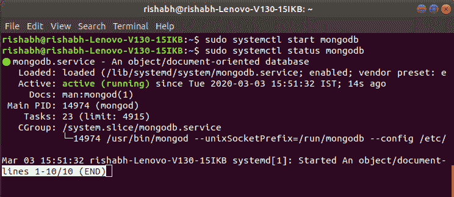

# 如何在 Ubuntu 中安装和配置 MongoDB？

> 原文:[https://www . geesforgeks . org/如何安装和配置-mongodb-in-ubuntu/](https://www.geeksforgeeks.org/how-to-install-and-configure-mongodb-in-ubuntu/)

[MongoDB](https://www.geeksforgeeks.org/mongodb-an-introduction/) 是一个面向开源文档的 NoSQL 数据库，用 C++编写。MongoDB 是无模式数据库系统，因此很容易在其中添加新字段。这是一个分布式系统，因此数据恢复是即时和更可靠的。

#### 蒙古数据库的特点

*   面向文档
*   不需要复杂的连接
*   索引数据库
*   可量测性
*   大数据的自动分区

#### 安装 MongoDB

MongoDB 可以使用以下命令安装在 Ubuntu 上。这些命令很容易在终端上运行，使安装过程变得方便。按照下面给出的步骤安装 MongoDB:

**步骤 1:** 首先需要更新和升级系统存储库，以便安装 MongoDB。在您的终端中键入以下命令，然后按回车键。

```
$ sudo apt update && sudo apt upgrade
```



**第二步:**现在，使用**【apt】**安装 MongoDB 包。键入以下命令，然后按回车键。

```
$ sudo apt install -y mongodb
```



**第三步:**借助以下命令检查 MongoDB 的服务状态:

```
$ sudo systemctl status mongodb
```


*systemctl* 验证 MongoDB 服务器已启动并运行。

**步骤 4:** 现在检查安装过程是否正确，一切正常。执行以下命令:

```
$ mongo --eval 'db.runCommand({ connectionStatus: 1 })'
```


ok 字段中的值“1”表示服务器工作正常，没有错误。

**第 5 步:**可以使用以下命令启动和停止 MongoDB 服务:
要停止运行 MongoDB 服务，请使用命令:

```
$ sudo systemctl stop mongodb
```

MongoDB 服务已停止，可以使用状态命令进行检查:

```
$ sudo systemctl status mongodb
```


可以看出服务已经停止，要启动服务我们可以使用:

```
$ sudo systemctl start mongodb
```



阅读更多关于 Unix 中 [systemctl 上 **systemctl 命令**的信息](https://www.geeksforgeeks.org/systemctl-in-unix/)