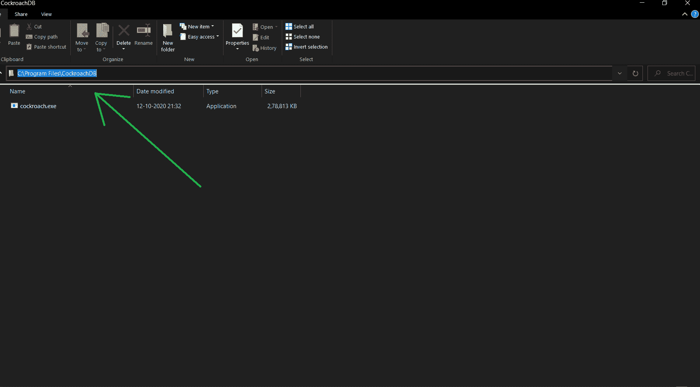
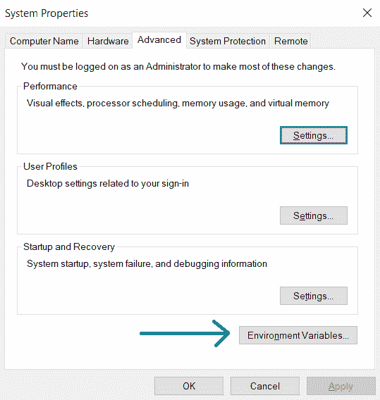
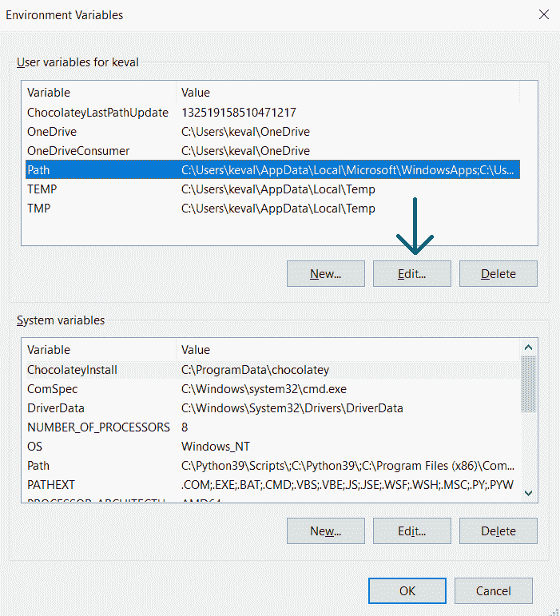
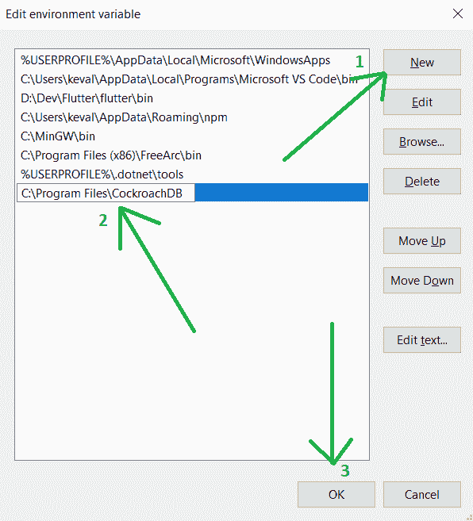
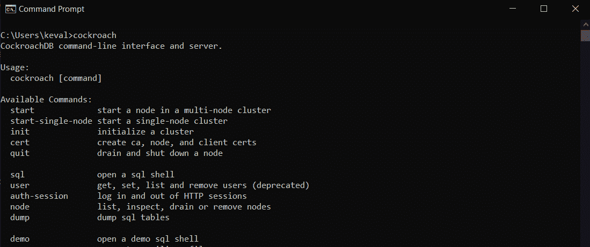

# 如何为 Windows 安装 CockroachDB】

> 原文:[https://www . geeksforgeeks . org/how-install-cocroach db-for-windows/](https://www.geeksforgeeks.org/how-to-install-cockroachdb-for-windows/)

**先决条件** -Windows 8 或更高版本

[蟑螂数据库](https://www.cockroachlabs.com/):

*   它建立在事务性和强一致性的键值存储上。
*   它是一个分布式的 SQL 数据库。
*   它水平缩放
*   它能够在磁盘、机器、机架甚至数据中心故障中幸存下来，并将延迟中断降至最低。
*   它没有人工干预。
*   它支持强一致的 ACID 事务。
*   它为结构化、操作和查询数据提供了一个熟悉的 SQL 应用编程接口。

**安装窗户:**

安装 CockroachDB 包括以下 3 个步骤。

1.  [计] 下载
2.  将其添加到环境变量路径
3.  运行它

**第一步:**

**下载:**

下载从[这里](https://binaries.cockroachdb.com/cockroach-v20.2.3.windows-6.2-amd64.zip)开始，在某个地方提取可执行文件。人们通常把它放在操作系统驱动器的程序文件文件夹中，但它可以在任何地方。一旦它被提取，我们将复制如下所示的路径。

**第 2 步:**

**将其添加到环境变量路径:**

我们需要将它添加到环境变量路径中，以便可以从系统上的任何目录访问它。为此，按下窗口按钮并搜索**“编辑系统环境变量”**，然后按回车键。这将打开一个新窗口，您应该点击**环境变量**按钮，如下所示。

这将打开另一个窗口，我们将选择路径并单击编辑。你可以看到给定的截图供你参考。

在下一个窗口中，单击“新建”按钮将添加一个新的文本字段，我们将在其中粘贴 CockroachDB.exe 的路径，然后单击“确定”按钮。

**第三步:**

**运行:**

现在，为了检查是否正确，我们将打开一个 Windows Power Shell 或命令提示符，键入**蟑螂**，然后按 enter 键。这应该会产生以下输出。

