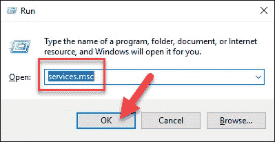

# 如何使用 cmd 在 Windows 中重置 MySQL 根密码？

> 原文:[https://www . geesforgeks . org/如何重置-MySQL-root-windows 中的密码-使用-cmd/](https://www.geeksforgeeks.org/how-to-reset-mysql-root-password-in-windows-using-cmd/)

可能会出现这样一种情况，您需要为您的 MySQL 数据库重置根密码。这可能是因为您忘记了密码，或者出于安全原因需要更改密码。

在本文中，我们将研究使用 Windows cmd 重置 MySQL 密码的过程。为此，请遵循以下步骤:

**步骤 1:** 停止 MySQL 服务器

*   首先检查您是否以管理员身份登录。
*   按 **Win+R** (按住 Windows/Super 键，按“R”。)一旦出现“**运行**框，键入:

```
*services.msc*
```

*   点击**确定**。
*   向下滚动服务列表，找到 MySQL 服务。右键单击该条目，然后左键单击**停止**。



**步骤 2:** 启动文本编辑器

*   点击菜单，搜索**记事本**。
*   或者，可以使用路径:M **enu > Windows 附件>记事本。**

**步骤 3:** 使用密码命令创建新的文本文件

*   在文本编辑器中输入以下行:

```
ALTER USER 'root'@'localhost' IDENTIFIED BY 'NewPassword';
```

*   确保保留引号和分号。用您选择的密码替换**新密码**。


*   使用**文件>将**另存为菜单将文件保存到硬盘的根目录。选择一个有意义的文件名，如 **mysql-init.txt.**

因此，**本地主机**命令将在您的本地系统上更改密码。如果您试图通过网络更改系统密码，请将主机名替换为**本地主机**。

**步骤 4:** 打开命令提示符

*   按 **Ctrl+Shift+Esc。**
*   然后，点击**文件菜单>运行新任务。**
*   键入**cmd.exe**，勾选该框以管理员身份运行。
*   点击**确定**。

**步骤 5:** 用新的配置文件重新启动 MySQL 服务器

*   使用命令提示符导航到 MySQL 目录:

```
cd "C:\Program Files\MySQL\MySQL Server 8.0\bin"
```

因此，命令行将显示您正在此文件夹中工作。

*   输入以下内容:

```
mysqld --init-file=C:\\mysql-init.txt
```

请注意，在 C:提示符后有两个斜杠。

此外，如果您在步骤 2 中选择了不同的名称，请在双斜线后使用相同的名称。

**第六步:**清理

现在，您可以使用新密码以 root 用户身份登录 MySQL 服务器。

*   反复检查以确保它有效。如果你有独特的配置选项(比如用**-默认值-文件**选项启动 MySQL)，那就去做吧。

一旦 MySQL 启动，并且您已经确认了密码更改，请删除**C:\ MySQL-init . txt**文件。

在这个阶段，您已经成功地重置了 MySQL 数据库的根密码。