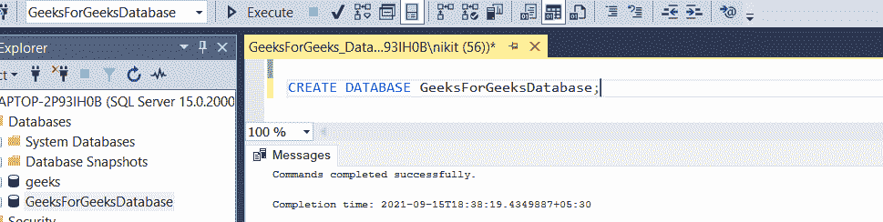
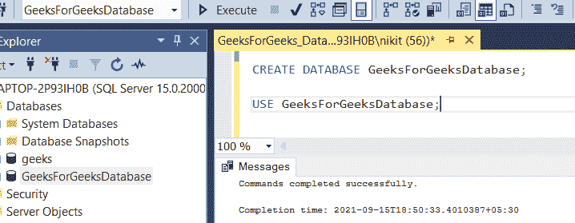
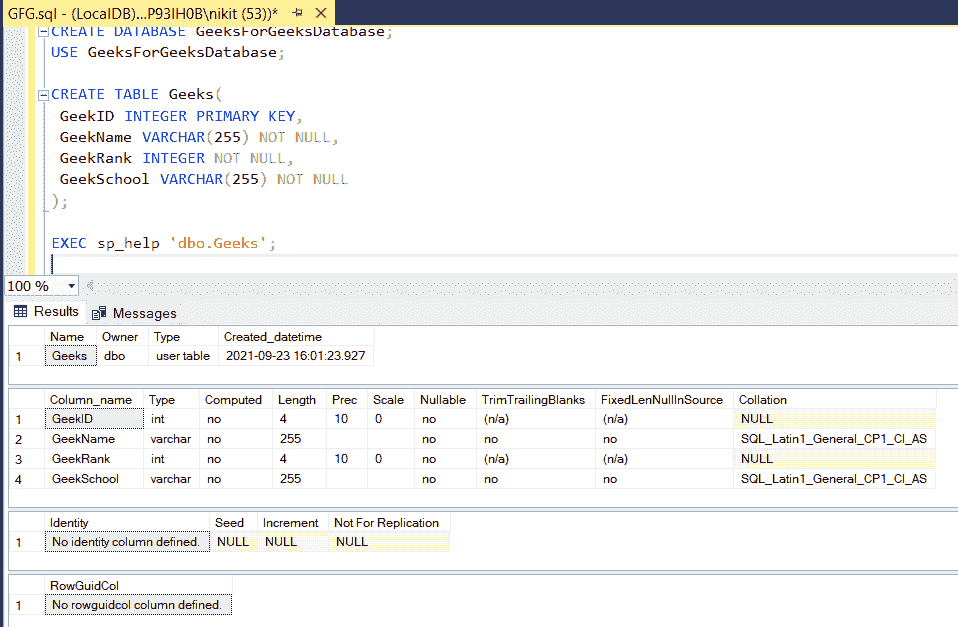

# 如何在 MySQL 数据库中显示一个表的模式？

> 原文:[https://www . geesforgeks . org/how-show-schema-of-in-a-table-in-MySQL-database/](https://www.geeksforgeeks.org/how-to-show-schema-of-a-table-in-mysql-database/)

术语“模式是指数据的组织，作为如何构建数据库的蓝图(在关系型数据库的情况下，分为数据库表)。数据库模式的正式定义是一组公式(句子)，称为强加在数据库上的完整性约束。在本文中，我们将学习如何借助一些 SQL 查询来显示表的模式。

**步骤 1:** 创建数据库

为了演示，我们将在名为“ **GeeksForGeeksDatabase** 的数据库中创建一个参与者表。

**查询:**

```
CREATE DATABASE GeeksForGeeksDatabase;
```



**步骤 2:** 使用数据库

使用下面的 SQL 语句将数据库上下文切换到 **GeeksForGeeksDatabase** 。

**查询:**

```
USE GeeksForGeeksDatabase;
```



**步骤 3:** 表格定义

**查询:**

```
CREATE TABLE Geeks(
GeekID INTEGER PRIMARY KEY,
GeekName VARCHAR(255) NOT NULL,
GeekRank INTEGER NOT NULL,
GeekSchool VARCHAR(255) NOT NULL
);
```


**步骤 4:** 在 SQL 中显示表结构(**模式**

在 Oracle 中，我们使用以下查询:

**查询:**

```
DESC tableName
```

在 MySQL 数据库中，我们使用以下查询:

**查询:**

```
DESCRIBE databasename.tableName;
```

在 SQL Server 中，我们使用 Transact-SQL:

**查询:**

```
EXEC sp_help 'dbo.tableName';
```



使用上面的查询，我们得到了表的完整描述，它的属性，如列名、用于每个列的数据类型、约束。