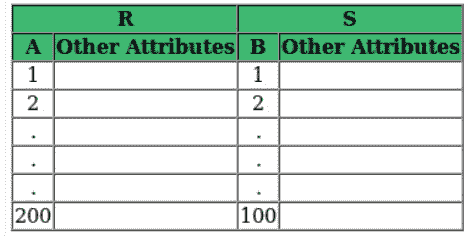
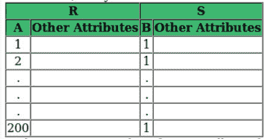
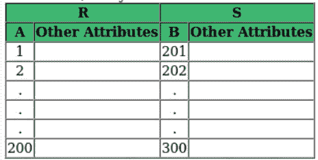
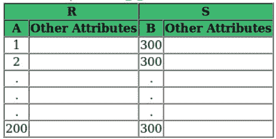

# 如何求解 GATE 的关系代数问题

> 原文:[https://www . geeksforgeeks . org/如何解决关系代数-为 gate 解决问题/](https://www.geeksforgeeks.org/how-to-solve-relational-algebra-problems-for-gate/)

在本文中，让我们讨论一下关系代数中常见的问题类型，这些问题在 GATE 中被问到。在阅读本文之前，您应该对关系代数中的[基本运算符](https://www.geeksforgeeks.org/basic-operators-in-relational-algebra-2/)和[扩展运算符](https://www.geeksforgeeks.org/extended-operators-in-relational-algebra/)有所了解。

**Type-1:给定一个关系代数表达式，求结果。**
假设你有一个关系 Order(Prod_Id，Agent_Id，Order_Month)，你必须找出下面的代数表达式会返回什么。

```
∏Order1.Prod_Id (ρ(Order1,Order) Order1.Prod_Id=Order2.Prod_Id 
 and Order1.Agent_Id≠Order2.Agent_Id 
 and Order1.Order_Month=Order2.Order_Month ρ(Order2,Order)) 
```

从最里面的括号开始处理表达式。

在本例中，我们将订单重命名为订单 1 和订单 2(两者表示相同的关系订单)。然后我们在 Order1 和 Order2 之间应用了条件连接。它将返回那些订单 1 和订单 2 的产品标识和订单月份相同但订单 1 和订单 2 的代理标识不同的行。这意味着同一产品在同一个月内被两个不同的代理商订购。然后我们投射产品标识。

因此，最终输出将返回不同代理商在同一个月订购的产品的产品标识。我们可以通过获取样本数据来做到这一点。Let Order 关系由以下数据组成。

**表–**订单

<figure class="table">

| 产品标识 | 代理 _Id | 订单 _ 月 |
| --- | --- | --- |
| P001 | A001 | 一月 |
| P002 | A002 | 二月（February 的缩写） |
| P002 | A001 | 二月（February 的缩写） |
| P001 | A002 | 二月（February 的缩写） |

当我们应用以下表达式时，将以蓝色突出显示的行将被选中。

```
(ρ(Order1,Order)Order1.Prod_Id=Order2.Prod_Id 
 and Order1.Agent_Id≠Order2.Agent_Id 
 and Order1.Order_Month=Order2.Order_Month ρ(Order2,Order))
```

<figure class="table">

| 订单 1。产品标识 | 订单 1。代理 _Id | 订单 1。订单 _ 月 | 订单 2。产品标识 | 订单 2。代理 _Id | 订单 2。订单 _ 月 |
| --- | --- | --- | --- | --- | --- |
| P001 | A001 | 一月 | P001 | A001 | 一月 |
| P002 | A002 | 二月（February 的缩写） | P001 | A001 | 一月 |
| P002 | A001 | 二月（February 的缩写） | P001 | A001 | 一月 |
| P001 | A002 | 二月（February 的缩写） | P001 | A001 | 一月 |
| P001 | A001 | 一月 | P002 | A002 | 二月（February 的缩写） |
| P002 | A002 | 二月（February 的缩写） | P002 | A002 | 二月（February 的缩写） |
| P002 | A001 | 二月（February 的缩写） | P002 | A002 | 二月（February 的缩写） |
| P001 | A002 | 二月（February 的缩写） | P002 | A002 | 二月（February 的缩写） |
| P001 | A001 | 一月 | P002 | A001 | 二月（February 的缩写） |
| P002 | A002 | 二月（February 的缩写） | P002 | A001 | 二月（February 的缩写） |
| P002 | A001 | 二月（February 的缩写） | P002 | A001 | 二月（February 的缩写） |
| P001 | A002 | 二月（February 的缩写） | P002 | A001 | 二月（February 的缩写） |
| P001 | A001 | 一月 | P001 | A002 | 二月（February 的缩写） |
| P002 | A002 | 二月（February 的缩写） | P001 | A002 | 二月（February 的缩写） |
| P002 | A001 | 二月（February 的缩写） | P001 | A002 | 二月（February 的缩写） |
| P001 | A002 | 二月（February 的缩写） | P001 | A002 | 二月（February 的缩写） |

投影 Order1 后。Prod_Id，输出将是 **P002** ，这是同月至少有两个不同代理商订购的产品的 Prod_Id。

**注意–**如果我们想找到同一个月至少有三个不同代理商订购的 Prod_Id，可以按如下方式进行:

```
∏Order1.Prod_Id (σOrder1.Prod_Id=Order2.Prod_Id 
 and Order1.Prod_Id=Order3.Prod_Id 
 and  Order1.Agent_Id≠Order2.Agent_Id 
 and Order1.Agent_Id≠Order3.Agent_Id 
 and Order2.Agent_Id≠Order3.Agent_Id 
 and Order1.Order_Month=Order2.Order_Month 
 and Order1.Order_Month=Order3.Order_Month(ρ(Order1,Order)X ρ(Order2,Order)X ρ(Order3,Order))) 
```

**Type-2:给定两个关系，自然连接后元组的最大和最小个数会是多少？**

考虑以下带下划线主键的关系 R(A， <u>B</u> ，C)和 S( <u>B，D</u> ，E)。关系 R 包含 200 个元组，关系 S 包含 100 个元组。自然连接 R 和 S 中可能的最大元组数量是多少？

为了解决这种类型的问题，首先，我们将看到在哪个属性上将发生自然连接。自然连接选择那些公共属性值相等的行。在这种情况下，表达式如下:

```
σR.B=S.B (RX S) 
```

在关系 R 中，属性 B 是主键。所以关系 R 有 200 个不同的 b 值。另一方面，关系 S 有 BD 作为主键。因此，属性 B 可以有 100 个不同的值，或者所有行都有 1 个值。

**情况-1:** 信噪比有 100 个不同的值，每个值都与信噪比相匹配



在这种情况下，S 中的 B 的每个值都将匹配 r 中的 B 的值。因此自然连接将有 100 个元组。

**情况-2:** 信噪比有 1 个值，该值与信噪比匹配



在这种情况下，S 中的 B 的每个值都将匹配 r 中的 B 的值。因此自然连接将有 100 个元组。

**病例-3:** S.B 有 100 个不同的值，这些值都与 R.B 不匹配



在这种情况下，S 中的 B 值不会与 r 中的 B 值匹配。因此，自然连接将有 0 个元组。

**情况-4:** S.B 值为 1，与 R.B 不匹配



在这种情况下，S 中的 B 值不会与 r 中的 B 值匹配。因此，自然连接将有 0 个元组。

所以元组的最大数量是 100，最小值是 0。

**注意–**如果明确提到 S.B 是 R.B 的外键，那么上面讨论的 Case-3 和 Case-4 是不可能的，因为 S.B 的值将来自 R.B 的值。因此，自然连接中元组的最小和最大数量将是 100。

**参考–**[纳瓦斯数据库系统基础](https://amzn.to/3h4jBNg)

文章由 **Sonal Tuteja** 供稿。如果你发现任何不正确的地方，或者你想分享更多关于上面讨论的话题的信息，请写评论。

</figure>

</figure>