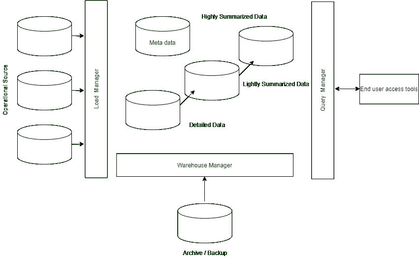

# 数据仓库中的实现和组件

> 原文:[https://www . geeksforgeeks . org/数据仓库中的实现和组件/](https://www.geeksforgeeks.org/implementation-and-components-in-data-warehouse/)

**先决条件–**[数据仓库架构](https://www.geeksforgeeks.org/multi-tier-architecture-of-data-warehouse/)

数据仓库用于存储历史数据，这些数据有助于企业做出战略决策。用于[在线分析处理(OLAP)](https://www.geeksforgeeks.org/olap-full-form/) 帮助分析数据。数据仓库有助于业务主管系统地组织、接受和使用他们的数据来做出战略决策。

**什么是数据仓库？**

数据仓库有多种定义方式，很难制定一个严格的定义。渐渐地，数据仓库是一个独立于组织运营数据库的数据仓库。数据仓库系统允许集成各种各样的应用系统。它们通过提供用于分析的聚合历史数据的可靠计划来支持信息处理。

数据仓库中的数据来自组织的运营系统以及其他外部来源。这些统称为源系统。从源系统中提取的数据存储在一个称为数据暂存区的区域中，在这里对数据进行清理、转换、组装和复制，以准备数据仓库中的数据。

数据暂存区通常是一组机器，在这里进行简单的活动，如排序和顺序处理。数据暂存区不提供。一旦系统提供查询或演示服务，它就被归类为演示服务器。演示服务器是目标计算机，数据从数据暂存区加载到其上，并直接存储供最终用户、报表作者和其他应用程序查询。

数据仓库需要三种不同类型的系统–

1.  源系统
2.  数据暂存区
3.  演示服务器

数据仓库架构

数据从数据源区域通过临时区域移动到演示服务器。整个过程被称为 [ETL(提取、转换和加载)](https://www.geeksforgeeks.org/etl-process-in-data-warehouse/)或 [ETT](https://www.geeksforgeeks.org/difference-between-elt-and-etl/) (提取、转换和传输)。

#### 数据仓库体系结构的组件及其任务:

**1。运营来源–**

*   操作源是由操作数据和外部数据组成的数据源。
*   数据可以来自关系型数据库管理系统，如 Informix、Oracle。

**2。负载管理器–**

*   加载管理器执行与提取数据仓库中的加载数据相关的所有操作。
*   这些任务包括简单的数据转换，为数据进入仓库做准备。

**3。仓库管理–**

*   仓库经理负责仓库管理流程。
*   仓库经理执行的操作是数据的分析、聚合、备份和收集，以及数据的非标准化。

**4。查询管理器–**

*   查询管理器执行与用户查询管理相关的所有任务。
*   查询管理器的复杂性由最终用户访问操作工具和数据库提供的功能决定。

**5。详细数据–**

*   它用于存储数据库模式中的所有详细数据。
*   详细数据被加载到数据仓库中，以补充收集的数据。

**6。汇总数据–**

*   汇总数据是存储预定义聚合的数据仓库的一部分
*   这些聚合由仓库管理器生成。

**7。归档和备份数据–**

*   存储详细数据和汇总数据是为了归档和备份。
*   数据被重新定位到存储档案，如磁带或光盘。

**8。元数据–**

*   元数据基本上是存储在数据之上的数据。
*   用于提取装载过程、仓库、管理过程、查询管理过程。

**9。最终用户访问工具–**

*   最终用户访问工具包括分析、报告和挖掘。
*   通过使用最终用户访问工具，用户可以链接到仓库。