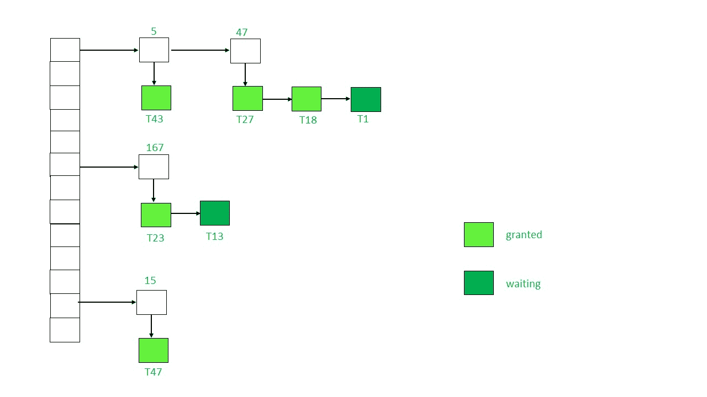

# 在数据库管理系统中实现锁定

> 原文:[https://www . geeksforgeeks . org/implementation-of-lock-in-DBMS/](https://www.geeksforgeeks.org/implementation-of-locking-in-dbms/)

锁定协议在数据库管理系统中用作并发控制的一种手段。多个事务可能同时请求一个数据项的锁。因此，我们需要一种机制来管理事务发出的锁定请求。这样的机制称为**锁管理器**。它依赖于消息传递的过程，其中事务和锁管理器交换消息来处理数据项的锁定和解锁。

**锁管理器中使用的数据结构–**
实现锁定所需的数据结构称为**锁表**。

1.  这是一个哈希表，其中数据项的名称用作哈希索引。
2.  每个锁定的数据项都有一个关联的链表。
3.  链表中的每个节点代表请求锁定的事务、请求的锁定模式(相互/排他)和请求的当前状态(授予/等待)。
4.  数据项的每个新锁定请求都将作为新节点添加到链表的末尾。
5.  散列表中的冲突通过单独链接的技术来处理。

考虑下面的锁表示例:

**说明:**上图中，锁表中存在的锁数据项有 5、47、167、15。

请求锁定的事务由下面用向下箭头显示的链表表示。

链表中的每个节点都有一个事务的名称，该事务已经请求了像 T33、T1、T27 等数据项。

节点的颜色代表状态，即锁是否已被授予或正在等待。

请注意，数据项 5 和 47 发生了冲突。它通过单独的链接来解决，其中每个数据项都属于一个链表。数据项充当包含锁定请求的链表的头。

**锁管理器的工作–**

1.  最初，锁表是空的，因为没有数据项被锁定。
2.  每当锁管理器接收到来自特定数据项 Q 上的事务 TIII的锁请求时，可能会出现以下情况:
    *   如果 Q i 尚未锁定，将创建一个链表，并向请求事务 T i 授予锁定。
    *   如果数据项已经被锁定，将在其链表的末尾添加一个新的节点，该节点包含关于由 T i 发出的请求的信息。
3.  如果 T i 请求的锁模式与当前拥有锁的事务的锁模式兼容，则 T i 也将获得锁，状态将更改为“已授予”。否则，T i 的锁将处于“等待”状态。
4.  如果事务 T i 想要解锁它当前持有的数据项，它将向锁管理器发送解锁请求。锁管理器将从这个链表中删除 T i 的节点。锁定将被授予列表中的下一个事务。
5.  有时事务 T i 可能不得不中止。在这种情况下，由 T i 发出的所有等待请求都将从锁表中的链表中删除。一旦堕胎完成，T i 持有的锁也将被释放。

**参考–**
数据库系统概念，第 6 版