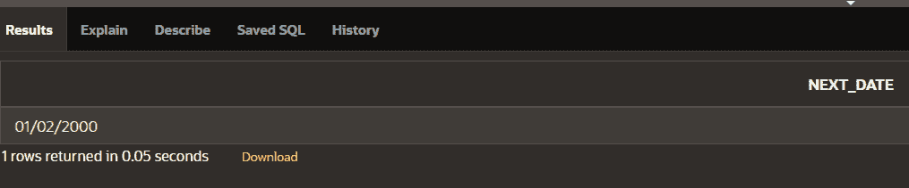
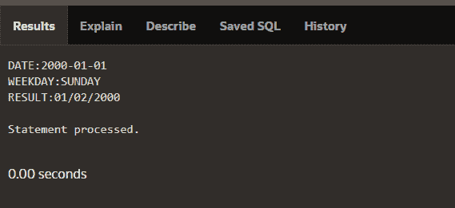
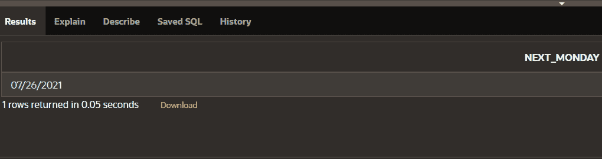

# PLSQL 中内置的 NEXT_DAY 函数

> 原文:[https://www . geesforgeks . org/inbuild-next _ day-function-in-plsql/](https://www.geeksforgeeks.org/inbuilt-next_day-function-in-plsql/)

**先决条件:** [PL/SQL 简介](https://www.geeksforgeeks.org/plsql-introduction/)
PLSQL 代表**“SQL 的过程语言扩展”**，用于转换、更新和查询数据库中的数据。它被分成包含声明和语句的块。并且它与 oracle 数据库集成(从版本 7 开始)。PLSQL 背后的主要思想是它增加了一些 SQL 中没有的编程约束。

在 PLSQL 中 **NEXT_DAY** 函数用于返回大于给定日期的第一个工作日。所以这个函数将接受用户输入的日期和工作日，然后根据工作日返回大于给定日期的日期。

并且 **Oracle 11g、Oracle 12c、Oracle 10g、Oracle 9i** 都支持该功能。

**示例–**

```
INPUT: NEXT_DAY('22-Jul-21','WEDNESDAY')
OUTPUT:'28-Jul-21'

INPUT: NEXT_DAY('03-Mar-15','MONDAY')
OUTPUT:'09-Mar-15'

INPUT: NEXT_DAY('22-Jul-20','SUNDAY')
OUTPUT:'26-Jul-20'
```

**语法–**

```
NEXT_DAY(DATE,WEEKDAY)
```

**参数:**
**日期–用于查找下一个工作日的日期值。
**WEEKDAY**-是我们要返回的一周中的某一天。
**RETURS–**根据工作日返回大于给定日期的第一个日期。**

**工作日接受下表中的以下工作日–**

<figure class="table">

| **工作日** | **返回** |
| **SUNDAY** | 比约会晚的第一个星期天 |
| **周一** | 比约会晚的第一个星期一 |
| **星期二** | 比约会晚的第一个星期二 |
| **周三** | 比约会晚的第一个星期三 |
| **星期四** | 比约会晚的第一个星期四 |
| **星期五** | 比约会晚的第一个星期五 |
| **周六** | 比约会晚的第一个星期六 |

****示例 1–****

```
SELECT 
    NEXT_DAY( DATE '2000-01-01', 'SUNDAY' ) as NEXT_DATE
FROM
    dual;
```

****输出–****

****

****示例 2–****

```
DECLARE
input varchar(25);
weekday varchar(25);
res varchar2(25);

BEGIN
input:=&input;
weekday:=&weekday;
res:=NEXT_DAY(input,weekday);
dbms_output.put_line('DATE:'||input);
dbms_output.put_line('WEEKDAY:'||weekday);
dbms_output.put_line('RESULT:'||res);
END;
```

****输出–****

****

****示例 3–**
使用 SYSDATE**

```
SELECT NEXT_DAY(SYSDATE,'MONDAY') AS NEXT_MONDAY
FROM DUAL;
```

****输出–****

****

</figure>