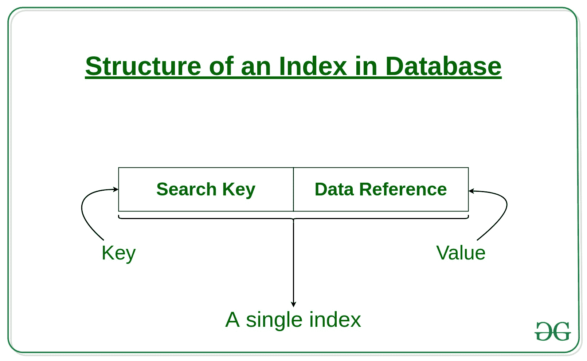
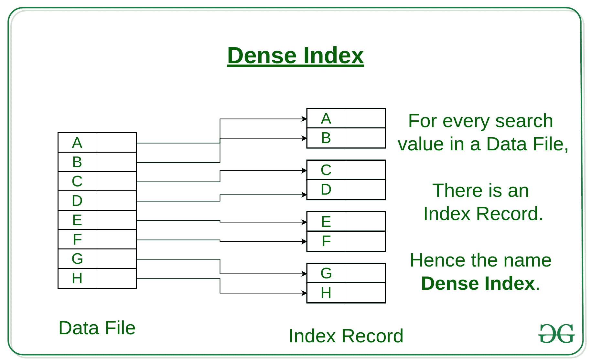
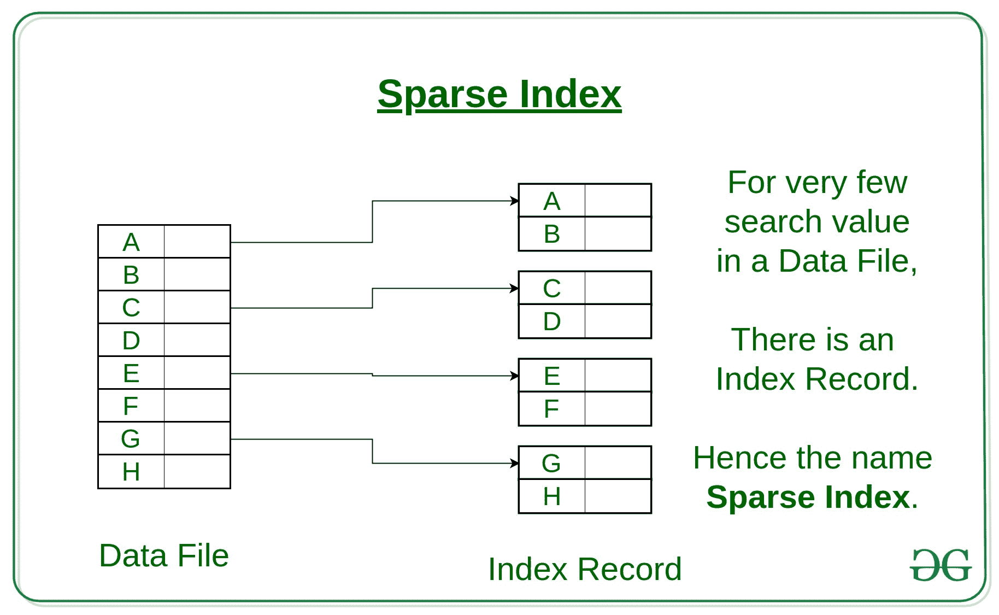
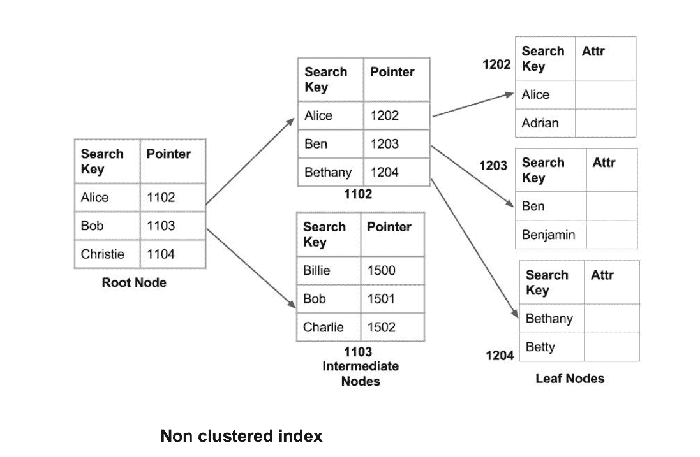
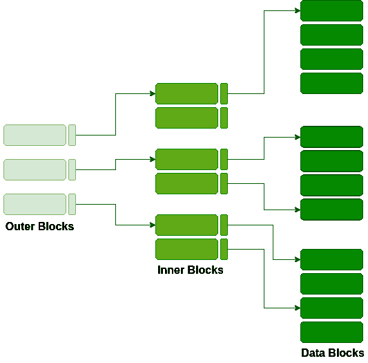

# 数据库中的索引|第 1 集

> 原文:[https://www.geeksforgeeks.org/indexing-in-databases-set-1/](https://www.geeksforgeeks.org/indexing-in-databases-set-1/)

索引是一种优化数据库性能的方法，它可以最大限度地减少处理查询时所需的磁盘访问次数。它是一种数据结构技术，用于快速定位和访问数据库中的数据。

索引是使用几个数据库列创建的。

*   第一列是**搜索键**，它包含表的主键或候选键的副本。这些值按排序顺序存储，以便可以快速访问相应的数据。
    *注意:数据可能按排序顺序存储，也可能不存储。*
*   第二列是**数据引用**或**指针**，它包含一组指针，保存可以找到特定键值的磁盘块的地址。

索引有各种属性:

*   **访问类型**:指基于值的搜索、范围访问等访问类型。
*   **访问时间**:指查找特定数据元素或元素集所需的时间。
*   **插入时间**:指找到合适的空间，插入一个新数据所花费的时间。
*   **删除时间**:找到一个项目并删除以及更新索引结构所花费的时间。
*   **空间开销**:指索引需要的额外空间。

通常，存储数据的索引方法遵循两种类型的文件组织机制:

**1。顺序文件组织或有序索引文件:**在这种情况下，索引基于值的排序。这些通常是快速和更传统类型的存储机制。这些有序或顺序的文件组织可能以密集或稀疏的格式存储数据:

**(一)密集指数:**

*   对于数据文件中的每个搜索键值，都有一个索引记录。
*   该记录包含搜索关键字以及对具有该搜索关键字值的第一个数据记录的引用。

**(二)稀疏指数:**

*   索引记录只出现在数据文件的几个项目中。每个项目都指向一个块，如图所示。
*   为了定位记录，我们找到最大搜索关键字值小于或等于我们正在寻找的搜索关键字值的索引记录。
*   我们从索引记录所指向的记录开始，继续文件中的指针(也就是顺序地)，直到找到所需的记录。

**2。哈希文件组织:**索引基于在一系列存储桶中均匀分布的值。分配值的存储桶由一个称为哈希函数的函数确定。

主要有三种索引方法:

*   聚集索引
*   非聚集索引或辅助索引
*   多级索引

**1。群集索引**
当两个以上的记录存储在同一个文件中时，这种类型的存储称为群集索引。通过使用聚类索引，我们可以降低搜索成本，因为与同一事物相关的多条记录存储在一个地方，并且它还提供了两个以上表(记录)的频繁连接。
聚类索引是在有序数据文件上定义的。数据文件在非关键字段上排序。在某些情况下，索引是在非主键列上创建的，这些列对于每条记录来说可能不是唯一的。在这种情况下，为了更快地识别记录，我们将两个或多个列组合在一起，以获得唯一的值，并从中创建索引。这种方法被称为聚类索引。基本上，具有相似特征的记录被分组在一起，并为这些组创建索引。
例如，每学期学习的学生被分组在一起。即 1 st 学期学生，2 nd 学期学生，3 rd 学期学生等。被分组。

**按名字排序的聚簇索引(搜索关键字)**

***【主索引:***
这是一种聚集索引，其中数据根据搜索关键字进行排序，数据库表的主关键字用于创建索引。这是一种默认的索引格式，它引入了顺序文件组织。由于主键是唯一的，并且以排序的方式存储，因此搜索操作的性能非常高效。

**2。非聚集索引或二级索引**
非聚集索引只是告诉我们数据在哪里，即它给我们一个虚拟指针或对数据实际存储位置的引用的列表。数据没有按照索引的顺序进行物理存储。相反，数据出现在叶节点中。一本书的目录页。每个条目都给我们存储信息的页码或位置。这里的实际数据(书的每一页上的信息)是没有组织的，但是我们有一个有序的引用(目录页)来说明数据点的实际位置。我们只能在非聚集索引中进行密集排序，因为稀疏排序是不可能的，因为数据没有相应地进行物理组织。
与聚集索引相比，它需要更多的时间，因为为了通过进一步跟踪指针来提取数据，需要做一些额外的工作。对于聚集索引，数据直接出现在索引的前面。

**3。多级索引**

随着数据库规模的增长，索引也在增长。由于索引存储在主内存中，单级索引可能会变得太大，无法在多次磁盘访问时存储。多级索引将主数据块分成不同的小数据块，以便将它们存储在单个数据块中。外部块被分成内部块，内部块又指向数据块。这可以很容易地以较少的开销存储在主存储器中。

本文由 **Avneet Kaur** 供稿。如果你发现任何不正确的地方，请写评论，或者你想分享更多关于上面讨论的话题的信息