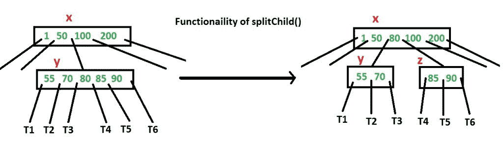
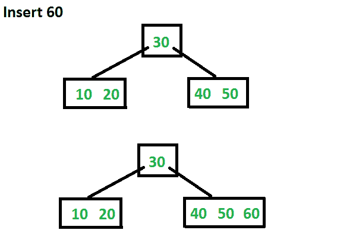
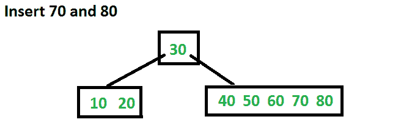
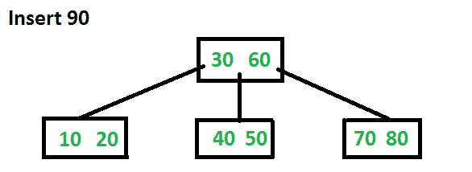

# 在 B 树中插入操作

> 原文:[https://www.geeksforgeeks.org/insert-operation-in-b-tree/](https://www.geeksforgeeks.org/insert-operation-in-b-tree/)

在[之前的帖子](https://www.geeksforgeeks.org/b-tree-set-1-introduction-2/)中，我们介绍了 B-Tree。我们还讨论了 search()和 traverse()函数。
本文讨论 insert()操作。新的键总是插入到叶节点。让要插入的键为 k。像 BST 一样，我们从根开始向下遍历，直到到达一个叶节点。一旦我们到达一个叶节点，我们就在该叶节点中插入密钥。与 BST 不同，我们对一个节点可以包含的键的数量有一个预定义的范围。因此，在向节点插入密钥之前，我们要确保节点有额外的空间。

*在插入密钥之前，如何确保节点有空间可用于密钥？*我们使用一个名为 splitChild()的操作，用于拆分节点的子节点。请参见下图了解拆分。在下图中，x 的子节点 y 被拆分为两个节点 y 和 z。请注意，splitChild 操作向上移动了一个键，这就是 B-Trees 长大的原因，而不是 BST 长大。



如上所述，为了插入新的密钥，我们从根到叶。在向下遍历到一个节点之前，我们首先检查该节点是否已满。如果节点已满，我们会将其拆分以创建空间。下面是完整的算法。

**插入**
**1)** 初始化 x 为根。
**2)** 当 x 不是叶子时，按照
进行操作.. **a)** 找到下一个要穿越的 x 的孩子。让孩子成为 y.
.. **b)** 如果 y 未满，将 x 更改为指向 y。
.. **c)** 如果 y 满了，拆分它，把 x 改为指向 y 的两个部分之一，如果 k 小于 y 中的 mid key，那么把 x 设为 y 的第一部分，否则 y 的第二部分，当我们拆分 y 时，我们把一个 key 从 y 移到它的父 x，
**3)** 当 x 是叶子时，第二步的循环停止。x 必须有 1 个额外键的空间，因为我们已经提前分割了所有节点。所以只需将 k 插入 x。

请注意，该算法遵循科曼书。这实际上是一种主动插入算法，在下到一个节点之前，如果它已满，我们会将其拆分。之前拆分的好处是，我们从来不会遍历一个节点两次。如果我们在下到一个节点之前不拆分它，并且只在插入新的键时才拆分它(被动)，我们可能会结束从叶到根再次遍历所有节点。当从根到叶的路径上的所有节点都已满时，就会发生这种情况。因此，当我们来到叶节点时，我们将其拆分，并向上移动一个键。向上移动键将导致父节点分裂(因为父节点已经满了)。这种级联效应从未发生在这种主动插入算法中。这种主动插入的缺点是，我们可能会做不必要的拆分。

让我们用一个最小度为 3 的示例树和一个初始为空的 B 树中的整数 10、20、30、40、50、60、70、80 和 90 的序列来理解这个算法。
最初根为空。让我们首先插入 10。


现在让我们插入 20、30、40 和 50。它们都将被插入根目录，因为一个节点可以容纳的最大键数是 2 * t–1，也就是 5。


现在让我们插入 60。由于根节点已满，它将首先分成两部分，然后将 60 插入相应的子节点。



现在让我们插入 70 和 80。这些新的密钥将被插入到适当的叶子中，没有任何分割。



现在让我们插入 90。这种插入会导致分裂。中间的键将指向父项。



下面是上述主动算法的 C++实现。

## C++

```
// C++ program for B-Tree insertion
#include<iostream>
using namespace std;

// A BTree node
class BTreeNode
{
    int *keys;  // An array of keys
    int t;      // Minimum degree (defines the range for number of keys)
    BTreeNode **C; // An array of child pointers
    int n;     // Current number of keys
    bool leaf; // Is true when node is leaf. Otherwise false
public:
    BTreeNode(int _t, bool _leaf);   // Constructor

    // A utility function to insert a new key in the subtree rooted with
    // this node. The assumption is, the node must be non-full when this
    // function is called
    void insertNonFull(int k);

    // A utility function to split the child y of this node. i is index of y in
    // child array C[].  The Child y must be full when this function is called
    void splitChild(int i, BTreeNode *y);

    // A function to traverse all nodes in a subtree rooted with this node
    void traverse();

    // A function to search a key in the subtree rooted with this node.
    BTreeNode *search(int k);   // returns NULL if k is not present.

// Make BTree friend of this so that we can access private members of this
// class in BTree functions
friend class BTree;
};

// A BTree
class BTree
{
    BTreeNode *root; // Pointer to root node
    int t;  // Minimum degree
public:
    // Constructor (Initializes tree as empty)
    BTree(int _t)
    {  root = NULL;  t = _t; }

    // function to traverse the tree
    void traverse()
    {  if (root != NULL) root->traverse(); }

    // function to search a key in this tree
    BTreeNode* search(int k)
    {  return (root == NULL)? NULL : root->search(k); }

    // The main function that inserts a new key in this B-Tree
    void insert(int k);
};

// Constructor for BTreeNode class
BTreeNode::BTreeNode(int t1, bool leaf1)
{
    // Copy the given minimum degree and leaf property
    t = t1;
    leaf = leaf1;

    // Allocate memory for maximum number of possible keys
    // and child pointers
    keys = new int[2*t-1];
    C = new BTreeNode *[2*t];

    // Initialize the number of keys as 0
    n = 0;
}

// Function to traverse all nodes in a subtree rooted with this node
void BTreeNode::traverse()
{
    // There are n keys and n+1 children, traverse through n keys
    // and first n children
    int i;
    for (i = 0; i < n; i++)
    {
        // If this is not leaf, then before printing key[i],
        // traverse the subtree rooted with child C[i].
        if (leaf == false)
            C[i]->traverse();
        cout << " " << keys[i];
    }

    // Print the subtree rooted with last child
    if (leaf == false)
        C[i]->traverse();
}

// Function to search key k in subtree rooted with this node
BTreeNode *BTreeNode::search(int k)
{
    // Find the first key greater than or equal to k
    int i = 0;
    while (i < n && k > keys[i])
        i++;

    // If the found key is equal to k, return this node
    if (keys[i] == k)
        return this;

    // If key is not found here and this is a leaf node
    if (leaf == true)
        return NULL;

    // Go to the appropriate child
    return C[i]->search(k);
}

// The main function that inserts a new key in this B-Tree
void BTree::insert(int k)
{
    // If tree is empty
    if (root == NULL)
    {
        // Allocate memory for root
        root = new BTreeNode(t, true);
        root->keys[0] = k;  // Insert key
        root->n = 1;  // Update number of keys in root
    }
    else // If tree is not empty
    {
        // If root is full, then tree grows in height
        if (root->n == 2*t-1)
        {
            // Allocate memory for new root
            BTreeNode *s = new BTreeNode(t, false);

            // Make old root as child of new root
            s->C[0] = root;

            // Split the old root and move 1 key to the new root
            s->splitChild(0, root);

            // New root has two children now.  Decide which of the
            // two children is going to have new key
            int i = 0;
            if (s->keys[0] < k)
                i++;
            s->C[i]->insertNonFull(k);

            // Change root
            root = s;
        }
        else  // If root is not full, call insertNonFull for root
            root->insertNonFull(k);
    }
}

// A utility function to insert a new key in this node
// The assumption is, the node must be non-full when this
// function is called
void BTreeNode::insertNonFull(int k)
{
    // Initialize index as index of rightmost element
    int i = n-1;

    // If this is a leaf node
    if (leaf == true)
    {
        // The following loop does two things
        // a) Finds the location of new key to be inserted
        // b) Moves all greater keys to one place ahead
        while (i >= 0 && keys[i] > k)
        {
            keys[i+1] = keys[i];
            i--;
        }

        // Insert the new key at found location
        keys[i+1] = k;
        n = n+1;
    }
    else // If this node is not leaf
    {
        // Find the child which is going to have the new key
        while (i >= 0 && keys[i] > k)
            i--;

        // See if the found child is full
        if (C[i+1]->n == 2*t-1)
        {
            // If the child is full, then split it
            splitChild(i+1, C[i+1]);

            // After split, the middle key of C[i] goes up and
            // C[i] is splitted into two.  See which of the two
            // is going to have the new key
            if (keys[i+1] < k)
                i++;
        }
        C[i+1]->insertNonFull(k);
    }
}

// A utility function to split the child y of this node
// Note that y must be full when this function is called
void BTreeNode::splitChild(int i, BTreeNode *y)
{
    // Create a new node which is going to store (t-1) keys
    // of y
    BTreeNode *z = new BTreeNode(y->t, y->leaf);
    z->n = t - 1;

    // Copy the last (t-1) keys of y to z
    for (int j = 0; j < t-1; j++)
        z->keys[j] = y->keys[j+t];

    // Copy the last t children of y to z
    if (y->leaf == false)
    {
        for (int j = 0; j < t; j++)
            z->C[j] = y->C[j+t];
    }

    // Reduce the number of keys in y
    y->n = t - 1;

    // Since this node is going to have a new child,
    // create space of new child
    for (int j = n; j >= i+1; j--)
        C[j+1] = C[j];

    // Link the new child to this node
    C[i+1] = z;

    // A key of y will move to this node. Find the location of
    // new key and move all greater keys one space ahead
    for (int j = n-1; j >= i; j--)
        keys[j+1] = keys[j];

    // Copy the middle key of y to this node
    keys[i] = y->keys[t-1];

    // Increment count of keys in this node
    n = n + 1;
}

// Driver program to test above functions
int main()
{
    BTree t(3); // A B-Tree with minimum degree 3
    t.insert(10);
    t.insert(20);
    t.insert(5);
    t.insert(6);
    t.insert(12);
    t.insert(30);
    t.insert(7);
    t.insert(17);

    cout << "Traversal of the constructed tree is ";
    t.traverse();

    int k = 6;
    (t.search(k) != NULL)? cout << "\nPresent" : cout << "\nNot Present";

    k = 15;
    (t.search(k) != NULL)? cout << "\nPresent" : cout << "\nNot Present";

    return 0;
}
```

**输出:**

```
Traversal of the constructed tree is  5 6 7 10 12 17 20 30
Present
Not Present
```

**参考文献:**
[Clifford Stein、Thomas H. Cormen、Charles E. Leiserson、罗纳德·L·李维斯特《算法导论第三版》](http://www.flipkart.com/introduction-algorithms-3rd/p/itmczynzhyhxv2gs?pid=9788120340077&affid=sandeepgfg)
[http://www . cs . utexas . edu/users/DJI menez/utsa/cs 3343/讲师 17.html](http://www.cs.utexas.edu/users/djimenez/utsa/cs3343/lecture17.html)
如发现任何不正确的地方，请写评论，或想分享更多关于以上讨论主题的信息。